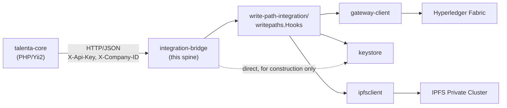

# Architecture Spine — Integration Bridge

## Design Paradigm

**Pipes-and-filters, as a fixed HTTP middleware chain, in front of one already-encapsulated
domain package.** The bridge has no domain logic of its own to protect — `write-path-integration/
writepaths.Hooks` already *is* the domain core, one process away — so every route runs the exact
same filter sequence rather than each handler re-deriving its own auth/validation/error logic.
Every stage's failure — including `[auth]`/`[validate]` rejections that never reach `Hooks` at
all — flows to `[map-error]` before a response is written; nothing short-circuits straight to
`[respond]`, which is what makes AD-3's "the error-mapping filter is the only place that sets
`status`" true without exception:

```
inbound HTTP request
  -> [auth]        X-Api-Key + X-Company-ID check
  -> [validate]    request envelope shape; required fields present
  -> [dispatch]    call the matching Hooks method, under AD-4's shared timeout budget
  -> [map-error]   EVERY stage's failure lands here (see AD-3's decision table) — the
                    only stage that sets `status`; the only path to [respond]
  -> [respond]     write the JSON response
```

**Stage Contract.** A single request-scoped struct, attached via one `context.WithValue` call as
the request enters `[auth]`, carries `EmployeeInternalID`, `ProfileSection`, `TenantID`, and —
once `[dispatch]` completes — `Result`/`Err`. Every later stage (`[map-error]`, `[respond]`, and
all logging) reads identifiers from **this struct**, never by `errors.As`-unwrapping an error —
the timeout path (AD-4) has no `*writepaths.PartialFailureError` to unwrap identifiers from, so a
hand-off mechanism that only works for the typed-error case would silently lose them on exactly
the path this spine is most worried about.

Layer-to-code mapping: `pipeline.go` owns the five filter stages as composable
`func(http.Handler) http.Handler`-shaped stages, including the Stage Contract struct; `handlers.go`
owns only the per-section dispatch target each route feeds into the chain; `main.go` owns wiring
(config, one-time `Hooks`/`GatewayClient` construction, route registration).

## Invariants & Rules

### AD-1 — Design paradigm: middleware pipeline, uniformly applied, single error path

- **Binds:** all bridge routes; the inter-stage hand-off (Stage Contract, above)
- **Prevents:** each handler independently re-deriving auth/validation/error-mapping logic and
  silently diverging on it; identifiers silently dropping out of logs/responses on the paths that
  don't produce a typed error
- **Rule:** no route may call a `Hooks` method directly from its own handler body outside the
  shared pipeline. Every stage's failure (including `[auth]`/`[validate]`) is routed to
  `[map-error]`, never straight to `[respond]`. `[map-error]`, `[respond]`, and all logging read
  `EmployeeInternalID`/`ProfileSection` only from the Stage Contract struct, never from
  `errors.As`-unwrapping an error.

### AD-2 — Module and deployment layout

- **Binds:** this service's build, dependency, and process lifecycle
- **Prevents:** splitting into a separate repository prematurely; blending an HTTP-facing service
  into `write-path-integration/go.work`'s four pure-library modules; a second, per-request
  `*gatewayclient.GatewayClient` construction that defeats the whole reason this bridge exists
- **Rule:**
  - `integration-bridge/` is a new top-level directory with its own `go.mod`. It is **not** added
    to `write-path-integration/go.work`. This is a **novel pattern for this repo, not a repeat of
    an existing one** — no `fabric-network/tools/*` module currently depends on another module via
    `replace`; they are standalone only because they need nothing beyond stdlib and public
    third-party packages. `integration-bridge/go.mod` needs `require`+`replace` pairs for **all
    four** `write-path-integration/*` modules (`writepaths`, `gatewayclient`, `ipfsclient`,
    `keystore`) — one `replace` for `writepaths` alone does not build, because `writepaths`'s own
    `go.mod` declares no dependency on its three siblings (that resolution happens only inside
    `go.work`'s workspace mode, which this module deliberately isn't part of). `keystore` also
    needs a **direct** import from `integration-bridge` (not merely transitive through
    `writepaths`), since `main.go` must construct concrete `keystore.EmployeeKeyStore`/
    `SaltStore`/`DocumentKeyStore` implementations to populate the `Hooks` struct.
  - The `*gatewayclient.GatewayClient` (and the `Hooks` that wraps it) is constructed **exactly
    once**, in `main.go`, at process startup, and passed by reference into every dispatch call —
    never per-request, never per-handler. This is the entire reason a standalone process exists
    rather than each write path opening its own connection (`ADR-0022`'s rejected Option D).
  - One bridge process serves **exactly one tenant** — `Hooks.TenantID` is fixed per instance by
    the package it wraps (channel-per-tenant, `ADR-0013`); this service does not multiplex
    tenants. A second tenant means a second deployment, not a routing change inside this service.
  - `main.go` registers `SIGTERM`/`SIGINT` handling and calls `GatewayClient.Close()` exactly once
    on shutdown, matching that method's own "call once, at host-process shutdown — never per
    transaction" contract.

### AD-3 — Error-mapping convention: status is transport, body carries outcome

- **Binds:** every route's response shape
- **Prevents:** a future handler treating any `5xx` as safely retryable — false for the one typed
  error (`*writepaths.PartialFailureError`) that means the operational-DB write already landed;
  two builders independently guessing which failures count as `rejected` vs. `error`
- **Rule:** HTTP status is pure transport (`2xx` = the bridge processed the request, `4xx` = bad
  input from talenta-core, `5xx` = the bridge itself is broken). All business outcome lives in a
  body field, `status: committed | partial_failure | rejected | error`, set **only** by
  `[map-error]`, per this decision table:

  | Failure origin | `status` |
  | --- | --- |
  | `[auth]` stage rejection (bad/missing `X-Api-Key`/`X-Company-ID`) | `error` — a transport/credential fault, not a business outcome |
  | `[validate]` stage rejection (malformed envelope, missing required field) | `rejected` — bad input, never reached the domain |
  | `Hooks`' untyped error from `Store.SaveSection` (pre-`anchor()`) | `error` — nothing committed; treated as a bridge/dependency fault |
  | `*writepaths.PartialFailureError` from `anchor()`, or a timeout per AD-4 | `partial_failure` |

  The body's `status` field is the **only** channel through which any future talenta-core
  retry/idempotency logic should observe outcome — the bridge does not assume such logic already
  exists; the retry-after-`partial_failure` policy itself is still an open `[ASSUMPTION]` per
  `writepaths.go`'s own doc comment on `PartialFailureError`, not a ratified design.

### AD-4 — Timeout: one shared budget, timeout maps to partial_failure

- **Binds:** every route's timeout handling
- **Prevents:** per-route timeout policy drift; a spurious `"timeout"` status category that would
  need its own, redundant, not-safe-to-retry handling in talenta-core
- **Rule:** one shared, centrally-configured budget, created via a fresh
  `context.WithTimeout(parentCtx, budget)` call as the **literal first statement** of `[dispatch]`'s
  own handler body — after `[auth]`/`[validate]` have already returned success, never earlier in
  the chain (e.g. never an `http.TimeoutHandler` wrapping the whole `ServeMux`, which would deduct
  auth/validate time from the same budget `Hooks` gets). On timeout, `status = "partial_failure"`
  — not a distinct `"timeout"` value — because every one of the five `Hooks` methods calls
  `Store.SaveSection` (the operational-DB write) and returns before `anchor()` runs, so a timeout
  during `anchor()` carries the same practical consequence as the typed error: the DB write has
  already landed, and the ledger side is either uncertain or was never contacted, depending on
  which of `anchor()`'s internal sub-steps the deadline interrupted — the bridge cannot
  distinguish which, so it treats both uniformly as `partial_failure`.

  **Scope of what this budget actually bounds, decided deliberately, not left implicit:** the
  configured `context.WithTimeout` genuinely bounds every `ctx`-aware call inside `anchor()` —
  `keystore` lookups, `ipfsclient.EncryptAndAdd` (when a document is present), and
  `gatewayclient`'s seed read plus its retry re-reads (all threaded through `EvaluateWithContext`).
  It does **not** bound the actual submit call: `gatewayclient.GatewayClient.
  SubmitRecordProfileSection`'s underlying `g.contract.SubmitTransaction` takes no `ctx` at all —
  it is governed only by fixed, connect-time SDK timeouts (`WithEndorseTimeout(15s)`/
  `WithSubmitTimeout(5s)`/`WithCommitStatusTimeout(1min)`, times up to `MaxSubmitRetries+1`
  attempts on the retryable path). `[dispatch]` calls `Hooks` **synchronously — it must not race a
  goroutine against `ctx.Done()` around this call.** A detached, still-running submit racing
  ahead of an HTTP response that already went out is a double-submission risk against the one
  shared, retained connection AD-2 exists to protect — worse than the alternative this Rule
  accepts instead: once execution enters `SubmitTransaction`, the configured budget has no effect,
  and the request blocks until the SDK's own fixed ceiling resolves it (success or error),
  potentially well past the configured budget. A request can therefore still take up to that SDK
  ceiling; the shared budget is a real, enforced bound on everything **before** the submit call,
  not a hard ceiling on total request latency. Threading `ctx` into `SubmitTransaction` itself
  would close this gap, but that changes code this spine doesn't own (`gateway-client`) — tracked
  as a Deferred follow-up, not invented here.

### AD-5 — Route/operation shape: 5 static operations, 1:1 with Hooks methods

- **Binds:** the bridge's API contract, including its literal wire paths
- **Prevents:** leaking a caller-specific implementation coincidence (PERSONAL and PAYROLL
  happening to share one PHP commit function, `InboxController::updateChangeData()`) into a
  contract a future second caller might not share; two builders producing different URL strings
  for the same operation
- **Rule:** exactly five static routes, one per `ProfileSection` enum value already ratified
  on-chain (`chaincode/asset.go`), registered literally (no `{section}` path parameter — Go
  `ServeMux`'s own routing enforces "never a combined operation", not app-level string matching):

  ```
  POST /v1/profile-sections/PERSONAL
  POST /v1/profile-sections/EMPLOYMENT
  POST /v1/profile-sections/EDUCATION
  POST /v1/profile-sections/ADDITIONAL
  POST /v1/profile-sections/PAYROLL
  ```

### AD-6 — Stack: stdlib HTTP only

- **Binds:** HTTP-layer dependencies
- **Prevents:** an unnecessary third-party router/framework dependency for five simple, static
  POST routes
- **Rule:** no HTTP router or framework import beyond `net/http`. Go 1.22+'s enhanced `ServeMux`
  gained method-restricted registration (`"POST /path"`, returning `405` + `Allow` on mismatch)
  and path-wildcard matching — this design uses only the **method-restriction** half; every
  identifier travels in the JSON body (AD-5/Consistency Conventions), so no route uses a `{param}`
  wildcard. `ServeMux` panics at registration time on genuinely ambiguous overlapping patterns —
  irrelevant to five fixed, non-overlapping literal paths, but worth knowing if routes ever grow.
  The AD-1 pipeline is plain `http.Handler`-wrapping functions, unaffected by which mux is used.

**Dependency direction** (who may depend on whom):



No arrow reverses: `writepaths.Hooks` never imports `integration-bridge`, and talenta-core never
imports any Go package directly — the HTTP boundary is the only seam between them. The dashed edge
is `integration-bridge`'s one direct sibling import (`keystore`, for constructing store
implementations in `main.go`) — everything else reaches `gateway-client`/`ipfsclient` only
transitively, through `Hooks`.

## Consistency Conventions

| Concern | Convention |
| --- | --- |
| Request envelope | JSON body: `employeeInternalID`, `userID` (actor — read directly by talenta-core at the call site, per the actor-identity gap at 3 of 4 real commit sites; never resolved by the bridge), `newValue`, `document` (optional, base64) — mirrors the matching `Hooks` method's own signature exactly; no bridge-invented fields. **`newValue` is a nested JSON object, captured in `[validate]` via `json.RawMessage` specifically — never `map[string]interface{}`/`interface{}` decoding.** `encoding/json` converts untyped JSON numbers to `float64`; PAYROLL's bank-account-number-shaped fields easily exceed `float64`'s exact-integer range (2^53), so any unmarshal-then-remarshal round-trip risks silently corrupting the value *before* `ComputeDataHash`'s RFC 8785 JCS canonicalization ever sees it — JCS cannot recover precision already lost upstream. `json.RawMessage` captures the raw bytes untouched, so this never happens. |
| Response envelope | `{"status": "committed"\|"partial_failure"\|"rejected"\|"error", "recordID"?: string, "detail"?: string}` per AD-3's decision table |
| Auth | `X-Api-Key` **and** `X-Company-ID` headers, matching `services/ems/BaseEmsService.php::companyLevelHeaders()`'s full existing production precedent (not `X-Api-Key` alone) — `X-Company-ID` is this bridge's one-tenant-per-deployment fact (AD-2) made explicit on the wire, not merely inferred from which URL was called |
| Error classification | `errors.As` for `*writepaths.PartialFailureError` only; every other error stays opaque — the bridge never re-implements `gateway-client`'s own private string-matched sentinel classification (`isExpectedRetryableRejection`/`isNotFoundRejection` stay internal to `gateway-client`) |
| Naming | Route paths and operation names match the five `ProfileSection` enum values verbatim, per AD-5's literal path list |

## Stack

| Name | Version |
| --- | --- |
| Go | 1.25.9 (matches every other module in this repo except the chaincode, which is pinned to 1.21) |
| net/http (stdlib) | stdlib @ Go 1.25.9 — no separate router/framework dependency (AD-6) |

## Structural Seed

```text
integration-bridge/
  go.mod              # module integration-bridge; require+replace all 4 write-path-integration/* modules (AD-2)
  main.go             # config, ONE-TIME Hooks/GatewayClient construction, SIGTERM/SIGINT -> Close(), route registration
  handlers.go         # 5 thin dispatch targets, one per ProfileSection (AD-5's literal paths), feeding the AD-1 pipeline
  pipeline.go         # the 5 filter stages + the Stage Contract struct (AD-1)
  pipeline_test.go
```

**Deployment & environments: not yet decided.** No deploy target (container image, orchestration,
environment topology) has been chosen for this service — left to Deferred rather than invented
here, since nothing in this run fixed it. One fact IS fixed (AD-2): whatever the deploy unit turns
out to be, there is exactly one per tenant.

## Deferred

- **`gatewayclient` doesn't thread `ctx` into `SubmitTransaction`.** AD-4 deliberately scopes its
  timeout budget to exclude the submit call rather than race a goroutine against it (see AD-4's
  Rule for why). Closing this gap for real — so the shared budget eventually bounds the whole
  request, not just everything before the submit — requires changing `gateway-client` itself to
  thread `ctx` through `SubmitTransaction`. That's a change to code this spine doesn't own; tracked
  here as a dependency, not decided or invented in this run. Owner: whoever owns `gateway-client`.
- **Exact timeout duration** for AD-4's shared budget — needs tuning against the ratified targets
  it exists to serve, `NFR-9` (< 500 ms added write-path latency) and `NFR-1` (< 3 s @ 500 TPS),
  using `QA-4`'s real measured Fabric latencies (`qa-tests/performance/RESULTS.md`) — not picked
  arbitrarily.
- **Circuit-breaker / local-queue fallback for a bridge or Fabric outage.** Explicitly flagged as
  unresolved by *both* `ADR-0014` and `ADR-0022` — neither ADR specifies this, and `ADR-0022`
  names a concrete follow-up this spine does not discharge: append a risk-register row for
  "write-path availability now coupled to bridge/ledger availability" to
  `agent-suite/10-risk/risk-register.md`. Without it, a bridge or Fabric outage becomes a
  talenta-core write-path outage for that section, with no designed mitigation.
- **Transport security beyond `X-Api-Key`/`X-Company-ID`** (mTLS vs. the `BaseEmsService`
  TLS+API-key-only precedent) — `ADR-0022` already flagged this needs explicit `security-architect`
  confirmation, not silent inheritance of the precedent.
- **The PAYROLL write surfaces this bridge does not cover as scoped** —
  `MyInfoController::actionEditPayrollInfo()`, bulk import, a cron job, and a third-party
  integration importer, none of which flow through the commit site this bridge is called from. A
  separate hook-and-bridge-call decision, per `ADR-0022`'s own disclosed gap (note: `ADR-0022`
  labels this list "3" while naming four items — a pre-existing miscount in that ADR, not
  introduced here; worth flagging back to whoever owns it, not silently corrected in either
  document given ADR bodies are immutable once accepted).
- **Deployment target and environment topology** — no container/orchestration/environment
  decision has been made for this service (one-per-tenant is fixed, per AD-2; the rest is open).
