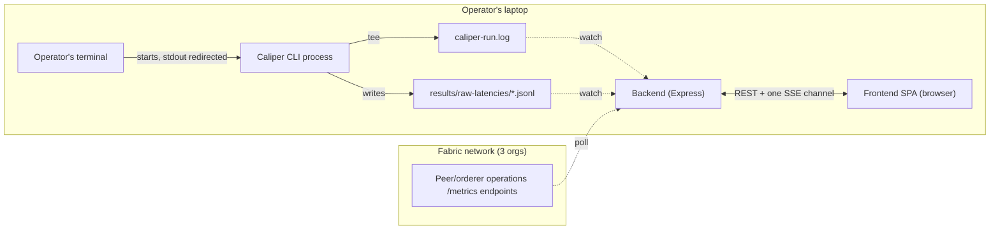

# Architecture Spine — Caliper Performance-Benchmark GUI Dashboard

## Design Paradigm

**Single-aggregator relay.** One backend process is the sole reader of every real data source (the
Caliper CLI's redirected output, the raw-latencies JSONL files, Fabric's operations `/metrics`
endpoints); it fans everything live out over exactly one SSE channel, plus plain REST for
static/read-once data. The frontend never reads any of the three sources itself — it is a pure
consumer of the backend's own contract (AD-4). This exists because a browser tab cannot read local
files or a foreign process's stdout at all, and cannot reliably fetch Prometheus-style endpoints
cross-origin — the aggregator isn't a style choice, it's the only shape that's actually possible.

Layer → directory mapping: `backend/src/watchers/` + `backend/src/poller/` are the aggregator's
three source-observers; `backend/src/stream.ts` is the fan-out; `backend/src/routes/` is the REST
half; `frontend/src/` is the pure-consumer layer, with no code path anywhere in it that touches a
file, a process, or an operations endpoint.



## Invariants & Rules

### AD-1 — Backend relay boundary

- **Binds:** all
- **Prevents:** the frontend attempting to read local files, tail a process, or fetch an
  operations endpoint directly — each of which is either impossible (browser sandboxing) or
  fragile (CORS) for the reasons in Design Paradigm above.
- **Rule:** the frontend never touches Caliper's process, any local file, or any Fabric operations
  endpoint. All three are read exclusively by the backend and reach the frontend only through the
  documented contract (AD-4). `[ADOPTED]`

### AD-2 — Two-process topology

- **Binds:** all
- **Prevents:** collapsing backend and frontend into one framework process (e.g. a single Next.js
  app), which would force the aggregator's long-lived state — a tailed process's log offset, open
  file watchers, a polling loop — to survive a request-response lifecycle and dev-mode hot-reload
  it was never designed for.
- **Rule:** the backend is a standalone, always-running Node process, independent of the
  frontend's build/dev-server process. The frontend never imports backend code directly — only
  the HTTP/SSE contract (AD-4) crosses the boundary. A single start script may launch both, but
  they remain two processes. `[ADOPTED]`

### AD-3 — Caliper observation via file-watching only

- **Binds:** FR-1, FR-2, FR-7
- **Prevents:** the backend spawning or otherwise controlling the Caliper CLI process — which
  would contradict the UX spine's UJ-1 (the operator starts the benchmark from the terminal; the
  dashboard never controls process lifecycle) and the PRD's Non-Goals (no live process control
  surface at all).
- **Rule:** the backend never spawns the Caliper CLI. The operator's own terminal invocation
  redirects stdout to a fixed log path (e.g. `... | tee caliper-run.log`); the backend tails that
  file for FR-7, and watches `qa-tests/performance/results/raw-latencies/*.jsonl` for FR-1/FR-2 —
  the same file-watching mechanism serving both. `[ADOPTED]`

### AD-4 — One relay channel with a literal event schema; REST for everything static and mutating

- **Binds:** FR-1, FR-2, FR-3, FR-4, FR-5, FR-6, FR-7, FR-8
- **Prevents:** independently-built per-concern SSE endpoints, each reinventing its own
  reconnect/backpressure handling; FR-3's topology data being left with no transport at all; and —
  found in review (`reviews/review-adversarial.md`) — the exact class of bug this AD exists to
  prevent (a schema ambiguous enough that two compliant builders produce incompatible payloads).
- **Rule — every SSE event is exactly one of these four shapes, no others, no optional fields
  beyond what's listed:**

  ```text
  { type: "metric-update", context: {scenario, isLive}, throughput, latency, successCount, failureCount }
  { type: "node-status",   context: {scenario, isLive}, nodeId, status: "healthy"|"slow"|"unreachable", resourceUsage: {cpuPct, memPct} | null }
  { type: "log-line",      context: {scenario, isLive}, line, timestamp }
  { type: "heartbeat",     context: {scenario, isLive}, sources: {log: timestamp|null, jsonl: timestamp|null, metrics: timestamp|null} }
  ```

  `context` is present on **every** event type, always — never a subset. `resourceUsage` is
  `null` in its entirety on `unreachable` (never an object with null fields inside); on `slow` or
  `healthy` it is always a populated object, never itself null. `nodeId` is always the identifier
  `topology.ts` assigned that node (AD-7) — `backend/poller` imports and polls by that id, it never
  maintains its own id scheme. `heartbeat`'s `sources` reports each of the three real sources'
  last-activity timestamp independently, so the frontend can mute one dead feed without muting the
  other two. Every event's bytes are captured/timestamped at the moment the backend reads them from
  their source, and `context` is stamped with the singleton's value at that same capture moment —
  never re-read from the live singleton later at emit/flush time (closes the scenario-switch race
  below).

  Static/read-once REST: `GET /api/scenarios` (list), `GET /api/topology` (FR-3, hand-modeled per
  AD-7), `GET /api/history` → `{ runs: [{id, timestamp, tps, latencyP99, ...}] }` (FR-6, **always
  pre-parsed structured JSON, never raw Markdown**), `GET /api/config` → `{ content: string }`
  (FR-8, raw YAML text — this one field is deliberately passthrough, unlike `/api/history`).
  `POST /api/scenario` is the one mutating action in this product; before applying a new
  selection, the backend closes the old scenario's watchers and drains/discards any of their
  already-captured, not-yet-emitted events rather than letting them flush under the new
  selection's context. `[ADOPTED]`

### AD-5 — Backend singleton state, no session model

- **Binds:** all
- **Prevents:** building either per-client session isolation (unneeded — there is never more than
  one operator or one browser window, per the UX spine's Foundation) or a fully stateless design
  that forces the frontend to re-supply full context on every request; the UX spine's persistent
  Idle/Live mode indicator being left with nothing backing it; and two builders independently
  guessing different trigger conditions or wire-consistency rules for that flag (found in review —
  see `reviews/review-adversarial.md`).
- **Rule:** the backend holds exactly two mutable singletons — **selected scenario** and
  **is-live** — which are independent axes, not derived from one another: selecting a scenario
  (`POST /api/scenario`) never by itself changes is-live, and is-live never implies any particular
  scenario is selected. **is-live's exact trigger:** it flips `true` on the first successfully
  *parsed* data record from either watched source (a real JSONL line or log line) — never on mere
  file-existence/open, which fires before Caliper has written anything (AD-3's tail is a
  necessary precondition, not the trigger itself). It flips back `false` when both watched
  sources have been silent past the heartbeat-derived staleness window (AD-6). Both singletons
  are readable over REST (`GET /api/scenario` returns `{ scenario, isLive }`) and that REST value
  and every SSE event's `context` field (AD-4) must always agree — `GET /api/scenario` returns the
  live singleton value at request time, never a cached one, and a page may treat either source as
  authoritative without risk of disagreement. No multi-client/session handling exists anywhere in
  the backend. `[ADOPTED]`

### AD-6 — Streaming resilience

- **Binds:** FR-1, FR-2, FR-4, FR-5, FR-7
- **Prevents:** one flaky data source (a timed-out operations-endpoint poll, a log file that
  doesn't exist yet) crashing the backend or blanking every other live feed; an ad hoc
  reconnect-replay buffer nobody asked for; and a silently-dead stream that looks alive because no
  error was ever thrown.
- **Rule:** every source read/poll is isolated so its own failure degrades only that one data
  point to an explicit unavailable value pushed over the stream (AD-4's exact null-shape per event
  type) — never an unhandled exception, never a dropped connection for unrelated feeds. The
  backend emits a `heartbeat` event (AD-4's exact payload) on a fixed interval regardless of
  whether anything else changed, so the frontend can detect per-source silence without guessing a
  timeout on its own. On any new or reconnected SSE connection, the backend pushes current/future
  state only; there is no backlog replay. `[ADOPTED]`

### AD-7 — Network-topology exclusion (tenant02) and canonical node identity

- **Binds:** FR-3, FR-4, FR-5
- **Prevents:** a future data source or discovery mechanism silently surfacing
  `OrgClient-tenant02`/`peer0.tenant02` — a real, running, but deliberately abandoned and
  previously-hazardous container (PRD §12) — live in front of the examination committee; and,
  found in review, two builders assigning the same node different id schemes (a display id in
  `topology.ts` vs. a real-hostname id in the poller), which silently orphans every `node-status`
  event from ever matching the node it's about.
- **Rule:** topology data is hand-modeled in `backend/topology.ts` to exactly the three
  `TenantChannelGenesis` orgs (`Org1`, `OrgClient-tenant01`, `Org3`) — never derived from a live
  discovery call against the Fabric network that could return a fourth org. `topology.ts` is the
  **single canonical source of every node's `nodeId`** (AD-4's schema); `backend/poller` imports
  that id list and polls/emits by it — it never maintains an independent id scheme (e.g. real
  hostnames) of its own. The "slow" status tier's threshold is keyed on **operations-endpoint poll
  response latency** specifically (not resource usage, not a different metric) — the exact
  threshold value is Deferred, but the dimension it measures is fixed here. Changing the org
  exclusion requires an explicit PRD update, not a code-level judgment call. `[ADOPTED]`

### AD-8 — Localhost-only binding

- **Binds:** all
- **Prevents:** the backend accidentally exposing plaintext Fabric operations metrics and the full
  benchmark config to anyone else on the defense room's network — Express's own default bind is
  `0.0.0.0` (every interface), and this project's own `grounding-gaps.md` (`G-37`) already
  discloses that the operations endpoints it polls carry no TLS/auth themselves.
- **Rule:** the backend's HTTP/SSE server binds explicitly to `127.0.0.1` — never `0.0.0.0`,
  never a real network interface. The frontend reaches it only via `localhost`. `[ADOPTED]`

### AD-9 — Run-mode discipline

- **Binds:** all
- **Prevents:** running either process in dev/watch mode during the actual defense, where an
  unrelated file change or a watcher hiccup could drop the live connection at the worst possible
  moment.
- **Rule:** the defense-day run uses production/built mode for both processes — the backend as a
  plain `node` run of its built output, the frontend as a `vite build` served statically (never
  `vite dev`/HMR). Dev mode is for the two-week build phase only. `[ADOPTED]`

## Consistency Conventions

| Concern | Convention |
| --- | --- |
| Naming (SSE events, REST routes) | SSE `type` values are the literal strings `metric-update`, `node-status`, `log-line`, `heartbeat` — no synonyms. `node-status`'s `status` field is exactly `healthy`/`slow`/`unreachable`. REST routes are noun-plural for reads (`/api/scenarios`, `/api/topology`, `/api/history`, `/api/config`), singular for the one mutation (`POST /api/scenario`). |
| Data & formats | Timestamps are ISO 8601 strings. An unavailable data point is an explicit JSON `null`, never an omitted key or empty string — the frontend must be able to tell "never received" from "explicitly reported unavailable." REST errors are `{ "error": string }` with a matching 4xx/5xx status. |
| Config & paths | Paths to `qa-tests/performance/` and the log-file location are read from backend config (env vars or a single config file) — never hardcoded absolute paths, since this repo can be checked out anywhere. |
| Auth | None. This runs on the operator's own laptop, for the operator alone, for a bounded live demo — no login, no token, no access control anywhere in this product. Made safe to omit by AD-8's localhost-only bind, not by itself. |
| Logging | Backend logs to stdout only — no separate log file of its own, to avoid adding a fourth thing that could fail to write. |
| Passthrough-content confidentiality | FR-6/7/8 pass real project files through byte-for-byte (CLI stdout, `RESULTS.md`, benchconfig YAML) — this dashboard adds no filtering of its own. Safety rests entirely on those source files already being generic-register-clean, per this repo's existing confidentiality discipline; this product must never be the first thing to introduce a real name into content that reaches it, and never adds its own scrubbing logic as a substitute for that discipline. |

## Stack

| Name | Version |
| --- | --- |
| Node.js | 24.x (Active LTS; 22.x Maintenance LTS also acceptable) |
| Express | 5.2.1 |
| React | 19.2.7 |
| Vite | 8.x (8.2 patch line) |
| shadcn/ui | CLI v4, Vite template (`npx shadcn@latest init -t vite`) |
| Tailwind CSS | latest stable, installed by shadcn's Vite template as a direct dependency (per `DESIGN.md`'s own "shadcn/ui on React + Tailwind") |
| TypeScript | latest stable, via the Vite React-TS template |

## Structural Seed

```text
caliper-dashboard/            # new top-level directory in fabric-hris (disclosed exception to
                               # project-context.md's "no frontend stack" rule)
  backend/
    src/
      server.ts                # Express app entry — REST routes + SSE endpoint mount
      watchers/                 # tails caliper-run.log (FR-7) and raw-latencies/*.jsonl (FR-1/2)
      poller/                   # polls each node's operations /metrics endpoint (FR-4/5)
      topology.ts               # hand-modeled 3-org topology (AD-7) — never discovered live
      routes/                  # GET /api/scenarios, /api/scenario, /api/topology, /api/history,
                                # /api/config; POST /api/scenario (REST, AD-4)
      stream.ts                 # the one SSE channel — event fan-out, reconnect handling (AD-4/6)
    package.json
  frontend/
    src/
      pages/                   # one per tab: Dashboard, NetworkProfile, TableList,
                                # Notifications, Configuration — matches EXPERIENCE.md's IA
      components/               # shadcn-based components per DESIGN.md
    package.json
  README.md                    # exact two-process start sequence for a live demo
```

## Capability → Architecture Map

| FR | Lives in | Governed by |
| --- | --- | --- |
| FR-1 Live throughput and latency display | `backend/watchers` (raw-latencies) + frontend Dashboard page | AD-1, AD-3, AD-4, AD-6 |
| FR-2 Live success/failure rate | `backend/watchers` (raw-latencies) + frontend Dashboard page | AD-1, AD-3, AD-4, AD-6 |
| FR-3 Topology visualization | `backend/topology.ts` (`GET /api/topology`) + frontend Network Profile page | AD-1, AD-4, AD-7 |
| FR-4 Live per-node connection/health status | `backend/poller` + frontend Network Profile page | AD-1, AD-4, AD-6, AD-7, AD-8 |
| FR-5 Live per-node resource usage | `backend/poller` + frontend Network Profile page | AD-1, AD-4, AD-6, AD-7, AD-8 |
| FR-6 Historical run browsing | `backend/routes` (REST, reads `RESULTS.md`/`QA6-RESULTS.md`) + frontend Table List page | AD-1, AD-4 |
| FR-7 Live CLI output tail | `backend/watchers` (log file) + frontend Notifications page | AD-1, AD-3, AD-4, AD-6 |
| FR-8 Read-only display of the active benchmark config | `backend/routes` (REST, reads `benchconfigs/*.yaml`) + frontend Configuration page | AD-1, AD-4 |

## Deferred

- **Backend internals below this altitude** (specific file-watching library, middleware
  structure, exact SSE library vs. hand-rolled `ReadableStream`) — implementation detail the code
  will show once it exists; nothing here would let two builders diverge incompatibly.
- **The "Slow" node-status threshold's exact value** (UX spine's own `[ASSUMPTION]`; the dimension
  it measures — operations-endpoint poll latency — is fixed by AD-7) — needs tuning against the
  real network under real benchmark load; not an architectural decision.
- **Table List's optional section filter** (UX spine's own `[ASSUMPTION]`) — a nice-to-have, build
  only if time remains.
- **Formalizing the "no frontend stack" exception** in `project-context.md`/`grounding-gaps.md` —
  a documentation follow-up owned by whoever does the repo-wide handoff, not this spine.
- **This tool's fate after the defense** (PRD §1's "not committed, but worth naming" reuse
  possibility) — explicitly left open; no decision needed now.
