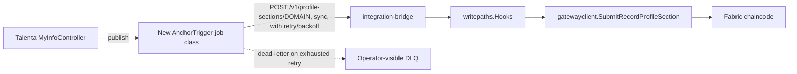

# Architecture Spine — Talenta HRIS × Hyperledger Fabric Write-Path Integration

## Design Paradigm

**Async outbox (Talenta/PHP) → synchronous bridge facade (Go) → ledger.** Talenta owns triggering
and resilience (queue, retry, dead-letter); `integration-bridge` stays a thin, stateless,
synchronous HTTP facade that only validates, computes the digest, and submits to Fabric;
`writepaths`/`gatewayclient` own the ledger-facing mechanics. No layer above the bridge ever
retries — retry authority lives in exactly one place (the new Talenta-side job), because the
bridge itself has no queue and must not gain one (that would create two independent retry
authorities racing each other into the same idempotency key).



## Invariants & Rules

### AD-1 — Retry/resilience authority lives in exactly one place

- **Binds:** FR-1a, FR-12, FR-13
- **Prevents:** two independent retry loops (one in the new Talenta job, one accidentally added to
  `integration-bridge`) racing into the same anchor and producing duplicate or out-of-order
  submissions.
- **Rule:** `integration-bridge` MUST remain purely synchronous, stateless per request, with no
  queue, retry loop, or dead-letter of its own. All retry/backoff/dead-letter logic lives in the
  new Talenta-side job class (FR-1a). The bridge's only contract with its caller is: return
  success, a retryable failure, or a non-retryable business rejection (AD-4) — nothing else.

### AD-2 — `integration-bridge` is the only Fabric-facing write component

- **Binds:** FR-1, FR-1a, FR-2
- **Prevents:** a second, parallel write path being built directly against `gatewayclient` from
  Talenta or anywhere else, splitting digest-construction logic across two call sites.
- **Rule:** All profile-section writes from Talenta reach Fabric through
  `integration-bridge`'s `POST /v1/profile-sections/{DOMAIN}` routes. No new service may call
  `gatewayclient.SubmitRecordProfileSection` directly.

### AD-3 — `recordIdentity` is encoded into the `employeeID` pseudonym, not carried as a separate chaincode field

- **Binds:** FR-3, FR-10, FR-11
- **Prevents:** Family's per-family-member repeating records and Additional Info's per-field
  records from colliding into one meaningless hash chain under the same `profileSection` — while
  respecting a hard constraint found during Reviewer Gate: `RecordProfileSection`'s real signature
  (`fabric-network/chaincode/employeeprofilerecord/chaincode/record_profile_section.go:71-82`) is
  exactly `tenantId, employeeID, profileSection, dataHash, prevHash, updatedBy, ipfsCIDs,
  canonicalizationVersion, hashAlgo, clientTimestamp` — there is no metadata field, and
  `profileSection` is strictly checked against the 5 ratified enum values (`IsValidProfileSection`)
  with no room to append a suffix. Adding a new parameter would be a ratified-schema change (out
  of this spine's authority per `fabric-hris` CLAUDE.md) and was rejected for that reason.
- **Rule:** The on-chain composite key stays exactly `(employeeID, profileSection)` — unchanged
  from today. Where a domain has more than one record per employee, `recordIdentity` is folded
  into `employeeID` itself by deriving a **distinct pseudonym per `(realEmployeeID,
  recordIdentity)` pair**, using the same `keystore`/`ComputeEmployeeID` mechanism the read path
  already uses for the single-record case. Concretely: single-record domains (Personal/Basic Info,
  Employment, Education aggregate, Payroll) pseudonymize on `(employeeID)` alone, exactly as today;
  Family sub-records (tagged `profileSection=PERSONAL`) pseudonymize on `(employeeID,
  familyMemberReferenceID)`; Additional Info sub-records (tagged `profileSection=ADDITIONAL`)
  pseudonymize on `(employeeID, customFieldID)`. Each distinct pseudonym gets its own independent
  hash chain under the existing, unmodified key shape. `integration-bridge` (which already holds
  `keystore` access for the read path) is responsible for this derivation — not the chaincode, and
  not the Talenta-side job, which never sees raw key material. **Genesis sentinel (FR-3):** for the
  first-ever anchor under any pseudonym (no prior anchor exists), `prevHash` MUST be an explicit
  all-zero hash — never null or omitted — so FR-10's verification logic never needs to special-case
  a missing previous hash.

### AD-4 — Route repurposing: `ADDITIONAL` means real Additional Info; Family moves to `PERSONAL`

- **Binds:** FR-2, FR-4, AD-3
- **Prevents:** anchoring real "Additional Info" custom-field values into a slot
  (`write-path-integration/writepaths/writepaths.go:285-293`, `ApproveFamilyDataChange`) whose
  existing doc comment and behavior are actually about Family/dependents data — silently
  mislabeling on-chain history.
- **Rule:** `cmd/integrationbridge/main.go`'s `POST /v1/profile-sections/ADDITIONAL` route MUST
  dispatch to a new `writepaths.Hooks` method for real Additional Info (custom-field values), not
  `ApproveFamilyDataChange`. Family-data writes MUST anchor under `profileSection=PERSONAL` with
  `recordIdentity` per AD-3 — via either a renamed/repurposed method or a new one; `writepaths`
  owns which, since both call `h.anchor(...)` with the same signature regardless.

### AD-5 — Operation type is caller-supplied metadata, never inferred from routing

- **Binds:** FR-4
- **Prevents:** any future contributor adding CREATE/UPDATE/DELETE-specific routes or hooks, which
  would fragment one domain's hash chain across multiple code paths.
- **Rule:** No route or `Hooks` method branches on operation type. The new Talenta-side job
  determines operation type from its own webhook payload/diff (per FR-4's design note) and passes
  it as an explicit field in the POST body. **`operationType` is off-chain metadata only** — the
  chaincode has no field for it (AD-3) and none is added. `integration-bridge` logs it alongside
  the correlation ID (FR-9) in its own request log; it is never written to the ledger. The on-chain
  hash chain proves *what data* changed, not *what kind* of operation produced it — this is a
  disclosed scope limitation of the on-chain guarantee, consistent with the PRD's existing
  Detection Boundary (§9), not a silent gap. **DELETE anchors carry `newValue` populated with the
  record's last-known state before deletion** (decided 2026-08-11) — not an empty/null value — so
  `validate.go`'s existing JSON-object check (`internal/pipeline/validate.go:60-62`) needs no
  change; a DELETE anchor's on-chain payload shape is identical to an UPDATE's, distinguished only
  by the off-chain `operationType` log entry.

### AD-6 — Dedup ownership belongs to the Talenta-side job; the chaincode's own idempotency is a backstop, not the mechanism

- **Binds:** FR-5, FR-9, FR-12
- **Prevents:** a retried anchoring job (AD-1) producing a duplicate chain entry, and — the sharper
  failure found in adversarial review — the Talenta-job engineer and the `integration-bridge`
  engineer each independently assuming the *other* side enforces dedup, so no dedup exists at all.
- **Rule:** The new Talenta-side job generates one correlation ID (FR-9) per logical write at
  enqueue time and includes it, unchanged, on every retry attempt to `integration-bridge`. **Dedup
  enforcement authority belongs to the Talenta-side job, explicitly** — it MUST NOT assume
  `integration-bridge` deduplicates on its behalf, because the bridge is stateless per request by
  design (AD-1) and has no lookup-by-ID store (`writepaths`' `OperationalStore` interface exposes
  only `SaveSection`/`DeleteSection`, no lookup). The exact dedup mechanism on the Talenta side
  (e.g. a `correlationID` uniqueness constraint on the job's own table) is left to Deferred, but
  the *ownership* is not. This is meaningfully backstopped by chaincode-level idempotency that
  already exists independent of this design: `RecordProfileSection` is a verified no-op on an
  identical `(dataHash, prevHash)` pair
  (`record_profile_section_test.go:TestRecordProfileSection_NoOpOnIdenticalDataHash`) — so a
  retried submission of the *same* logical write, even without Talenta-side dedup, does not
  corrupt the on-chain chain. It can still double-write to `writepaths`' operational store
  (`SaveSection`, called before the chaincode submit) — whether that store's writes are themselves
  idempotent on identical input is a `writepaths`-level detail this spine does not resolve; flagged
  in Deferred.

### AD-7 — Four specific `MyInfoController` actions require a *new* trigger call, not extension of an existing one

- **Binds:** FR-1
- **Prevents:** a builder wiring `AnchorTriggerJob` only at the 7 existing `EmploymentUpdateWebhookService::publish()` call sites and shipping with 4 in-scope mutations permanently under-anchored — an easy mistake, since "extend the existing hook" reads as sufficient unless this is called out as its own rule.
- **Rule:** `actionDeletePayroll`, `actionAddComponent` (Payroll), `actionDeleteEmergencyContact`,
  and `actionImportDataEmergencyContact` (Personal) currently have no `publish()` call anywhere in
  their bodies. Wiring `AnchorTriggerJob`'s trigger point requires *adding* a new call in each of
  these four actions, not extending an existing one. This is required for FR-1 to hold, not
  optional hardening.

### AD-8 — FR-10's on-demand verification is a read against the same anchors AD-3 defines, not a separate write path

- **Binds:** FR-10
- **Prevents:** FR-10 being designed later as a parallel path with its own idea of the anchor key,
  drifting from AD-3's pseudonym scheme.
- **Rule:** On-demand verification recomputes the current Talenta DB state's digest for a given
  `(employeeID, profileSection, recordIdentity)` and compares it against the latest anchor at that
  same pseudonym (AD-3) — it MUST resolve the pseudonym the identical way `integration-bridge`'s
  write path does, not via a second derivation. Per the PRD's `[RESOLVED]` deletion-verification
  rule (carried forward here so it isn't lost): when the latest anchor's off-chain `operationType`
  log entry (AD-5) shows DELETE, verification reports "deletion verified" and stops — it does not
  attempt to hash-compare against a DB row that no longer exists. Full design (where this check
  runs, what triggers it) is otherwise Deferred.

## Consistency Conventions

| Concern | Convention |
| --- | --- |
| Cross-boundary request shape | JSON body over HTTP, matching `integration-bridge`'s existing `{employeeInternalID, userID, newValue, document}` shape, extended with `correlationID`, `operationType`, `recordIdentity` (additive per AD-3/AD-5/AD-6 — not yet present in the route today), and the two fields FR-4 mandates that the existing shape has no equivalent for: `companyId` (Talenta's tenant identifier, distinct from `employeeInternalID`) and `sourceEndpoint` (which Talenta API action produced this write, for traceability — logged off-chain alongside `operationType`, same rationale as AD-5) |
| Error taxonomy at the boundary | `integration-bridge` classifies outcomes via existing `classify.go` vocabulary (auth/validation/timeout/partial-failure/success); the new Talenta job maps this to retryable vs. non-retryable per AD-1, never retries a validation/auth rejection |
| Domain naming | `profileSection` string values are exactly the 5 existing `ProfileSection` enum values (`PERSONAL, EMPLOYMENT, EDUCATION, ADDITIONAL, PAYROLL`) — no new values, per AD-4 |
| Identity | `employeeInternalID` is the pseudonymized on-chain identity already computed via `keystore.EmployeeKeyStore` + `gatewayclient.ComputeEmployeeID`. **`integration-bridge` alone computes it** — the Talenta-side job sends the real `employeeInternalID`/`recordIdentity` pair in its request; it never derives or sees the on-chain pseudonym itself (AD-3), since it has no `keystore` access and shouldn't gain any |
| Wire format for new fields (AD-3/AD-5) | `recordIdentity`: bare string, unprefixed (e.g. `"482"`, not `"family:482"`) — the domain context that disambiguates it is the `profileSection` field already on the same request, so a prefix is redundant and only risks the two sides drifting on convention. `operationType`: one of the literal strings `CREATE`, `UPDATE`, `DELETE` (uppercase, matching `dataHash`/`prevHash`'s existing all-caps `profileSection` convention) |

## Stack

| Name | Version |
| --- | --- |
| `integration-bridge` runtime | Go 1.25.9 (existing `go.mod`) |
| `hyperledger/fabric-gateway` | v1.12.0 (existing, pinned) |
| `talenta-core` new job class | PHP / Yii2 (existing app framework — no new language introduced) |

## Structural Seed

```text
talenta-core/
  services/fabric/                      # existing read-path bridge client (unchanged)
  jobs/AnchorTriggerJob.php              # NEW — the async job class (AD-1, FR-1a)
  controllers/api/web/MyInfoController.php  # existing; gains publish()-equivalent calls at the
                                          # 4 currently-unwired actions (PRD FR-1)

integration-bridge/
  cmd/integrationbridge/main.go          # existing routes; ADDITIONAL dispatch target changes (AD-4)
  internal/pipeline/                     # existing validate/auth/classify/dispatch — validate.go
                                          # gains DELETE-shape allowance (AD-5)

write-path-integration/writepaths/
  writepaths.go                          # existing Hooks; gains new Additional-Info method,
                                          # Family call-site change (AD-4)

integration-bridge/
  (keystore-holding layer)               # gains per-(employeeID, recordIdentity) pseudonym
                                          # derivation (AD-3) — chaincode signature and composite
                                          # key (record_profile_section.go, contract.go,
                                          # queries.go) stay UNCHANGED; no ratified-schema work
```

## Capability → Architecture Map

| Capability / Area | Lives in | Governed by |
| --- | --- | --- |
| Write-path trigger (FR-1, FR-1a) | `talenta-core/jobs/AnchorTriggerJob.php` (new) | AD-1, AD-6 |
| Digest + Fabric submission (FR-2) | `integration-bridge` + `writepaths` + `gatewayclient` (existing) | AD-2 |
| Hash-chain key structure (FR-3) | `writepaths.Hooks` / chaincode `RecordProfileSection` call | AD-3 |
| Domain/route mapping (FR-4) | `cmd/integrationbridge/main.go`, `writepaths.go` | AD-4, AD-5 |
| Retry/dead-letter (FR-12, FR-13) | `talenta-core/jobs/AnchorTriggerJob.php` | AD-1 |
| On-demand verification (FR-10) | new component, not yet placed | AD-8, see Deferred |
| Scheduled reconciliation (FR-11) | new component, not yet placed — see Deferred | — |
| Missed-write-trigger coverage (FR-1's 4 gaps) | `MyInfoController.php`'s 4 unwired actions | AD-7 |

## Deferred

- **Reconciliation job's placement and "what changed" source** (FR-11, requiring DB-timestamp-
  derived change detection independent of the trigger) — not designed here; needs its own coaching
  pass. **Interim invariant so this isn't silently violated in the meantime:** whichever component
  ends up owning reconciliation MUST read "what changed" from Talenta's own DB (e.g.
  `updated_date`/row-version columns), never from the Talenta-side job's own success/failure log —
  this constraint is already load-bearing (it's what makes FR-11 catch a suppressed-anchor attack,
  per the PRD's adversarial-review fix) and must not be re-decided differently by whoever designs
  the reconciliation component. **Cadence is also already decided and must not be re-decided
  differently:** hourly for Personal and Payroll, daily for Employment/Education & Experience/
  Additional Info (NFR-7) — not a uniform cadence.
- **Operator-facing dead-letter persistence, not just UI.** FR-13 requires dead-lettered jobs to be
  "visible to operators" and "re-driveable without data loss" — this needs a persisted, queryable
  record (payload, correlation ID, failure reason, attempt count) that survives process restarts,
  independent of whatever UI eventually reads it. Satisfying AD-1's retry logic alone is not
  sufficient if dead-lettered jobs only land in Yii2's default queue table with no correlation-ID
  indexing or redrive semantics — the persistence model itself is deferred, but is a real
  requirement, not only an interface gap.
- **Personal-domain rollout is gated on a Talenta-side fix landing first.** The PRD (§9) elevates
  `POST /my-info/update-identity-address`'s missing `canRequestChangeData` check to a launch
  pre-requisite specifically for the Personal domain — shipping Personal-domain anchoring (which
  AD-3/AD-4 govern in detail: Family's `recordIdentity`, `PERSONAL` routing) before that fix lands
  would anchor an unapproved bypass as "verified" history. This spine does not implement that fix;
  it only records that Personal-domain wiring must not ship ahead of it.
- **Exact idempotency dedup mechanism on the Talenta-side job** (AD-6's ownership is fixed; the
  mechanism — e.g. a `correlationID` uniqueness constraint on the job's own table — is not) — left
  open pending a look at what Yii2's queue infrastructure already offers for this.
- **Whether `writepaths`' `OperationalStore.SaveSection` is idempotent on identical input** — a
  retried anchoring job (backstopped on-chain by `NoOpOnIdenticalDataHash`, AD-6) could still call
  `SaveSection` twice; whether that's safe is a `writepaths`-level detail not resolved here.
- **Persistent salt/key store** for `integration-bridge` (currently in-memory only, a real
  production blocker per the PRD's §13) — out of this spine's scope; it's an existing-component
  hardening task, not new architecture, but must land before production.
- **Operator-facing dead-letter UI/tooling** (FR-13's "visible to operators") — no interface
  designed here; likely a small addition to whatever admin surface Talenta already has.
