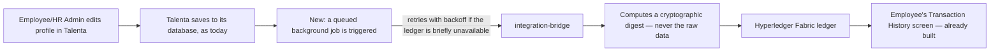

# Solution Design: Talenta HRIS × Hyperledger Fabric Write-Path Integration

## What this integration does

Talenta stores employee-profile data (Personal, Employment, Education & Experience, Additional
Info, Payroll) in its own database, which stays the system of record. This integration adds a
second, independent guarantee on top: every change to that data is anchored as a tamper-evident
fingerprint on a permissioned blockchain ledger (Hyperledger Fabric). Nothing about how HR staff
or employees use Talenta changes. What changes is provable, after the fact: anyone with permission
can confirm a piece of employee data hasn't been altered outside the normal approval process, and
if it has, that tampering is detectable — even though it isn't blocked in real time.

## What's actually being built here (and what already existed)

A common misconception this project corrected mid-design: the "connection to blockchain" already
exists on the Fabric side. A service called `integration-bridge` already accepts write requests
for all 5 domains and submits them to the ledger — built, tested, working. What's missing is
narrower: **nothing in Talenta calls that bridge yet.** This project's actual scope is building that
missing trigger, plus hardening a few real gaps the existing bridge has (no retry logic if the
ledger is briefly unreachable, an in-memory-only key store that loses data on restart, and one
domain-labeling mismatch inherited from earlier work).

## The shape of the solution

Three design principles hold this together:

1. **The blockchain never blocks a save.** If the ledger is down when someone edits their profile,
   the save still succeeds instantly in Talenta. The anchoring happens afterward, in the
   background, with automatic retry. This was a deliberate trade-off: real-time blocking would add
   unpredictable delay to every profile edit and turn the ledger into a single point of failure for
   an unrelated system. The cost is that this design can only *detect* tampering after the fact,
   not *prevent* an already-authorized-looking write in the moment it happens — Talenta's own
   existing approval rules are still what decides whether a write is allowed at all.
2. **No raw personal data ever reaches the ledger.** Salary figures, ID numbers, bank details,
   addresses — none of it is ever written to Fabric. Only a salted cryptographic fingerprint is.
   The fingerprint changes if the underlying data changes, which is exactly what makes tampering
   detectable, without exposing what the data actually is.
3. **Existing components stay in charge of what they already own.** The already-working bridge
   keeps doing exactly what it does today (validate, compute the fingerprint, submit to the
   ledger); the new piece being built lives entirely on Talenta's side, and its only job is
   reliably triggering that existing bridge and handling retries if it doesn't succeed immediately.

## Key decisions and why

| Decision | Why |
| --- | --- |
| Detective, not preventive, tamper-checking | Avoids adding blocking latency or a new failure point to every ordinary profile edit; accepted trade-off, not an oversight |
| New retry/resilience logic lives on the Talenta side, not inside the existing bridge | The bridge is intentionally simple and stateless; putting retry logic in two places would let them race and double-submit |
| Family members' data and Additional Info's custom fields each get their own independent tamper-evidence trail, even though they share a domain label with other data | Otherwise a change to one family member's record and a change to the employee's own basic info would appear to tamper-check against each other, which is meaningless |
| No change to the ledger's own data schema | The schema is a formally ratified design; this integration achieves everything it needs by being clever about how existing fields are used, not by requesting a schema change |
| One specific pre-existing bug in Talenta (an approval check that's skipped on one endpoint) must be fixed before this integration can make a meaningful integrity claim about Personal-domain data | Otherwise the very thing this integration is meant to catch — an unapproved change — would sail through and get faithfully recorded as "verified" |

## What's intentionally not decided yet

A few pieces are correctly left for follow-on work, not because they were missed, but because they
need their own focused design pass:

- **The scheduled "did we miss anything" check** (comparing Talenta's database against the ledger
  daily, or hourly for the two most sensitive domains) — the *rule* that it must check
  independently of the new trigger (so a compromise of one doesn't blind the other) is locked in;
  *where this check lives* is not.
- **How a dead-lettered (repeatedly failed) anchoring attempt is stored and surfaced to an
  operator** — the requirement is locked in; the concrete data model isn't.
- **The exact duplicate-submission safety net** on the Talenta side — the ledger itself already
  has some built-in protection against exact duplicates, which meaningfully reduces the risk here,
  but the Talenta-side mechanism itself isn't finalized.

## Who should read what next

- **Engineers building this** should read `ARCHITECTURE-SPINE.md` (the terse, decision-by-decision
  companion to this document) before writing code — it has the enforceable rules, file:line
  citations, and exact wire-format conventions this document intentionally leaves out.
- **Anyone reviewing scope or timeline** should treat the "Personal-domain launch gate" above as a
  real dependency, not a nice-to-have: shipping Personal-domain anchoring ahead of that Talenta-side
  fix landing would undermine the integration's own core promise for that domain.
