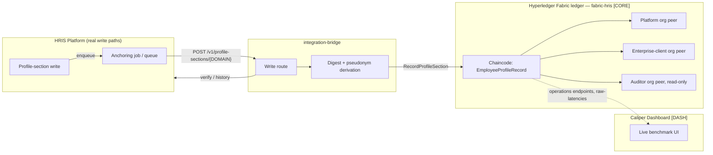

# PRD — fabric-hris: Blockchain-Anchored HRIS Data-Integrity Platform (Combined)

> **What this document is.** A single, top-level reference synthesizing the business features across all three ratified PRDs in this project. It does not replace them — each stays the detailed, ratified record for its own scope, and this document points back to them by ID wherever detail is needed. Read this first to understand the whole; read the originals for full acceptance criteria, BDD scenarios, and technical rationale.
>
> **Sources combined** (all `status: final`):
> - **[CORE]** `prds/prd-fabric-hris-2026-08-02/prd.md` — the founding integrity-anchoring platform
> - **[INT]** `prds/prd-fabric-hris-2026-08-11/prd.md` — the HRIS write-path integration
> - **[DASH]** `prds/prd-fabric-hris-2026-08-10/prd.md` — the Caliper performance-benchmark dashboard
>
> **Status at a glance:** all three source PRDs are `final`, and their core capabilities are built — section-level anchoring with zero on-chain PII, all five HRIS domains wired to real writes, resilient delivery with a real dead-letter/redrive path, and a demonstrable live benchmark dashboard. What's genuinely still open: no dedicated-hardware performance benchmark exists yet (§5 NFR-B/C), end-to-end anchor-metadata traceability doesn't fully hold in the shipped code (§7), and cross-tenant isolation has never been proven against a real second tenant (§7). None of these block the platform's core integrity claim; all are disclosed, not hidden.

## 1. Vision

An HRIS SaaS platform's employee profile data lives in a mutable relational database with no cryptographic way to prove current data still matches the last legitimately-authorized value — a privileged actor can mutate it directly, with no forensic trace. This project adds an **independently-verifiable integrity layer** alongside the existing HRIS, not replacing it:

- Every write to one of five profile-section domains — Personal, Employment, Education & Experience, Additional Info, Payroll — is fingerprinted (salted, keyed digest; zero raw PII) and permanently anchored on a permissioned Hyperledger Fabric ledger, replicated independently across the platform provider, the enterprise client, and a read-only auditor **[CORE]**.
- That anchoring is now wired to a **real HRIS platform's own write paths**, so every authorized profile change is anchored automatically and asynchronously, without ever blocking a live write **[INT]**.
- The whole system's real, live-measured performance is demonstrable through a purpose-built dashboard, turning benchmark evidence from a static table into something a reviewer watches run **[DASH]**.

Core value proposition, unchanged from the founding PRD: **shift the trust basis from "trust the vendor's reputation" to "verify mathematically, independently, at any time."**

**Non-goals, all three sources agree:** this does not replace the HRIS's database as system of record, does not replace existing at-rest encryption, does not store profile data itself on-chain, and never blocks a live write on a Fabric check.

## 2. System composition — how the three efforts compose

**[CORE]** is the ledger and its trust model (3 orgs, per-tenant channels, salted-HMAC pseudonymization, crypto-shredding). **[INT]** is everything that gets a real write from the HRIS platform into `RecordProfileSection` reliably and observably — the piece **[CORE]**'s own PRD assumed would exist but didn't when **[INT]** started (see §7). **[DASH]** is a demonstration/observability surface over the live network and Caliper benchmark output — it does not change how anchoring works, only how its performance is watched.

## 3. Business Features

### 3.A — Core Integrity Platform **[CORE]**

- **Section-level integrity anchoring.** One independent version chain per (employee, profile-section) pair — not per whole profile — so an update to one section never disturbs another's chain, and an auditor can pinpoint exactly which section was tampered with. Writing identical content again is a deliberate no-op (no ledger bloat).
- **Salted, keyed digest scheme.** `DataHash = SHA-256(salt ‖ canonical-JSON)`; identifiers (`EmployeeID`, `UpdatedBy`) are HMAC-derived from a per-employee, independently-random key (`employeeKey_i`) — deterministic for lookup, not reversible without the key, destroyable per-employee without touching anyone else's data. RFC-8785 JSON Canonicalization (JCS) pinned so writer and verifier hash identical bytes.
- **Client-side, evaluate-only verification.** Plaintext never becomes a chaincode argument in either direction. A read-only call returns only `{DataHash, Version, Timestamp, UpdatedBy}`; the caller recomputes and compares locally — a sub-second, peer-local check needing no ordering-service consensus. Callable by the employee, an HR manager, or an auditor, each against their own org's peer.
- **Full forensic history per section**, including identifying the last version whose fingerprint still matched (though recovering the *actual* prior value is explicitly an off-chain-backup concern — the ledger can confirm a candidate value, never reconstruct one).
- **Cryptographic multi-tenant isolation.** One Fabric channel per tenant; cross-tenant reads rejected by MSP channel-membership enforcement, not application logic. Platform, enterprise-client, and auditor orgs each hold an independent ledger copy.
- **Crypto-shredding for right-to-erasure.** A valid deletion request destroys the employee's `employeeKey_i`, salts, and `KEY_EMPLOYEE` — final and unreversible, since no master key exists to derive them from — while on-chain fingerprints are never mutated (they become unidentifiable orphans, with proof-of-erasure recorded for regulatory demonstration).
- **Encrypted supporting-document storage.** Documents (ID cards, diplomas, payslips) are encrypted client-side and pinned to a private IPFS cluster; only the CID reaches the ledger.
- **Regulatory-compliance demonstrability** against Indonesia's PDP Law (UU No. 27/2022) via a tiered, honesty-graded compliance matrix — including explicit "cannot be claimed" rows (DPIA, automatic retention/expiry) rather than overclaiming coverage.
- **Bulk-operation batching.** Mass writes affecting many employees at once (e.g. an annual company-wide salary adjustment) are anchored via batching rather than one anchoring call per employee per section — a scale concern the per-section model would otherwise hit immediately at real HRIS volumes.

**Load-bearing caveat this platform is explicit about:** the system proves **integrity** (data matches its last legitimately-authorized state), not **accuracy** (that the authorized value itself was correct) — and successful tamper detection is not a compliance win in isolation: it *triggers* PDP Law's 72-hour breach-notification obligation, raising the platform's own compliance exposure rather than lowering it.

### 3.B — HRIS Write-Path Integration **[INT]**

- **All five profile-section domains wired to real writes.** Every completed write in the HRIS platform (Personal — including Family and Emergency Contact sub-tabs, Employment, Education & Experience, Additional Info, Payroll) enqueues an anchoring job on the platform's own background-job queue — never synchronously inside the request/response cycle.
- **Per-record pseudonym support.** A repeating sub-record under one employee (a family member, a custom-field entry) anchors and later verifies under its own pseudonym, not the employee's single "self" pseudonym — closing a real collision risk the founding platform's schema didn't originally need to consider.
- **Detective-only authorization (D1).** Fabric is never consulted before a write commits; the HRIS platform's existing role/permission checks are unchanged and continue to gate who can write. Fabric's role is to make every change part of immutable history and make *out-of-band* tampering (a direct DB write bypassing the app entirely) detectable after the fact — explicitly not a defense against an *in-band* write that went through the app but should have been blocked by the app's own rules.
- **On-demand integrity verification.** A caller supplies a current value (or asserts a deletion by omitting it); the system recomputes and compares against the last on-chain anchor, returning verified / compromised / deletion-verified / no-anchor-found.
- **Independent, suppression-resistant reconciliation sweep.** Runs on a schedule, deriving "what changed" from the HRIS platform's own database timestamps — deliberately never from the anchoring job's own success/failure log — so an attacker with direct DB access who also suppresses the anchoring call is still caught.
- **Resilient delivery: retry, dead-letter, and operator redrive.** A job that can't reach the bridge retries with backoff; on exhaustion it dead-letters to a real, restart-surviving, queryable-by-correlation-ID record — not a log line — and an operator can find and re-drive it without losing or duplicating data.
- **Encrypted, persistent key storage.** The bridge's per-record salts and keys survive a process restart (previously in-memory only — a real risk the founding platform's own design didn't anticipate needing to persist independently of its own restart cycle).
- **Backlog observability.** Queue depth (as an anchor-specific attempted/succeeded/dead-lettered counter set) and dead-letter count are real, emitted metrics with a documented alert threshold.
- **Feature-flagged rollout.** Ships behind the HRIS platform's existing feature-toggle mechanism; rollback is a flag flip, since Fabric is never in the synchronous write path.

### 3.C — Performance-Benchmark Dashboard **[DASH]**

Five areas, deliberately **tiered by depth** rather than uniform — a ~2-week build-to-defense timeline meant not every area could be fully live, so depth was allocated to what the examination committee is likeliest to probe (throughput/latency, live network health) over what mainly needs to exist for completeness (historical browsing, raw config display):

- **Live throughput/latency and success/failure display** *(fully live)* for an in-progress Caliper benchmark round, sourced from the same run producing the project's own raw-latency data — no reload, values visibly update within seconds.
- **Live network topology and per-node health/resource view** *(fully live)*, scoped to the network's actual active `TenantChannelGenesis` profile — deliberately excluding the second, abandoned tenant (`tenant02`) even though its peer container is still running, since that tenant crashed production containers twice and isn't part of the network the defense demonstrates against. Reads only existing peer/orderer operations endpoints — no new instrumentation.
- **Historical run browsing** *(static/read-only)* across every previously-collected benchmark scenario, sourced directly from the project's existing results documents (read-once, no new database).
- **Live benchmark-CLI output tail** *(simplified)*, so a reviewer watching a live run sees the same raw process output the operator does.
- **Read-only display of the actual benchmark configuration** *(static/read-only)* driving the current run, byte-for-byte from the real config file — deliberately no live editing or resubmission, judged the riskiest, least-justified scope item for a rehearsed (not improvised) defense.

## 4. Success Metrics

| ID | Predicate | Threshold | Source |
|---|---|---|---|
| P1 ⭐ | Every direct-DB manipulation is detected via hash mismatch | 100% across all five sections | [CORE] — **not yet fully verified, see §7** |
| P2 | Integrity logging doesn't disrupt HRIS write performance | <3s write latency @ 500 TPS | [CORE] |
| P3 | Cross-tenant isolation is cryptographic, not logical | Cross-tenant read denied by MSP | [CORE] — **not yet tested against a real second tenant, see §7** |
| P4 | Regulatory obligations are technically satisfiable | Tiered, honesty-graded matrix — not a blanket claim | [CORE] |
| SM-1 | Dashboard shows real, unmocked live data during a full rehearsal | Pre-defense rehearsal completed | [DASH] |
| SM-2 | All 5 dashboard areas demonstrable on request | Reachable during defense | [DASH] |
| SM-3 | A recorded fallback exists if live demo fails | Rehearsed, switchable within time budget | [DASH] |
| SM-4 | Thesis document includes dashboard-sourced figures | ≥1 figure distinct from results tables | [DASH] |

**Why no [INT]-specific row:** [INT]'s own PRD doesn't define standalone pass/fail predicates the way [CORE] (P1–P4) and [DASH] (SM-1–4) do — its equivalent is the NFR set in §5 below (NFR-A/A1 through NFR-G) plus its own Goals (G1–G8) and Acceptance Criteria (AC-1–8), which read as implementation-verification criteria rather than product-level success metrics. Not an omission; a structural difference between the three source PRDs.

**Counter-metrics (do not optimize at their expense):** [CORE]/[INT]'s write-path latency must not regress from adding anchoring (NFR-A/NFR-A1 below); [DASH]'s build time must not eat into thesis-writing or rehearsal time.

## 5. Non-Functional Requirements (consolidated, deduplicated)

| ID | Requirement | Status | Source |
|---|---|---|---|
| NFR-A | Anchoring write-path latency must not measurably regress the HRIS platform's own write-endpoint p95/p99 | Structurally true (fully async) — **not independently benchmarked** | [CORE] NFR-9, [INT] NFR-1 |
| NFR-A1 | Added write-path latency specifically (added-latency budget, not just "no regression") | **<500ms**, provisional — [CORE]'s own PRD flags this as an initial threshold pending recalibration once a real Caliper run exists | [CORE] NFR-9 |
| NFR-B | End-to-end anchoring latency (enqueue → committed) has a production target | **TBD — open.** Only dev-laptop numbers exist (p95≈26.7s), explicitly disclaimed as non-representative | [CORE] NFR-2/P2, [INT] NFR-2 |
| NFR-C | Throughput sustains real production write volume without unbounded queue growth | **TBD — open**, same benchmarking gap as NFR-B | [INT] NFR-3 |
| NFR-D | Zero raw PII, or any reversible derivative of it, ever reaches the ledger | Verified by design and by a dedicated full-ledger scan tool | [CORE] NFR-3, [INT] NFR-5 |
| NFR-E | Fabric outage never blocks or degrades an HRIS write | True by construction (detective-only, D1) | [INT] NFR-4 |
| NFR-F | Anchoring backlog depth and dead-letter count are monitored, alertable metrics, with a concrete alert threshold (NFR-6a) | Implemented; threshold is a documented default (see §8) | [INT] NFR-6, NFR-6a |
| NFR-G | Reconciliation sweep cadence matches domain sensitivity | [INT]'s own PRD specifies hourly (Personal, Payroll) and daily (Employment, Education & Experience, Additional Info) for **all five** domains — but the **as-built** system only covers Personal/Employment/Payroll (via one shared timestamp column) plus Family sub-records; Education & Experience and Additional Info's underlying tables have no last-modified column at all, so the PRD's own cadence for those two was never actually achievable | [INT] NFR-7 |
| NFR-H | Cryptographic tenant isolation | Enforced via per-tenant Fabric channel + MSP | [CORE] NFR-5/P3 |
| NFR-I | Transport security | mTLS on all peer/orderer/CA endpoints — **peer operations endpoints are a known exception, plaintext-reachable** | [CORE] NFR-6 |
| NFR-J | Verification is interactive (sub-second) | True by construction — peer-local read, no consensus needed | [CORE] NFR-2 |

## 6. Key Constraints & Design Decisions

- **D1 — Detective, not preventive, authorization.** Repeated across [CORE] and [INT]: Fabric never gates a write; it only makes tampering provable after the fact. Any future request to make Fabric block a write in real time is a scope change, not a bug.
- **No chaincode/on-chain schema change was needed** to support the HRIS integration — the 12-field `EmployeeProfileRecord` schema and its 5-domain `ProfileSection` enum from [CORE] mapped 1:1 onto [INT]'s real domains.
- **Four independent key domains, never cross-derived**: Fabric MSP/TLS identity; the HRIS application's own at-rest PII key (out of this project's scope entirely); the per-employee/per-record salt+key domain (`employeeKey_i`, salts); the IPFS document-encryption domain (`KEY_EMPLOYEE`).
- **Second-tenant onboarding is deliberately out of scope and currently abandoned** — the tenant-provisioning tool is flagged as the most dangerous command in this project, having caused a real multi-container crash twice.
- **Two build-blocking gates remain open in [CORE]'s own PRD**, not yet resolved anywhere in this project: PB-1 (the API gateway's own trust-boundary header handling) and PB-3 (pinning one canonical RFC-8785 JSON Canonicalization implementation shared writer/verifier). Any downstream work assuming these are settled should re-check [CORE] §10/PB list first.
- **A pre-existing HRIS-platform auth gap is a launch prerequisite for the Personal domain specifically**: a missing `canRequestChangeData` check on `update-identity-address` means an unauthorized write could reach the Personal domain today — anchoring that write would immortalize the unauthorized change as "verified" history, undermining the exact integrity claim this project makes. [INT]'s own PRD names this as a fix required in the HRIS platform *before* Personal-domain anchoring can be considered a meaningful integrity claim, not merely a nice-to-have.
- **[DASH]'s frontend build was scoped as a bounded, disclosed exception for the defense** (2-week timeline, single-operator/single-screen — no multi-viewer or deployment concern to design for) to this project's general "no frontend stack" posture. Its own PRD deliberately leaves the door open to reusing the live-metrics plumbing as an ongoing tool later — an acknowledged future possibility, not a decided plan, and not yet formalized either way (open question in [DASH]'s own PRD).

## 7. Known Limitations (cross-cutting, carried forward honestly)

These are real, currently open gaps — surfaced here because a reference-level PRD should not let a reader assume more coverage than exists:

- **No dedicated-hardware performance benchmark exists.** Every latency/throughput number in this project comes from a single shared dev laptop, explicitly disclaimed as non-representative. NFR-B/NFR-C above remain TBD until one is run on real, dedicated hardware.
- **End-to-end traceability does not actually hold today — and the design docs said it did.** [INT]'s own PRD names correlation ID / operation type / actor / timestamp as required anchor metadata (FR-9), and a separate architecture decision (AD-5) explicitly claimed `operationType` was "logged in integration-bridge's own request handling." A later verification pass found neither claim holds: `correlationID`, `operationType`, source endpoint, and client-supplied timestamp are all silently dropped at the bridge boundary — useful only within the HRIS platform's own retry/dead-letter bookkeeping, never reaching the bridge's logs or the ledger. This is a documentation-drift issue as much as a missing feature: the design record and the shipped code disagreed, and nothing caught it until this was specifically traced. Disclosed, not fixed, as of this writing.
- **A first-ever anchor's "previous hash" is an empty string, not an explicit all-zero sentinel** — functionally correct and chaincode-tested, but not literally what [INT]'s own acceptance criteria describe.
- **Two regulatory obligations are explicitly "cannot be claimed"** (DPIA under Pasal 34; automatic retention/expiry under Pasal 42) — named in [CORE]'s compliance matrix as research limitations, not silently omitted. Two further legal questions are open, not resolved: whether replicating the ledger to the auditor org counts as a data "transfer" under Pasal 16(1)(e), and whether crypto-shredding (destroying `employeeKey_i` rather than deleting on-chain data) actually satisfies the statutory right-to-erasure — neither has a legal determination behind it yet.
- **Reconciliation's as-built coverage falls short of what [INT]'s own PRD specifies** (see NFR-G above) — Education & Experience and Additional Info were promised a daily cadence but have no reconciliation signal at all, since their underlying tables carry no last-modified timestamp.
- **Cross-tenant isolation (P3) has never been tested against a real second tenant** — the only other tenant this project ever provisioned was abandoned after crashing production containers twice; P3's cryptographic-isolation claim rests on the chaincode/MSP design and unit tests, not a live second-tenant test.
- **P1's "100% across all five sections" was not actually tested across all five at the time [CORE]'s PRD was ratified** — the Additional Info section had never been put through a manipulation-detection test scenario; one more scenario was flagged as required for P1 to genuinely hold as claimed.

## 8. Explicitly Out of Scope

- Replacing the HRIS's database as system of record, or its existing at-rest encryption.
- Any synchronous/blocking Fabric check in a live write path.
- Building a full HRIS, or logging user *activity* (only data fingerprints are anchored).
- Cross-employee history visibility beyond the HRIS platform's own existing permission model.
- Second-tenant onboarding/scaling automation.
- `PayrollComponentController`'s other ~28 actions (bulk cross-employee payroll adjustments, Compensation Planning) and custom-field *definition* CRUD — only custom-field *values* and the specific Payroll write actions named in §3.B are anchored.
- Any legal determination of controller/processor status, or of cross-border-transfer legal basis, under applicable data-protection law.
- Live editing/resubmission of benchmark configuration from the dashboard; any dashboard deployment beyond the local defense machine; multi-viewer dashboard support.
- A formal, numeric backlog-depth production threshold derived from real traffic (NFR-F's current threshold is a documented, defensible starting default — a first, reasoned guess this project had no production traffic history to derive empirically, not an empirically-derived number).

## 9. Glossary

- **Anchor** — a `RecordProfileSection` transaction committing a section's digest to the ledger.
- **Detective control** — catches tampering after the fact; does not prevent it (contrast: preventive control). See D1 below.
- **D1** — this project's ratified decision that Fabric is always a detective, never a preventive, control: it is never consulted before a write commits.
- **Pseudonym / EmployeeID (on-chain)** — an HMAC-derived identifier that reveals nothing about the real employee without the corresponding key.
- **Reconciliation sweep** — a scheduled job independently re-deriving "what should have been anchored" from the HRIS database's own state, not from the anchoring job's own log.
- **Dead-letter** — a job that exhausted its retries and is held for manual inspection/redrive rather than silently dropped.
- **JCS (RFC-8785)** — the JSON Canonicalization Scheme: a standard for producing one deterministic byte sequence from a JSON value, so the writer and a later verifier hash identical bytes even if their own JSON libraries would otherwise format the same data differently.
- **Crypto-shredding** — fulfilling a right-to-erasure request by destroying the decryption key (here, `employeeKey_i`/`KEY_EMPLOYEE`) rather than deleting the underlying on-chain data — the data becomes permanently unreadable/unusable without ever mutating the append-only ledger.
- **`TenantChannelGenesis`** — the Fabric channel-genesis profile defining which orgs/peers belong to the network's one currently-active tenant channel; the dashboard's Network Profile view is scoped to exactly this membership.

## References

- `_bmad-output/planning-artifacts/prds/prd-fabric-hris-2026-08-02/prd.md` — [CORE], full FR-1–37, NFR-1–11, P1–P4
- `_bmad-output/planning-artifacts/prds/prd-fabric-hris-2026-08-11/prd.md` — [INT], full FR-1–13, NFR-1–7a
- `_bmad-output/planning-artifacts/prds/prd-fabric-hris-2026-08-10/prd.md` — [DASH], full FR-1–8, SM-1–4
- `agent-suite/11-execution/grounding-gaps.md` — G-38 through G-43 for the specific evidence behind §7's limitations
- `_bmad-output/implementation-artifacts/sprint-status.yaml` — current build/story status behind [INT]'s features
