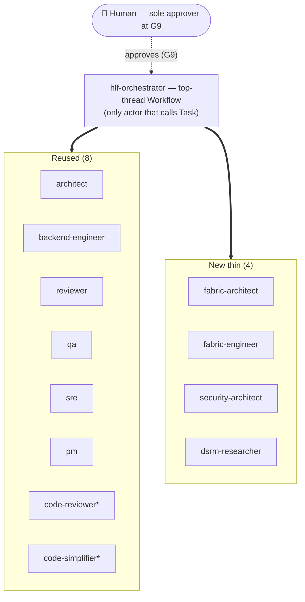
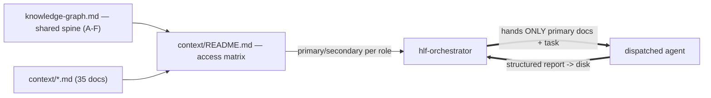

# Multi-Agent Architecture (Deliverable 1)

How the HRIS-on-Fabric agent suite is structured: the **hierarchy**, the **communication model**, the
**context-sharing strategy**, and the **memory strategy**. The *dynamics* — delegation chain, review/
approval loops, failure recovery — live in [`orchestration-and-collaboration.md`](orchestration-and-collaboration.md)
(Deliverable 4); the gate definitions live in [`quality-gates-and-approval.md`](quality-gates-and-approval.md).

> **Design-only boundary:** this architecture *produces the design package*; no prototype application
> code is written before the human approval gate G9 (`[brief: agents-guide.md]`, risk R-05).

## 1. The governing constraint

Claude Code **subagents are one level deep** — a subagent (dispatched via the Task tool) cannot itself
dispatch subagents. The brief's five-tier, ~40-node "AI engineering organization" therefore **cannot**
be realized as a nested agent tree. It flattens to a single pattern the rest of this package already
uses to build itself:

> **one top-thread orchestrator *Workflow* dispatching a flat roster of specialist agents, sequenced
> by DSRM phase, with a blocking verification at every gate.**

The "Engineering Orchestrator" from the brief is that Workflow (`hlf-orchestrator`, see
[`../prompts/`](../prompts/)) — **not** a runtime agent. It is the only actor that calls the Task tool.

## 2. Hierarchy

40 brief-named roles collapse onto **12 operational agents + 1 orchestrator Workflow** (full mapping in
[`../01-agents/agent-catalog.md`](../01-agents/agent-catalog.md)):

- **8 reused** — `architect`, `backend-engineer` (Go + PHP), `reviewer`, `qa`, `sre`, `pm` (files under
  `~/.claude/agents/`) + `code-reviewer`, `code-simplifier` (Claude Code built-in subagent types).
- **4 new thin specializations** — `fabric-architect`, `fabric-engineer`, `security-architect`,
  `dsrm-researcher` (authored into [`../agents/`](../agents/), installed in `.claude/agents/`).

*(`*` = built-in type, not a `~/.claude/agents/` file. Every agent is a leaf — none dispatches another.
Standalone source: [`diagrams/suite-hierarchy.mmd`](diagrams/suite-hierarchy.mmd).)*

Each agent is a **role that binds** a set of skills + context docs + MCP servers to a slice of the DSRM
work (see each spec in [`../01-agents/specs/`](../01-agents/specs/)). Specialization comes from that
binding, not from a new runtime.

## 3. Communication model

Communication is **stigmergic** — agents coordinate through durable artifacts on disk, never through a
direct agent-to-agent channel (which the one-level-deep model forbids anyway):

1. The orchestrator dispatches an agent with a scoped task + its primary context docs.
2. The agent does its work and **returns a structured report**, which becomes a new disk artifact
   (a spec, an ADR, a verify log, a control matrix).
3. The orchestrator — **not** the agent — reads that report and decides the next dispatch.
4. The next agent reads prior artifacts as its input.

There is **no shared mutable runtime state** between agents; the disk is the single source of truth.
This is why every deliverable is a file and every claim carries a citation: the artifacts *are* the
communication bus. Concrete author→critic wiring and the retry/recovery rules are in
[`orchestration-and-collaboration.md`](orchestration-and-collaboration.md).

## 4. Context-sharing strategy

The knowledge base is large (35 context docs + the spine); handing every doc to every agent would blow
context windows and invite the drift risk R-02. Instead:

*(Standalone: [`diagrams/context-sharing.mmd`](diagrams/context-sharing.mmd).)*

- **The spine.** [`../11-execution/knowledge-graph.md`](../11-execution/knowledge-graph.md) is the one
  index of actors → PII entities → services → Fabric capabilities (D1–D15) → security frames → DSRM
  phases. Every agent reasons against it, so 12 agents and 35 docs stay mutually consistent.
- **Scoped handoff.** The [`../context/README.md`](../context/README.md) access matrix binds each agent
  role to only its `●` primary docs (`○` secondary on demand). The brief's rule — "each agent must
  reference only the context documents relevant to its role" — is enforced here.
- **No duplication.** Shared concepts live in one home and are cross-referenced, never copied
  (`AUTHORING-CONTRACT.md §7`). The Fabric knowledge stays in the 8-skill suite; context docs point to it.

## 5. Memory strategy

Three tiers, matched to lifetime:

| Tier | Mechanism | Holds | Lifetime |
|------|-----------|-------|----------|
| **Working** | the orchestrator Workflow's own run (agent reports in-flight) | this gate's intermediate results | one gate run |
| **Project (durable)** | the `agent-suite/` files themselves + the status board | the whole design package — every spec, ADR, matrix, verify log | the project |
| **Cross-session** | serena memories + `.remember/` + the `remember` skill | decisions, gotchas, "why" that isn't in the code | across sessions |

Durability rule: **anything another agent or a future session needs must be written to disk**, because
there is no persistent shared memory between subagent runs. Assumptions are never held in a head — they
are tagged `[ASSUMPTION]` and tracked in [`../11-execution/grounding-gaps.md`](../11-execution/grounding-gaps.md);
decisions are recorded as ADRs. The status board in [`../README.md`](../README.md) is the durable record
of gate progress.

## 6. Why this shape (design rationale)

- **Modular** — each agent is independently replaceable; adding a capability = adding one role binding.
- **Reusable** — 8 of 12 agents and ~28 of ~35 skills are reused unchanged; the suite orchestrates
  existing tooling rather than reinventing it.
- **Scalable** — the flat roster + stigmergic bus has no nesting limit; the orchestrator fans out as
  wide as the concurrency cap allows.
- **Safe** — every gate embeds an adversarial verify (a separate agent trying to *falsify* the author);
  the design-only boundary holds until G9. This is the same machine that produced this document.
