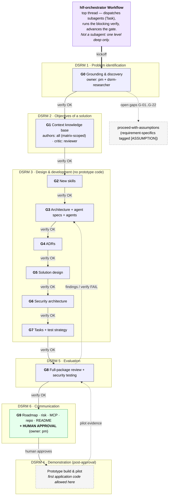
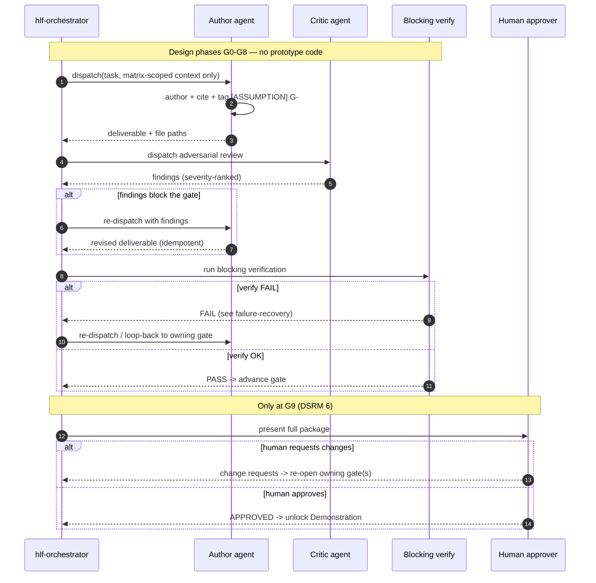
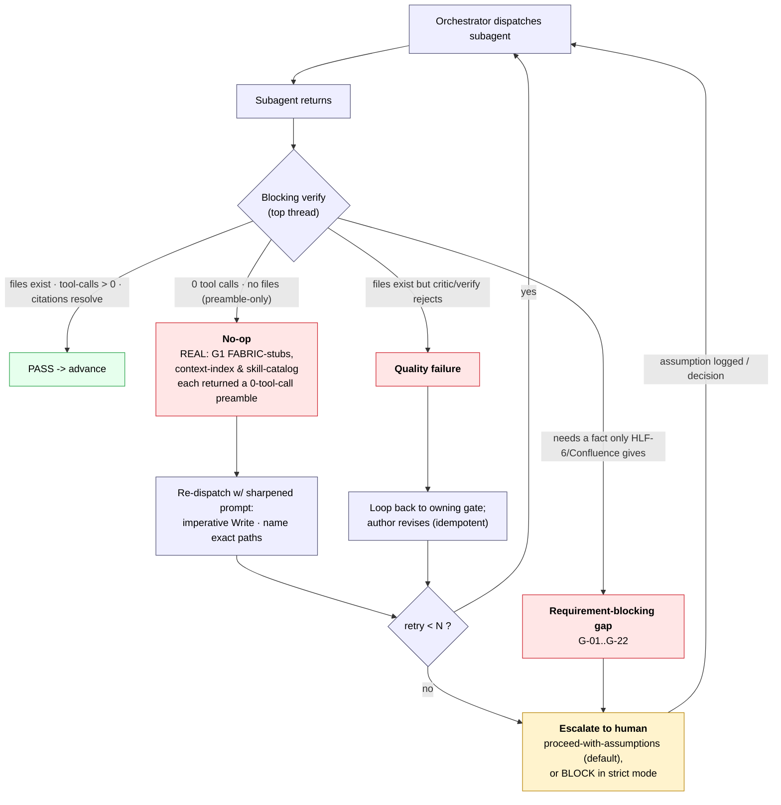

# Orchestration & Collaboration — how the agents work together

> **Deliverable.** Brief Deliverable 4 (Agent Collaboration) `[brief: agents-guide.md §4]`: which agent
> starts first, the delegation chain, orchestration logic, feedback loop, review loop, approval flow,
> failure recovery, and retry mechanism. It also carries the Deliverable-1 items that are *behavioural*
> rather than structural — communication model, context-sharing, memory, delegation & escalation rules.
>
> **Cross-reference, do not restate.** The roster and its per-agent contracts live in
> [`../01-agents/`](../01-agents/); the six DSRM activities are defined in
> [`../context/DSRM.md`](../context/DSRM.md); the gate table + status board live in
> [`../README.md`](../README.md); the agent→context access rules live in
> [`../context/README.md`](../context/README.md); the shared factual spine is
> [`../11-execution/knowledge-graph.md`](../11-execution/knowledge-graph.md) (Layer F maps DSRM→gates).
> This document wires those together into a runtime; it repeats none of them.
>
> **Citation classes** (same as the package): `[brief: …]` = the project brief · `[code: …]` = a real
> repo fact · `[docs: …]` = the pinned Fabric 2.5 corpus · **[ASSUMPTION] (gap G-##)** = a
> requirement-shaped specific tracked in [`../11-execution/grounding-gaps.md`](../11-execution/grounding-gaps.md).

---

## 0. The one constraint that shapes the whole design

Claude Code **subagents are one level deep**: a dispatched subagent (`Task` tool) **cannot itself
dispatch subagents**. The brief's "Engineering Orchestrator" therefore **cannot** be a runtime agent —
if it were a subagent it could not delegate to anyone, and if it delegated at the top thread it would
not be an agent at all.

**Resolution.** The Engineering Orchestrator is realized as the **`hlf-orchestrator` Workflow** — a
**top-thread pipeline** (the same shape as this package's own gate workflows), *not* a runtime subagent.
The top thread is the only actor that may call `Task`; every other agent is a leaf that reads, authors,
and returns. This is why the operational roster below is **12 flat agents + 1 workflow**, and why every
delegation arrow in this document originates at the top thread.

> Everything downstream — the delegation chain, the review loop, the failure recovery — is a consequence
> of this single fact. The orchestrator does not "manage" agents at runtime; it **sequences gated
> dispatches** and runs the blocking verification between them.

---

## 1. Operational roster — ~40 brief roles collapse onto 12 agents

The brief names ~40 roles across nine divisions `[brief: agents-guide.md §2]`. Recreating them one-for-one
would multiply maintenance surface and drift (risk **R-02** in [`../10-risk/risk-register.md`](../10-risk/risk-register.md))
and violate the reuse mandate `[brief: agents-guide.md]`. They collapse onto **8 reused org agents +
4 new thin specializations**. The Engineering Orchestrator collapses onto the Workflow (§0), not an agent.

| # | Operational agent | Kind | Brief roles it realizes |
|---|---|---|---|
| — | **`hlf-orchestrator` (Workflow)** | top-thread pipeline | Engineering Orchestrator |
| 1 | **`pm`** | REUSED | Executive coordination · Confluence Publisher · Technical Writer (coordination) · gate bookkeeping |
| 2 | **`dsrm-researcher`** | NEW (thin) | DSRM Research Assistant · Literature Reviewer · Experiment Planner · Evaluation Report Generator |
| 3 | **`architect`** | REUSED | Solution Architect · Principal Software Engineer · ADR Writer · System/C4/sequence design |
| 4 | **`fabric-architect`** | NEW (thin) | Hyperledger Fabric Architect · Fabric Network Designer · Performance Optimizer (ledger) |
| 5 | **`fabric-engineer`** | NEW (thin) | Smart Contract Engineer · Blockchain Integration Engineer · Ledger Data Modeling · on-chain DB |
| 6 | **`backend-engineer`** | REUSED | Senior Go Engineer · Senior PHP Engineer · REST API Engineer · off-chain DB · Integration Engineer · API Documentation Writer · Debugger |
| 7 | **`security-architect`** | NEW (thin) | Security Architect · Cryptography Specialist · Privacy Engineer · Threat Modeling · OWASP Reviewer · Security Reviewer (author) · Security Testing (design) |
| 8 | **`reviewer`** | REUSED | Reviewer Agent · Architecture Review · Root Cause Analysis Agent |
| 9 | **`code-reviewer`** | REUSED (Claude Code built-in) | adversarial diff/code critic (post-G9 code; design-phase artifact critique via `code-review`) |
| 10 | **`code-simplifier`** | REUSED (Claude Code built-in) | Refactoring Agent |
| 11 | **`qa`** | REUSED | Test Strategy · Test Spec Writer · Unit/Integration Test Generator · Performance Test Engineer · Security Testing (execution) |
| 12 | **`sre`** | REUSED | Docker Engineer · Kubernetes Engineer · CI/CD Engineer · deployment/ops |

> **Design-only boundary (risk R-05).** In gates G0-G8 the engineering agents (`fabric-engineer`,
> `backend-engineer`) and `qa` produce **design artifacts, templates, and strategy only — no prototype
> application code, no chaincode, no test code**. The first line of application code is written in the
> DSRM Demonstration phase, **after** the human approval at G9 `[brief: agents-guide.md]`.

---

## 2. Which agent starts first, and the delegation chain

**First movers: `pm` + `dsrm-researcher` at G0.** DSRM is *problem-centered* `[context: DSRM.md]`, so the
pipeline opens with the two agents who frame the problem, not with a builder. `pm` opens the gate and owns
the status board; `dsrm-researcher` frames the problem and objectives and seeds
[`../11-execution/knowledge-graph.md`](../11-execution/knowledge-graph.md) + the grounding-gaps register.
Because the product docs (Jira **HLF-6**, Confluence) are unreachable here, G0 also fixes the operating
mode — **proceed-with-assumptions** — that every later gate inherits (gap **G-01**, risk **R-01**).

The delegation chain then runs one gate at a time. Each row is a **single orchestrator dispatch cycle**
(dispatch → author → critic → blocking verify → advance); the DSRM column is the authoritative mapping
from [`knowledge-graph.md` Layer F](../11-execution/knowledge-graph.md).

| Gate | DSRM activity | Lead author(s) | Adversarial critic | Blocking verify checks |
|------|---------------|----------------|--------------------|------------------------|
| **G0** | 1 · Problem | `pm` + `dsrm-researcher` | `reviewer` | knowledge-graph + gaps + risk register exist; repos & corpus grounding confirmed |
| **G1** | 2 · Objectives | all authors, **matrix-scoped** | `reviewer` | 35 context docs exist; FABRIC stubs point to skills; 0 unresolved `[VERIFY]`; every `[ASSUMPTION]`→gap |
| **G2** | 3 · Design | `dsrm-researcher`, `security-architect` | `reviewer` | 3 new skills installed; each SKILL.md has a negative boundary naming its sibling (R-03) |
| **G3** | 3 · Design | `architect`, `fabric-architect` | `reviewer` | agent catalog + specs; skills named resolve to real skills; access matrix consistent |
| **G4** | 3 · Design | `architect` (+ `fabric-architect`, `security-architect`) | `reviewer` | each ADR ratifies/revises a working assumption; links its gap ID |
| **G5** | 3 · Design | `fabric-architect`, `fabric-engineer`, `backend-engineer` | `code-reviewer`, `reviewer` | data-model + integration seam cite `[docs:]`/`[code:]`; no on-chain plaintext PII (G-02) |
| **G6** | 3 · Design | `security-architect` | `fabric-security-review` (skill) + `reviewer` | 7 frames covered; controls trace to capabilities D1-D15; CWE/ASVS mappings sourced (R-04) |
| **G7** | 3 · Design | `qa`, `pm` | `reviewer` | task breakdown + test **strategy** (no test code); each task traces to a design artifact |
| **G8** | 5 · Evaluation | `reviewer`, `code-reviewer`, `qa`, `security-architect` | cross-check (peers review peers) | full-package consistency (R-02); citation integrity; can send any deliverable back to its gate |
| **G9** | 6 · Communication | `pm` | **human approver** | roadmap · risk · MCP · repo · README complete; **human sign-off** |
| post-G9 | 4 · Demonstration | `fabric-engineer`, `backend-engineer`, `sre` | `qa`, `code-reviewer` | prototype exercises anchor/verify; pilot evidence re-enters G8 |

**Why Demonstration (DSRM 4) comes *after* Communication (DSRM 6).** DSRM's activities iterate rather than
run strictly in order `[context: DSRM.md]`. This package treats the **design package itself** as the DSRM
artifact under evaluation (G8), publishes and gets it approved (G9), and only then builds the prototype
that demonstrates it — honoring the no-code-before-approval boundary. Pilot evidence loops back into G8.

### Orchestration flow

*Source: [`diagrams/orchestration-flow.mmd`](diagrams/orchestration-flow.mmd).*

---

## 3. Orchestration logic, communication, context & memory

The `hlf-orchestrator` Workflow is **a pipeline of phase-gates, each embedding a blocking verification**.
A gate is not "done when the author returns" — it is done when a **deterministic verify step in the top
thread** confirms the work physically exists and is well-formed. This turns a probabilistic dispatch into
a gated, resumable state machine.

**Anatomy of one gate** (identical at every gate; see the sequence diagram in §4):

1. **Dispatch** — the top thread calls `Task`, handing the agent **only its primary (`●`) context docs**
   from the access matrix ([`../context/README.md`](../context/README.md)), plus the gate's exit criteria.
2. **Author** — the leaf agent reads, invokes its skills, writes deliverables to fixed paths, cites
   sources, tags every requirement-specific `[ASSUMPTION] (gap G-##)`, and returns file paths.
3. **Critique** — the top thread dispatches an **adversarial critic** (§4) against the fresh output.
4. **Blocking verify** — the top thread runs a deterministic check (files exist, tool-calls > 0,
   citations resolve, 0 unresolved `[VERIFY]`, assumptions tracked to gaps).
5. **Decide** — PASS advances the status board in [`../README.md`](../README.md); FAIL routes to §5.

**Communication model — no agent-to-agent channel.** Because subagents cannot spawn or message peers
(§0), agents never talk to each other directly. All coordination is **stigmergic**: an agent writes an
artifact to disk; the next agent reads it. The top thread is the only router. This is why the delegation
chain is a chain, not a mesh.

**Context-sharing — least-context by matrix.** Each agent receives only the docs its role needs
`[brief: agents-guide.md §5]`, enforced by the `●`/`○` matrix in [`../context/README.md`](../context/README.md).
`●` docs ship by default; `○` docs are added on demand. This keeps prompts small and prevents cross-role
contamination.

**Memory strategy — one durable spine, ephemeral workers.** Agents are stateless across dispatches; the
**durable memory is the filesystem**, anchored by the single shared index
[`../11-execution/knowledge-graph.md`](../11-execution/knowledge-graph.md) (the one home for the PII
inventory, capability map, and traceability chains). Every doc cites that spine instead of restating it
(risk **R-02**). A re-dispatched agent rebuilds its working state by re-reading the same deterministic
inputs — which is exactly what makes retry safe (§5).

**Delegation & escalation rules (summary).**
- **Delegate down** by gate ownership (the table in §2); never skip a gate.
- **Route away, don't overreach** — an agent that hits work outside its lane leaves it for the owning
  agent's gate rather than doing it (e.g. `fabric-architect` defers chaincode data-encoding to
  `fabric-engineer`; `backend-engineer` defers on-chain modeling to `fabric-engineer`).
- **Escalate up** to the human when (a) a gap is requirement-blocking (only HLF-6/Confluence can answer),
  or (b) bounded retries are exhausted (§5). Everything else stays inside the pipeline.

---

## 4. Feedback loop & review loop — the author→critic adversarial pattern

Every deliverable in this package is produced by an **author** and then challenged by a **separate
adversarial critic** before its gate can pass. The author optimizes for completeness; the critic
optimizes for finding what is wrong. Separating the two roles is the package's core quality mechanism and
the practical realization of the brief's "feedback loop" and "review loop."

| Artifact class | Author | Adversarial critic | What the critic hunts |
|---|---|---|---|
| Context docs (G1) | matrix-scoped authors | `reviewer` | citation rot, duplication, `[VERIFY]` leaks |
| New skills (G2) | `dsrm-researcher`, `security-architect` | `reviewer` | missing negative boundary / sibling overlap (R-03) |
| Architecture & ADRs (G3-G4) | `architect`, `fabric-architect` | `reviewer` | unstated assumptions, ungrounded decisions |
| Solution design (G5) | `fabric-engineer`, `backend-engineer` | `code-reviewer` + `reviewer` | on-chain PII leak, seam failure modes (G-02) |
| Security architecture (G6) | `security-architect` | `fabric-security-review` skill + `reviewer` | hallucinated CWE/ASVS/Fabric specifics (R-04) |
| Full package (G8) | all | peers cross-review | whole-package inconsistency (R-02) |
| Prototype code (post-G9) | `fabric-engineer`, `backend-engineer` | `code-reviewer`, `qa` | defects, missing tests, drift from design |

The loop is bounded: findings go back to the **same author**, who revises in place (idempotent overwrite)
until the critic is satisfied **and** the blocking verify passes.

*Source: [`diagrams/review-approval-loop.mmd`](diagrams/review-approval-loop.mmd).*

---

## 5. Approval flow — the human gate at G9

There is exactly **one human approval gate: G9** (DSRM 6 · Communication). Gates G0-G8 are
machine-verified; the human is not asked to approve intermediate artifacts, only the **assembled package**
(roadmap, risk register, MCP architecture, repo structure, README). This concentrates human attention at
the single most consequential decision — **whether to authorize prototype construction** — and keeps the
design-only boundary intact until then (risk **R-05**).

- **Approve** → unlocks DSRM 4 (Demonstration): the engineering agents may now write code.
- **Request changes** → the top thread re-opens the specific owning gate(s); the loop in §4 reruns; the
  package returns to G9.
- **Assumption ratification** happens here too: the human can close grounding-gaps by decision (recorded
  in [`../11-execution/grounding-gaps.md`](../11-execution/grounding-gaps.md)), converting `[ASSUMPTION]`
  rows into ratified facts and re-opening any deliverable they touched.

---

## 6. Failure recovery & retry

The blocking verify (§3 step 4) is also the failure detector. It classifies a returned dispatch into one
of three failure modes and routes each back into the pipeline. Retries are **bounded (< N)** and
**idempotent** (a re-dispatched agent overwrites its own partial output, reading the same deterministic
inputs from the spine), so recovery never corrupts state.

| Failure mode | How verify detects it | Recovery |
|---|---|---|
| **No-op** (preamble-only) | agent returned prose but **0 tool calls / no files on disk** | **re-dispatch with a sharpened, imperative prompt** — "You MUST call Write", "return only after files exist", enumerate exact target paths |
| **Quality failure** | files exist but critic rejects / citation broken / `[VERIFY]` leak / duplication / gap untracked | **loop back to the owning gate**; author revises against findings |
| **Requirement-blocking gap** | deliverable needs a fact only HLF-6/Confluence can supply | **escalate to human**; default is proceed-with-assumptions (tag, log gap G-##, continue) |

### Evidence — the real no-op incidents this build hit

The no-op failure mode is **not hypothetical; this very build hit it and recovered.** During **G1**
(context knowledge-base construction), three separate dispatches — the agents tasked with writing the
**FABRIC-\* context stubs**, the **context index / access-matrix README**, and the **skill-catalog** —
each returned a confident *"I'll now read the sources and create the files…"* **preamble with zero
`Write`/`Edit` tool calls**, leaving nothing on disk. A naive orchestrator that trusts the agent's
narration would have marked G1 complete over three empty deliverables.

The **blocking verify caught all three** by a file-existence + tool-call check (narration is not
evidence; a file on disk is). Each was **re-dispatched with a sharpened prompt** that made the write
imperative and named the exact target paths — and produced the real files on the retry. Those files now
exist and are cited throughout this package. This incident is the empirical justification for making the
verify step *blocking and deterministic* rather than trusting agent self-report, and it is the reason
retry #1 is always "sharpen the prompt, re-dispatch" rather than "escalate."

*Source: [`diagrams/failure-recovery.mmd`](diagrams/failure-recovery.mmd).*

---

*Traceability: realizes brief Deliverable 4 (+ behavioural items of Deliverable 1)
`[brief: agents-guide.md §4, §1]`. DSRM→gate mapping from
[`knowledge-graph.md` Layer F](../11-execution/knowledge-graph.md); roster from
[`../01-agents/`](../01-agents/); access rules from [`../context/README.md`](../context/README.md);
gate table from [`../README.md`](../README.md); risks R-01/R-02/R-03/R-04/R-05 from
[`../10-risk/risk-register.md`](../10-risk/risk-register.md); grounding mode + gaps G-01..G-22 from
[`../11-execution/grounding-gaps.md`](../11-execution/grounding-gaps.md).*
