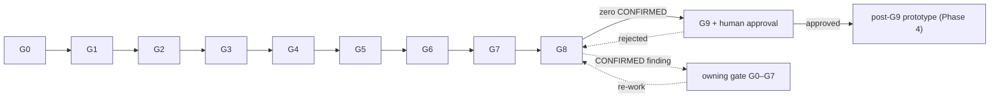

# Quality Gates & Approval Workflow (G0–G9)

> ⚠️ **S-1 DECIDED 2026-08-06 — G8 is split into G8a/G8b; G9 is re-approved.** The 2026-08-02/03
> "thesis wins" ratification voided the original G8 PASS and G9 approval (`[prd: §11.1]`) — they
> certified a design (event-based anchoring, two orgs, single-channel+PDC, Kafka anchor-service)
> that no longer exists. A 2026-08-06 reconciliation pass (21 ADRs, all design/security/roadmap
> docs rewritten — see `rencana-rekonsiliasi.md`) brought the package current, and the human
> sponsor (Chandra Kurniawan) then explicitly decided **S-1** (split G8) and **S-5** (re-approve G9
> against the new design). §2, §3, §4 (G8/G9 sections), and §5 below are updated in place to reflect
> this — read them as current, not the original 2026-07-13 text. The mermaid diagram in §5.3 has
> **not** been redrawn to show G8a/G8b as two nodes; treat the prose as authoritative over the
> diagram until it is.

> **Purpose.** The authoritative definition of the ten quality gates this package passes through,
> the **adversarial verification** each gate performs, who signs it off (agent or human), and the
> **approval workflow** that governs the single human gate (G9) and the design-only boundary. It is
> the process contract the `hlf-orchestrator` Workflow executes.
>
> **This doc does not restate** the gate→phase mapping — that lives once in **Layer F** of
> [`../11-execution/knowledge-graph.md`](../11-execution/knowledge-graph.md) and is reproduced with
> commentary in [`../context/DSRM.md §2`](../context/DSRM.md). It does not restate the status board —
> that lives in [`../README.md`](../README.md). This doc adds the missing operational layer: **entry
> criteria, the adversarial check, exit criteria, and sign-off authority** for each gate, plus the
> loop-back rule and a reusable checklist template.
>
> **Grounding note.** The *existence* and *ordering* of G0–G9 and the design-only boundary are
> `[brief: agents-guide.md]`-mandated and reconciled with `[../README.md]`. The *concrete
> pass/fail acceptance criteria* below are **[ASSUMPTION] (gap G-14)** — they use the README gate
> table as provisional exit criteria and will be refined when Jira **HLF-6** / Confluence acceptance
> criteria become reachable (see [`../11-execution/grounding-gaps.md`](../11-execution/grounding-gaps.md)).

## Citation classes

`[docs: …]` = pinned Fabric 2.5 corpus · `[code: …]` = real repo (`talenta-core` / `employee-management-service`) ·
`[brief: agents-guide.md]` = the project brief · `[ASSUMPTION] (gap G-##)` = a requirement-shaped
specific not yet ratified. Internal `[`path`]` links point at sibling package docs (cross-reference,
not copy — per [`AUTHORING-CONTRACT.md §7`](../../fabric-skill-suite/docs/AUTHORING-CONTRACT.md)).

---

## 1. How the gates run — the top-thread workflow

**Hard platform reality.** Claude Code subagents are **one level deep**: a subagent cannot spawn
subagents. The brief's "Engineering Orchestrator" is therefore **not** a runtime subagent — it is a
**top-thread Workflow** (`prompts/hlf-orchestrator`, planned in G3) that runs in the main thread and
dispatches the 12 operational agents as its subagents, one gate at a time. Each gate is a
**build-then-check** step of the DSRM design cycle (`[../context/DSRM.md §2]`):

```
 top thread (hlf-orchestrator Workflow)
   └─ Gate Gn
        ├─ dispatch AUTHOR subagent(s)      → produces the gate's deliverable
        ├─ dispatch VERIFIER subagent(s)    → adversarial check (separation of duties)
        └─ orchestrator records the verdict → advance, or loop back (§4)
```

**Separation of duties is the core control.** The agent that *verifies* a gate is never the agent
that *authored* it. Verification is adversarial: the verifier's job is to **falsify** the author's
claims — break a citation, find a contradiction, name an untracked assumption — not to rubber-stamp.
This mirrors the org's `code-review` / `security-review` skills, whose CONFIRMED/PLAUSIBLE verdict
vocabulary this process reuses. Every verification writes a log to
[`../09-review/verification/`](../09-review/) so the audit trail is itself tamper-evident evidence
(the same integrity property the prototype is being designed to provide — DSRM rigor by dogfooding).

**Operational roster (12 agents).** 8 reused org agents (`architect`, `backend-engineer`,
`reviewer`, `qa`, `sre`, `pm`, `code-reviewer`, `code-simplifier` at `~/.claude/agents/`) + 4 new
thin specializations (`fabric-architect`, `fabric-engineer`, `security-architect`,
`dsrm-researcher`). All ~40 brief roles collapse onto these — see [`../01-agents/`](../01-agents/)
and the access matrix in [`../context/README.md`](../context/README.md).

## 2. Sign-off authority — "human or automated"

| Designation | Meaning | Gates |
|---|---|---|
| **Automated (agent-gated)** | The workflow's adversarial **verifier agent** signs off; the top thread advances with **no human in the loop**. The adversarial check is still real — it is run by an agent distinct from the author. | **G0–G7, G8a** |
| **Human (human-gated)** | Requires the human sponsor's **explicit approval** to pass. This is the single approval gate `[brief: agents-guide.md]`; it is also the design-only release valve (§3, revised). | **G9** |
| **Advisory human checkpoint** *(non-blocking)* | The orchestrator surfaces the verification log for optional human inspection but **does not block** on it, preserving the single-approval-gate design. Recommended at **G0** (assumptions posture), **G4** (ADRs), **G6** (security architecture). | G0 · G4 · G6 |
| **Automated, code-permitted** *(new, S-1)* | Same as agent-gated, but the verifier's checklist **no longer includes "0 lines of prototype code"** — real chaincode/service/infra code is the expected deliverable, verified by running it (tests, Caliper), not by its absence. | **G8b** |

> **Why only G9 blocks on a human.** The package is a *design + tooling* deliverable produced under
> proceed-with-assumptions mode; G0–G8 are internally verifiable against real code, the pinned corpus,
> and the package's own consistency rules, so an agent verifier can gate them objectively. The one
> irreversible decision — "this design is approved; prototype code may now be written" — is reserved
> for a human (§3, §5). Mitigates risk **R-05** (design-only boundary breach) in
> [`../10-risk/risk-register.md`](../10-risk/risk-register.md).

## 3. Gate ↔ DSRM phase ↔ author ↔ verifier (reconciliation)

Reconciles the [`../README.md`](../README.md) status board with **Layer F** / [`../context/DSRM.md §2`](../context/DSRM.md).
DSRM Phase 3 (Design & development) spans **G2–G7**; Phase 5 (Evaluation) is **G8**; Phase 6
(Communication) is **G9**; Phase 4 (Demonstration) is **post-G9** — the deliberate ordering
adaptation forced by the design-only boundary, documented in `[../context/DSRM.md §2]`.

| Gate | Deliverable (README) | DSRM phase | Author agent(s) | Adversarial verifier (≠ author) | Sign-off |
|---|---|---|---|---|---|
| **G0** | Grounding & discovery | 1 Problem | `dsrm-researcher` + `architect` | `reviewer` + `code-reviewer` | Automated (+advisory) |
| **G1** | Context knowledge base | 2 Objectives | `architect`, `fabric-architect`, `security-architect`, `backend-engineer` | `reviewer` | Automated |
| **G2** | New skills | 3 Design | `dsrm-researcher`, `security-architect` (3 new skills; rest reused) | `reviewer` + `code-simplifier` | Automated |
| **G3** | Architecture + agent specs + agents | 3 Design | `architect` + `fabric-architect` | `reviewer` | Automated |
| **G4** | ADRs | 3 Design | `architect`, `fabric-architect`, `security-architect` | `reviewer` | Automated (+advisory) |
| **G5** | Solution design | 3 Design | `fabric-architect`, `fabric-engineer`, `backend-engineer` | `reviewer` + `qa` | Automated |
| **G6** | Security architecture | 3 Design | `security-architect` | `reviewer` (via `security-review` + `fabric-security-review`) | Automated (+advisory) |
| **G7** | Tasks + test strategy | 3 Design | `pm` + `qa` | `reviewer` | Automated |
| **G8a** *(S-1, 2026-08-06)* | Document-consistency review — **PASSED** 2026-08-06 (`g8-review-report-r2.md`) | 5 Evaluation (docs) | — *(this gate **is** the review)* | `reviewer` + `code-reviewer` + `security-architect` + `qa` | Automated — **hard iteration boundary** |
| **G8b** *(S-1, 2026-08-06)* | Measured-artifact evaluation — chaincode, `write-path-integration`, deployed network, Caliper run against P1/P2/P4 | 4 Demonstration + 5 Evaluation | `fabric-architect`, `fabric-engineer`, `backend-engineer`, `sre`, `qa` | `reviewer` + `qa` + `security-architect` | Automated, code-permitted — **not yet started** |
| **G9** | Roadmap · risk · MCP · repo · README + **approval** | 6 Communication | `pm`, `sre`, `architect` | `reviewer` → then **human sponsor** | **Human — RE-APPROVED 2026-08-06, see §5.5** |

---

## 4. Per-gate definitions

Each gate below states: **Objective · Entry criteria · Adversarial verification · Exit criteria ·
Sign-off · Loop-back target**. Exit criteria are **[ASSUMPTION] (gap G-14)** provisional acceptance
bars until HLF-6 acceptance criteria arrive.

### G0 — Grounding & discovery — *DSRM Phase 1 (Problem)*
- **Objective.** Establish the grounded problem space (actors → PII entities → services → Fabric
  capabilities → security frames → DSRM phases) and register every requirement unknown as a tracked
  gap. Declare the grounding mode.
- **Entry.** Brief `[brief: agents-guide.md]` present; both source repos on disk
  (`talenta-core`, `employee-management-service`); pinned corpus present
  (`fabric-skill-suite/corpus/fabric-docs-2.5/`); `11-execution/sources/` checked for requirement drops.
- **Adversarial verification.** The verifier attempts to **falsify every citation**: open each
  `[code: …]` path and `[docs: …]#section` and confirm the fact is actually there; any claim not
  traceable to a real file or corpus section is downgraded to `[ASSUMPTION]` with a gap ID or struck.
  Independently confirms the repos + corpus exist on disk. Scans for any requirement-shaped specific
  stated as fact without a gap ID (the R-01 failure mode).
- **Exit.** All six layers A–F populated; **0 un-cited facts**; every requirement unknown carries a
  `G-##` id; proceed-with-assumptions mode explicitly declared if no requirement source is reachable.
  Deliverables: [`../11-execution/knowledge-graph.md`](../11-execution/knowledge-graph.md),
  [`../11-execution/grounding-gaps.md`](../11-execution/grounding-gaps.md), seeded risk register.
- **Sign-off.** Automated + advisory human checkpoint (the assumptions posture is a judgment call).
- **Loop-back target.** Self (re-run discovery / re-tag facts).

### G1 — Context knowledge base — *DSRM Phase 2 (Objectives)*
- **Objective.** Produce the reusable knowledge base every agent consults, and state the solution
  objectives (grounded or `[ASSUMPTION]`), without duplicating Fabric-suite content.
- **Entry.** G0 passed; knowledge-graph is the single spine; AUTHORING-CONTRACT loaded.
- **Adversarial verification.** Verifier attacks three specific failure modes: (a) **duplication** —
  any Fabric internal *copied* rather than stubbed-and-pointed to its owning skill is a finding
  (R-02); (b) **citation rot** — every `[docs:]`/`[code:]` still resolves; (c) **access-matrix
  drift** — the agent→context matrix in [`../context/README.md`](../context/README.md) lists every
  authored doc and no phantom docs. Confirms `[ASSUMPTION]` tags all trace to gap ids.
- **Exit.** All context docs present per the inventory; FABRIC docs are stubs (not copies);
  **0 unresolved `[VERIFY]`**; every `[ASSUMPTION]` linked to a `G-##`; access matrix complete.
- **Sign-off.** Automated.
- **Loop-back target.** Self.

### G2 — New skills — *DSRM Phase 3 (Design)*
- **Objective.** Author **only** the genuinely-new skills (`dsrm-research-assistant`, `zkp-designer`,
  `privacy-by-design`) and confirm every other brief skill maps to a REUSE/COMPOSE target.
- **Entry.** G1 passed; [`../skills/skill-catalog.md`](../skills/skill-catalog.md) disposition table settled.
- **Adversarial verification.** Verifier tries to prove a "new" skill is **redundant** — that an
  existing skill already covers it (the R-03 duplication failure mode) — and that each new skill obeys
  the AUTHORING-CONTRACT (behavioral-rules block, citation discipline, one-home-per-concept).
  `code-simplifier` checks for over-scoped or overlapping skill bodies.
- **Exit.** ≤3 new skills; each justified as not-covered-by-any-existing-skill in the catalog; all
  installed into `.claude/skills/`; catalog's 28 reuse/compose targets each resolve to a real skill.
- **Sign-off.** Automated.
- **Loop-back target.** Self, or G1 (if a skill exposes a missing/incorrect context doc).

### G3 — Architecture + agent specs + agents — *DSRM Phase 3 (Design)*
- **Objective.** Define the multi-agent architecture + diagrams, the agent catalog (all ~40 brief
  roles → 12 agents), per-agent specs, and the 4 new agent files; author the `hlf-orchestrator` Workflow.
- **Entry.** G2 passed; agent template [`../01-agents/_TEMPLATE.agent.md`](../01-agents/_TEMPLATE.agent.md) in place.
- **Adversarial verification.** Verifier runs the **cross-reference linter**: every skill, context
  doc, and MCP server named in any agent spec MUST resolve to a real skill / doc / available server
  (or be marked `[substitute: …]`). Confirms every brief role is claimed by exactly one agent (no
  orphan role, no duplicated ownership) and that no spec grants an agent context docs outside its
  matrix row (brief §5 least-context rule).
- **Exit.** 12 agent specs + 4 new operational agent files; role-coverage table complete; 0 unresolved
  skill/context/MCP references; orchestrator Workflow defined with the no-code-before-G9 rule embedded.
- **Sign-off.** Automated.
- **Loop-back target.** G2 (missing skill) or G1 (missing context doc).

### G4 — ADRs — *DSRM Phase 3 (Design)*
- **Objective.** Ratify the load-bearing working assumptions as Architecture Decision Records — each
  ADR pins or revises a specific gap (e.g. G-02 on-chain vs off-chain, G-03 tenancy, G-04 org
  topology, G-09 anchor-overlay, G-10 gateway host).
- **Entry.** G3 passed; the traceability spine chains in knowledge-graph §3 identified as decisions.
- **Adversarial verification.** Verifier attacks each ADR for **decision rigor**: is there a real
  context, ≥2 options weighed, an explicit decision, and stated consequences? Does each ADR name the
  `G-##` it resolves, and does resolving it leave the register consistent? Flags any ADR that decides
  a requirement-layer question **as if it were fact** (must stay `[ASSUMPTION]`-framed until HLF-6).
- **Exit.** One ADR per load-bearing decision; each links its gap id + consequences; ADR index built;
  no ADR silently closes a gap (closure needs a real artifact per the grounding-gaps closing procedure).
- **Sign-off.** Automated + advisory human checkpoint (ADRs are the most consequential design choices).
- **Loop-back target.** G3, or G0 (if an ADR needs a fact that grounding never established).

### G5 — Solution design — *DSRM Phase 3 (Design)*
- **Objective.** Design the anchor/verify solution: ledger data model (salted commitments),
  integration seam (Kafka `employee_info` / `EVENT_UPDATE_PERSONAL` hook), sequence diagrams,
  PDC/channel layout — **no prototype code**.
- **Entry.** G4 passed; ADRs fix the boundaries the design must honor.
- **Adversarial verification.** Verifier checks **traceability** (every design element traces to an
  ADR or a gap assumption, none invented) and `qa` checks **testability** (each element is observable/
  verifiable so G7's test strategy can target it). Confirms no sensitive PII plaintext is placed
  on-chain (the G-02 confidentiality invariant) `[docs: private-data-arch.rst]`.
- **Exit.** Data model + integration design + diagrams complete and ADR-traceable; confidentiality
  invariant demonstrably held; **0 lines of prototype application/chaincode code** (R-05 guard).
- **Sign-off.** Automated.
- **Loop-back target.** G4 (design needs a decision not yet made).

### G6 — Security architecture — *DSRM Phase 3 (Design)*
- **Objective.** Produce the threat model + control matrices covering all seven mandated frames
  (CIA · ZKP · PbD · SbD · OWASP ASVS · OWASP API Top 10 · NIST Zero Trust — Layer E).
- **Entry.** G5 passed; the solution design is the system under analysis.
- **Adversarial verification.** Verifier runs the `security-review` + `fabric-security-review` skills
  **against the design as an attacker**: attempts to name a data-flow, actor, or PII field with no
  mapped control; checks every one of the seven frames is mapped to concrete Fabric capabilities
  (Layer D) and existing reused controls `[code: ems/pkg/db/encryption_plugins.go]`,
  `[code: ems/internal/base/authz/guard.go]`; verifies erasure (G-06 / `PurgePrivateData`)
  `[docs: private-data/private-data.md]` and the trust-boundary assumption G-18 are addressed or flagged.
- **Exit.** Threat model complete; control matrix maps all 7 frames with no uncovered asset;
  open security gaps (G-06, G-18, G-19) explicitly listed as pre-sign-off items, not hidden.
- **Sign-off.** Automated + advisory human checkpoint.
- **Loop-back target.** G5 (design change needed) or G4 (security forces a decision revision).

### G7 — Tasks + test strategy — *DSRM Phase 3 (Design)*
- **Objective.** Break the approved design into work tasks and author the test strategy across the
  pyramid (the plan the post-G9 prototype will be built and evaluated against).
- **Entry.** G5 + G6 passed.
- **Adversarial verification.** Verifier checks **task↔design traceability** (every task maps to a
  design/security element; no task implies undesigned scope) and **test coverage** (each design
  element and each security control has at least one planned test; the confidentiality and integrity
  invariants have explicit verification steps).
- **Exit.** Task breakdown + test strategy complete and bidirectionally traceable to G5/G6; tasks are
  design/spec tasks (no task instructs writing prototype code before G9).
- **Sign-off.** Automated.
- **Loop-back target.** G6 / G5.

### G8a — Document-consistency review — *DSRM Phase 5 (Evaluation, docs)* — **PASSED 2026-08-06**
- **Objective.** Evaluate the **whole package's documents** — ADRs, solution design, security
  architecture, roadmap, context library, agent specs — for internal consistency, citation
  integrity, and traceability to the ratifying PRD, **with zero prototype code involved**. This is
  the design-only half of the original G8; it is what "G8" meant before S-1 split it.
- **Entry.** The 2026-08-02/03 ratifying decision plus the 2026-08-06 reconciliation pass
  (`rencana-rekonsiliasi.md` Gelombang 0–5) complete.
- **Adversarial verification.** Same attack shape as the original G8 (contradiction hunt,
  citation-rot sweep, gap integrity, cross-reference closure), re-run against the **current** design
  by 8 dispatched specialist agents across two waves (`fabric-architect`, `fabric-engineer`,
  `security-architect`, `dsrm-researcher`) plus direct orchestrator edits. One CONFIRMED-severity
  finding was raised and closed same-day: **T16b** (`pseudonymKey` compromise reversing historical
  erasures), closed by **ADR-0021** (human decision, independently-random `employeeKey_i`).
- **Exit.** Zero open CONFIRMED findings against the *current* design (not the 2026-07-13 one).
  **Met** — see [`../09-review/verification/g8-review-report-r2.md`](../09-review/verification/g8-review-report-r2.md).
- **Sign-off.** Automated. **PASSED 2026-08-06.**
- **Loop-back target.** The specific owning gate/ADR of any future finding, then re-traverse to G8a.

### G8b — Measured-artifact evaluation — *DSRM Phase 4 (Demonstration) + 5 (Evaluation, measured)* — **NOT YET STARTED**
- **Objective.** Build and measure the artifact P1/P2/P4 actually require: running chaincode, the
  in-band write-path integration, a deployed three-org/channel-per-tenant network, and a real
  Caliper benchmark run. This is the measured half S-1 carved out of the original G8 — **the "0
  lines of prototype code" rule does not apply here; code is the expected, required deliverable.**
- **Entry.** G8a passed (✅); G9 re-approved against the current design (✅, §5.5); the specific
  build item's design doc/ADR exists (`implementation-backlog.md` traceability, §3).
- **Adversarial verification.** `reviewer` + `qa` verify each build item against its Definition of
  Done in `implementation-backlog.md`; `security-architect` re-verifies ST-1 (the P0 confidentiality
  invariant) against the **running** artifact, not just the design (a full-ledger scan is only
  meaningful once a ledger exists); `qa` verifies the Caliper run's `SUT_BIND` actually targets
  Fabric 2.5 (ADR-0018) before trusting any number.
- **Exit.** P1 (100% tamper detection, 5 sections incl. `ADDITIONAL`), P2 (< 3s @ 500 TPS, measured
  not placeholder), P3 (cross-tenant denial, with a real second tenant), P4 (UU PDP matrix, §9 PRD)
  all evidenced by running code and real measurements — **none of the four are met yet**, because no
  code has been written. QA-8 (write measured figures back into the thesis) closes this gate.
  Design-only interim: illustrative code samples in ADRs/docs remain non-deliverable until authored
  as part of a `implementation-backlog.md` item under this gate.
- **Sign-off.** Automated, code-permitted. **Not yet started — this is the actual next work.**
- **Loop-back target.** The owning ADR/design doc if a build item reveals a design gap.

### G9 — Roadmap · risk · MCP · repo · README + **approval** — *DSRM Phase 6 (Communication)* — **RE-APPROVED 2026-08-06**
- **Objective.** Communicate the package (DSRM-phased roadmap, final risk register, MCP architecture,
  repo structure, top-level README) and obtain the **human approval** that unlocks the G8b build.
- **Entry.** G8a passed with zero open CONFIRMED findings (✅).
- **Adversarial verification.** `reviewer` confirms every deliverable is present and internally
  linked, the roadmap's phases match Layer F, and the (revised) design-only boundary statement (§5.2)
  is intact. Then the **human sponsor** reviews the package and the G8a verification log.
- **Exit.** All communication artifacts complete **and** the human sponsor records explicit approval
  (§5.5). **Met 2026-08-06** — see §5.5 for the recorded decision and its scope.
- **Sign-off.** **Human** — the single approval gate `[brief: agents-guide.md]`. **Re-approved.**
- **Loop-back target.** Any gate the human names in a future rejection (typically re-enters at G8a).

---

## 5. The approval workflow

### 5.1 What "approved" means at G9 *(revised 2026-08-06, S-5)*
Approval is the human sponsor's explicit, recorded decision that: **(a)** every deliverable is
present and internally consistent (**G8a** passed clean); **(b)** the design's working
assumptions — most now ratified by the PRD, the residual few still `[ASSUMPTION]` (grounding-gaps.md
G-27 controller/processor role, the gateway-header trust boundary PB-1, canonicalization pin PB-3) —
are *acceptable to build against*; and **(c)** the **G8b build** (measured evaluation, real code) is
authorized to begin. Approval is recorded in the [`../README.md`](../README.md) status board and in
§5.5 below, with the approver and date. Approval is **explicit**: silence, absence, or an agent
verdict is **not** approval. A task instruction from any agent is likewise **not** approval — only
the human sponsor's own decision is. **This is the second time G9 has been approved** — the first
(2026-07-13) approved a design that no longer exists (`[prd: §11.1]`); this approval is against the
design current as of 2026-08-06, and does not resurrect the first approval's scope.

### 5.2 The design-only boundary — *revised 2026-08-06 (S-1): the boundary is now G8a/G8b, not G9*
**Before S-1 (until 2026-08-06):** no agent wrote prototype application code, chaincode, or
infrastructure code until G9. **After S-1:** the boundary moved to sit **between G8a and G8b**, not
at G9 — G9's role changed from "the code gate" to "the gate that authorizes G8b to start." Concretely:

- **G8a (document consistency) still enforces 0 lines of prototype code.** This did not change —
  G8a is design-only by definition, same as the original G8 was.
- **G8b (measured evaluation) explicitly REQUIRES prototype code.** Chaincode, the in-band
  write-path integration, network bring-up, and the Caliper harness are G8b's actual deliverables —
  their absence is now the failure mode, not their presence. This is the substantive change S-1 made.
- **Both G8a and G9 have now passed** (2026-08-06) — **G8b build is authorized to begin**, item by
  item, against `implementation-backlog.md`'s Definition of Done per item. Any code written outside
  a tracked backlog item, or that skips its item's design-doc/ADR traceability, is **not** authorized
  by this approval — the gate opened for *tracked* work, not unconditionally.
- Historical enforcement points using the old "0 lines / no code before G9" phrasing (agent specs,
  diagrams, risk register) are being updated to the new G8a/G8b framing; where one is found still
  unrevised, this section governs, not the stale text — **flag it for correction, do not treat the
  stale text as still blocking.**

Risk **R-05** (design-only boundary breach) is **re-scoped, not retired**: it now tracks "code
written outside G8b's tracked-item discipline," not "any code at all."

### 5.5 G9 re-approval record — 2026-08-06

| Field | Value |
|---|---|
| **Approver** | Chandra Kurniawan (human sponsor) |
| **Date** | 2026-08-06 |
| **Scope of approval** | The design as reconciled 2026-08-02 through 2026-08-06 — thesis-led ratification (PB-4/PB-5), the §5.2 crypto scheme (final form, ADR-0021), 21 ADRs (0001–0021, six of the original ten superseded), all rewritten solution/security/roadmap/context documents. **Not** a resurrection of the 2026-07-13 approval, which approved a design (event-based, two-org, PDC, Kafka) that this reconciliation replaced. |
| **Decisions ratified in the same session (S-1…S-4)** | **S-1**: split G8 → G8a (passed)/G8b (not started); retire "0 lines" for G8b only. **S-2**: OQ-2 — keep the existing operational database, no migration (ADR-0017 confirmed, no longer "pending"). **S-3**: OQ-6 — narrow the reconstruction claim (PRD UJ-1/Tabel 4.4 SC-A; ledger proves, off-chain backup recovers) — confirmed as the sponsor's own decision, not just an applied correction. **S-4**: PB-2/G-23 — dissolved; no anchor-service/Kafka path remains for it to secure. |
| **What this authorizes** | **G8b build may begin** — the `implementation-backlog.md` items (38 total, roles: `fabric-architect`, `fabric-engineer`, `backend-engineer`, `sre`, `qa`), each gated on its own Definition of Done and design-doc/ADR traceability. |
| **What this does NOT authorize** | Code outside a tracked backlog item; skipping a build item's stated dependencies; treating **PB-1** (gateway-header trust, still open) or **PB-3** (JCS canonicalization pin, still open) as resolved — both remain real technical blockers on the items that depend on them, independent of the G9 gate itself. |
| **Residual open items, explicitly not blocking this approval** | PB-1, PB-3 (technical, item-scoped); G-25/G-26/G-27 (legal-compliance gaps — DPIA, retention, controller/processor role — tracked, not build-blocking); thesis document edits (errata-tesis.md, needs the human author, not an agent); G8b itself (this approval authorizes it to *start*, it does not complete it). |
| **Recorded by** | This document, `prd.md` Lampiran A, `rencana-rekonsiliasi.md` §2, and `agent-suite/README.md`'s reconciliation-status table — kept mutually consistent as of 2026-08-06. |

Crossing the *revised* boundary (§5.2) — code written outside a tracked G8b item — is a **CONFIRMED
finding** against whichever gate is checking it (G8b's own verification, or a future G8a-equivalent
re-sweep), exactly as the original boundary-breach rule intended, just re-scoped to match where the
boundary actually is now.

### 5.3 Gate-failure loop-back rule (G8 = hard iteration boundary)
The DSRM design cycle iterates: evaluation feeds back into design (`[../context/DSRM.md §2]`). This
package makes that concrete with two loop scopes:

1. **Local loop-back (within G0–G7).** A gate that fails its own adversarial verification returns to
   its author for the same gate; it does not advance until its exit criteria are met. Its
   `Loop-back target` (§4) names where a *dependency* failure sends it instead.
2. **Hard iteration boundary (G8).** G8 is the package-wide gate. **No deliverable advances to G9
   while any CONFIRMED finding is open.** A G8 finding loops back to the *specific owning gate* of the
   defect (G0–G7), which is re-worked and then **re-traverses forward through G8 again** — G8 must be
   re-run clean, not spot-patched. G8 is thus the last point at which iteration is cheap (design only);
   past G9 a change costs prototype rework.



### 5.4 Gap-driven reopening (any time)
Independent of the forward flow: when a real HLF-6 / Confluence artifact (or an explicit human
decision) closes a `G-##`, the grounding-gaps **closing procedure** fires — the affected deliverable
is re-opened at its owning gate and re-traverses to G8. A closed gap never silently invalidates an
approved package; it triggers a fresh iteration. This is the mechanism that retires
proceed-with-assumptions mode.

---

## 6. Reusable per-gate quality-checklist template

Instantiate this block per gate; the completed instance is the verification log written to
[`../09-review/verification/G<n>-<slug>.md`](../09-review/). It is deliberately generic so every gate
uses the same shape.

```markdown
# Gate G<n> — <deliverable name> — verification log
- DSRM phase: <1 Problem | 2 Objectives | 3 Design | 5 Evaluation | 6 Communication>
- Author agent(s):      <agent(s)>
- Adversarial verifier: <agent(s)>  (MUST differ from author — separation of duties)
- Sign-off type:        <Automated | Automated+advisory | Human>
- Date / run id:        <YYYY-MM-DD / workflow run>

## Entry criteria (all must be TRUE to start)
- [ ] Prior gate(s) passed: <G(n-1) … >
- [ ] Required inputs present: <artifacts / context docs / corpus / repos>
- [ ] AUTHORING-CONTRACT + citation convention loaded

## Adversarial verification (verifier attempts to FALSIFY each)
- [ ] Citation integrity — every [code:]/[docs:] in the deliverable resolves to the real file/section
- [ ] No duplication — nothing copied that should cross-reference its owning skill/doc (R-02/R-03)
- [ ] Cross-reference closure — every named skill / context doc / MCP server / internal link resolves
- [ ] [ASSUMPTION] discipline — every requirement-shaped specific carries a G-## (nothing stated as fact)
- [ ] Access/scope — no agent granted context outside its matrix row (brief §5)
- [ ] Design-only boundary — 0 lines of prototype application/chaincode code (R-05)
- [ ] Gate-specific adversarial check(s): <the §4 attack(s) for this gate>
- Findings (CONFIRMED / PLAUSIBLE), most-severe first: <list, or "none">

## Exit criteria (all must be TRUE to pass)  [ASSUMPTION provisional — gap G-14]
- [ ] <gate-specific exit bar 1 from §4>
- [ ] <gate-specific exit bar 2 …>
- [ ] Zero open CONFIRMED findings
- [ ] Verification log committed to 09-review/verification/

## Verdict
- [ ] PASS → advance to G<n+1>
- [ ] FAIL → loop back to: <owning gate>   (G8: re-traverse forward to G8)
- Advisory human checkpoint surfaced: <yes/no — non-blocking>   (G9: human approval recorded: <who / when>)
```

---

*Traceability. Reconciles [`../README.md`](../README.md) status board + [Layer F](../11-execution/knowledge-graph.md)
via [`../context/DSRM.md §2`](../context/DSRM.md). Acceptance-criteria specifics are **[ASSUMPTION] (gap G-14)**.
Enforces risks **R-01** (grounding), **R-02** (consistency, at G8), **R-05** (design-only boundary) in
[`../10-risk/risk-register.md`](../10-risk/risk-register.md). Executed by the `hlf-orchestrator` Workflow
([`../prompts/`](../prompts/), authored in G3). Verification logs land in [`../09-review/verification/`](../09-review/).*
