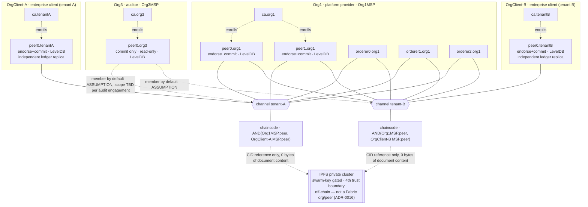

# Fabric Network Design — HRIS PII-anchoring prototype

Instantiates the accepted ADRs into a concrete Hyperledger Fabric 2.5 topology. **Design only** — no
crypto material is generated and no network is stood up before G9. Maintains the confidentiality
invariant (INV-1/FR-31): only per-section digests + non-PII metadata + document CIDs ever reach the
ledger.

> Depth on each Fabric concept: see the owning skill (`fabric-network-architect`,
> `fabric-identity-security`) and `context/FABRIC-*.md`. This doc is the concrete instantiation, not a
> re-explanation. Instantiates **ADR-0012** (three-org consortium, platform-operated ordering),
> **ADR-0013** (channel-per-tenant), **ADR-0005** (MSP/NodeOU/attributes — org names updated only),
> **ADR-0007** (LevelDB), **ADR-0016** (IPFS private cluster — pointer only, not part of the Fabric
> network itself).

## 1. Organizations & MSPs (ADR-0012, ADR-0013)

| Org | MSP ID | Role | Operated by | Channel membership |
|-----|--------|------|-------------|---------------------|
| **Org1** | `Org1MSP` | Platform provider — owns the HRIS write path that triggers `RecordProfileSection`; hosts the ordering service | SaaS platform vendor | Every tenant channel |
| **`OrgClient-<tenantID>`** (the "Org2" role, instantiated once per tenant — ADR-0013) | `OrgClient-<tenantID>MSP` | Enterprise client — independent co-endorser, holds its own independent ledger replica | Enterprise client, **client-operated** — not the platform vendor | Exactly that tenant's own channel |
| **Org3** | `Org3MSP` | Auditor — independent, read-only verifier; does **not** endorse | Auditor — operator not fixed by any ratified requirement (`**TBD**`, ADR-0012) | Every tenant channel by default (`[ASSUMPTION]`, gap G-03 residual — see ADR-0013) |

There is **no separate ordering org**: Org1 both hosts endorsing/committing peers *and* operates the
entire ordering service (§2). This differs from the prototype's earlier design, which used a 4th,
purely-ordering `OrdererOrg` — that separation is dropped; the ratified topology is **three**
organizations, not four `[prd: §5.1]`.

NodeOUs enabled (`client`/`peer`/`admin`/`orderer`) so roles are asserted by OU `[docs: msp.rst]`; the
HRIS-role → attribute mapping shape is unchanged from **ADR-0005** — only the org names it is
instantiated against have changed (`HROrgMSP`/`AuditOrgMSP` → `Org1MSP`/`OrgClient-<tenantID>MSP`/`Org3MSP`).

## 2. Nodes (ADR-0012)

| Node | Count | Org | Role | State DB |
|------|-------|-----|------|----------|
| `peer0.org1`, `peer1.org1` | **2** | Org1 | endorse + commit, on every tenant channel | **LevelDB** (ADR-0007) |
| `peer0.<tenantID>` | **1 per tenant** | `OrgClient-<tenantID>` | endorse + commit, independent ledger replica for its own channel | **LevelDB** |
| `peer0.org3` | **1** | Org3 | commit only — **read-only**, no endorsement role, on every tenant channel by default | **LevelDB** |
| `orderer0.org1`, `orderer1.org1`, `orderer2.org1` | **3** | Org1 | `etcdraft` consenters — a **single** ordering service shared across every tenant channel | — |

**Ordering is provisioned once, not per tenant.** Channel-per-tenant (ADR-0013) fans out peers, MSPs,
and chaincode lifecycle operations by tenant count `N`; it does **not** fan out the ordering service —
the same 3 Org1-operated nodes back every channel.

**Raft sizing, stated numerically (ADR-0012):** consenter count = **3**, all Org1-operated. Quorum =
majority = **2 of 3**. Crash-fault tolerance `f = floor((3-1)/2) = 1` — the service keeps ordering
with 1 node down and halts ordering on **every** channel it serves if 2 or more of the 3 are
unavailable simultaneously `[docs: orderer/ordering_service.md#raft-concepts]`.

**Residual risk, restated here from ADR-0012 — not a new finding, the same one, so it is not missed
by a reader who only reads this doc:** because all 3 consenters are Org1-operated, Org1 alone
controls network-wide ordering availability and transaction inclusion timing, even though it cannot
forge an endorsement it does not hold (Org2's/`OrgClient-<tenantID>`'s signature is structurally
required by the `AND` policy, §5). This is accepted, not hidden — see ADR-0012 Consequences for the
full statement and the recommended partial mitigation (spread the 3 nodes across ≥3 availability
zones within Org1's own infrastructure to harden against infrastructure failure; this does **not**
address the organizational half of the risk).

Sizing beyond node *count* (throughput, block-cutting parameters) is deferred to `fabric-performance`
per PRD §3.1 — the Caliper v0.5 harness numbers are still placeholders, not yet measured.

## 3. Identity & CAs (ADR-0005, ADR-0009 — unchanged in shape, updated org names)

- One **Fabric CA per org**: `ca.org1`, one `ca.<tenantID>` per tenant client org, `ca.org3` — plus a
  TLS CA (shared or per-org, per ADR-0009's file-based-TLS constraint).
- HRIS roles continue to map to X.509 identities exactly as ADR-0005 specifies: **org membership via
  MSP**, and **HRIS role as an enrolled X.509 attribute** read in chaincode via the CID API for ABAC.
  This ADR's org-topology change does not alter that mapping shape — only the MSP IDs it is
  instantiated against.
- **Key separation (ADR-0009):** Fabric MSP signing keys + TLS keys remain a distinct key domain from
  the operational database's encryption keys and from the off-chain digest secrets (`salt`,
  `pseudonymKey`/`employeeKey_i` — PRD §5.2). No key derives another, across three orgs now instead of
  two — the separation principle is unchanged by the org count.

## 4. Channels (ADR-0013)

- **One channel per tenant**, `tenant-<tenantID>`, application capability **`V2_5`**.
- For `N` onboarded tenants there are `N` channels. Membership per channel: Org1 (both peers) +
  `OrgClient-<tenantID>` (that tenant's own peer) + Org3 (by default — see §1's `[ASSUMPTION]`).
- Tenant scoping is now at the **channel** level, not by composite-key prefix — the world-state key
  shape drops the `companyId` prefix used under the superseded ADR-0004 (`data-model.md`'s change to
  make; noted here as the direct consequence of ADR-0013, not redesigned in this document).
- Channel creation for a new tenant is submitted via the orderer's channel-participation API and
  requires an **Org1 orderer-admin identity** (Org1 is the only org operating the ordering service and
  is present on every channel) — this is the mechanical basis for ADR-0013's "onboarding is a
  privileged operation" consequence.
- Channel config / `configtx.yaml` for each tenant channel + the (now-per-tenant) genesis/creation
  transaction are **artifacts to generate at build time** (G7 bring-up), not produced here.

## 5. Chaincode & endorsement (ADR-0012)

- The anchor/verify chaincode contract (interface and field shapes owned by `data-model.md` and
  `api-contracts.md`; the digest-scheme ADR is forthcoming as **ADR-0011**) is deployed **identically**
  to every tenant channel.
- **Endorsement policy per channel:** `AND('Org1MSP.peer', 'OrgClient-<tenantID>MSP.peer')` — a write
  is valid only with signatures from at least one Org1 peer **and** at least one peer of that tenant's
  own client org. **Org3 does not endorse** — its peer commits and reads but is excluded from the
  endorsement set, consistent with its read-only role (FR-23).
- **Lifecycle fan-out, stated numerically (ADR-0013):** for `N` tenants, the identical chaincode
  package requires `N` separate approve-by-Org1 + approve-by-`OrgClient-<tenantID>` + commit
  sequences — `O(N)` lifecycle operations, not `O(1)`, even though the code itself never changes
  across channels.
- No PDC is used for tenant isolation or for any bulk PII exchange — channel membership carries that
  weight now (ADR-0013 superseded ADR-0004's narrow HR↔Audit PDC use case along with the rest of that
  decision). If a narrow field-value exchange between Org1 and a tenant's client org is ever needed
  again, it would be scoped **within** that tenant's own channel, not shared across tenants — not
  designed here since no such requirement is currently ratified.

## 6. Transport & deployment

- **Mutual TLS** on all peer/orderer/CA endpoints; `clientAuthRequired` for admin/ordering
  `[docs: enable_tls.rst]` — unchanged by the org-topology change.
- Org1's peers and all 3 orderer nodes deploy on the platform's own infrastructure (deployment target
  itself is `[ASSUMPTION]`, gap G-13, outside this document's scope — owned by `sre`/`fabric-operations`
  post-G9). Each `OrgClient-<tenantID>` peer is, by definition (ADR-0012), **operated by the client
  itself** — it does not sit inside the platform's own deployment boundary, and its infrastructure
  target is not this package's to specify.
- **IPFS private cluster (ADR-0016) — pointer only, not part of the Fabric network topology.** The
  cluster is off-chain infrastructure that Fabric chaincode only ever references by CID (FR-31/32); it
  is not a Fabric org, peer, or channel member. ADR-0016 recommends it be Org1-operated (2+ pinning
  peers, not yet ratified) and names its operator as a **4th trust boundary** distinct from the three
  Fabric MSP-credentialed boundaries fixed by ADR-0012. This document notes the pointer for topology
  completeness; the cluster's own design is ADR-0016's, not re-specified here.

## 7. Topology diagram

See [`../diagrams/network-topology.mmd`](../diagrams/network-topology.mmd) (embedded below; redrawn
from zero for the three-org, channel-per-tenant topology — the prior two-org/single-channel diagram
is retired, not patched).

## 8. Gap traceability

| Element | Gap / status |
|---------|--------------|
| Org1/OrgClient/Org3 triad | **G-04** — platform/client/auditor roles ratified; regulator-org line remains `[ASSUMPTION]` |
| Channel-per-tenant | **G-03** — ratified; Org3 per-tenant membership scope remains `[ASSUMPTION]` residual |
| Per-tenant client-org multiplicity (`OrgClient-<tenantID>`) | Structural synthesis in ADR-0013, not directly-quoted PRD text — flagged there |
| Ordering: 3-node Raft, all Org1 | Ratified topology fact (PRD §5.1); residual risk accepted, stated in ADR-0012 |
| Org3 operator identity | `**TBD**` — not fixed by any ratified requirement |
| Role → attribute mapping | **G-11** — unchanged from ADR-0005 |
| IPFS cluster operator / node count | Not yet gap-tracked — recommendation only, per ADR-0016 |
| Deployment target (Org1 infra) | **G-13** — unchanged, out of this document's scope |

*Consumed by G6 (security architecture — MSP/CA/endorsement threat surface, including the newly-named
Org1-ordering residual risk and the IPFS-cluster 4th trust boundary) and G7 (network bring-up,
per-tenant channel-creation, endorsement-wiring tests).*
