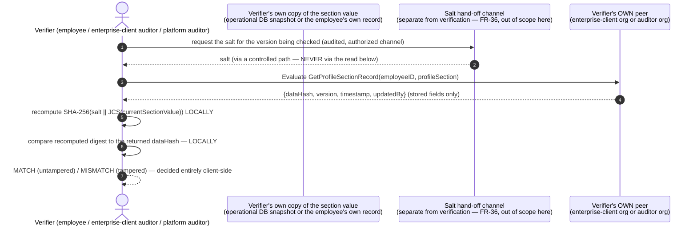

# Integration Design — In-band profile-section anchoring (post-reconciliation)

> **Scope.** The concrete end-to-end design of the seam between the HRIS application's own
> write paths and the Hyperledger Fabric 2.5 ledger: the **anchor write path** (profile-section
> write → operational database → off-chain digest → `RecordProfileSection` → co-signed commit),
> the **client-side verification protocol** (Kelompok B′, FR-34..FR-37), the **erasure hook**
> (cross-reference), and the **open availability question** this design's in-band posture leaves
> for a follow-on decision.
>
> **This document instantiates:** **ADR-0011** (per-section salted digest, two-tier keyed
> identifiers), **ADR-0014** (in-band recording — no Kafka, no anchor-service), **ADR-0020**
> (chaincode contract + off-chain hashing boundary). Topology facts (org/MSP set, channel-per-tenant,
> endorsement-policy MSP identifiers) are **consumed** from `[prd: §5.1]` and are
> `fabric-architect`'s to ratify formally (pending ADR-0012/0013) — this document does not decide
> them.
>
> **Supersedes §1–§12 of the pre-reconciliation version of this document in full**, including its
> §5.1–§5.4 (the Kafka consumer, the `anchor_map` state machine, and the reconciliation job) —
> none of that machinery exists in this design; see ADR-0014 for why.
>
> **Cross-reference, do not duplicate.** The `EmployeeProfileRecord` shape and the world-state key
> live in [`data-model.md`](data-model.md); the four-function chaincode contract and its argument
> shapes live in [`api-contracts.md`](api-contracts.md); Fabric Gateway connect/endorse/submit
> mechanics live in `> See fabric-chaincode-dev/references/gateway-client.md`. Grounding index and
> citation convention: [`../../11-execution/knowledge-graph.md`](../../11-execution/knowledge-graph.md).
>
> **Register note.** Per `project-context.md` AUTHORITY NOTICE, this document names HRIS write
> paths only in generic terms — no product name, codebase, file, class, or table name appears here.

---

## 1. Overview

An HR admin or an employee edits one of five profile sections through the platform's existing
write path for that section (a personal-data change-approval workflow, a transfer/mutation
approval action, an education-history write action, a family-data change-approval workflow, or a
payroll/bank-account update action). That write path, at the point it commits the section to the
operational database, also computes the section's canonical JSON form, generates a fresh
per-record salt, derives the section's `DataHash` and the acting employee's/actor's pseudonymous
identifiers off-chain, and submits a `RecordProfileSection` transaction through the Fabric
Gateway — **in the same request**, not via a queue. The chaincode-level endorsement policy requires
the platform org **and** the enterprise-client org to co-sign before the record commits, so no
single org — including the platform operator — can write an anchor alone. Later, an employee, the
enterprise client's own auditor, or the auditor org verifies any recorded section by recomputing
the digest **client-side**, from the section's current value plus its off-chain salt, and
comparing that to the digest returned by a read-only chaincode function — the ledger is read only
to compare, never to reconstruct, and the plaintext never crosses to a peer to do so.

## 2. Goals & non-goals

**Goals.**
- Produce tamper-evident, independently co-signed integrity evidence for every create/update of
  any of the five profile sections.
- Enforce the hashing boundary at the write path itself: **0 bytes** of section plaintext, or any
  salt, ever become a chaincode argument or return value, on Submit or Evaluate (ADR-0020).
- Let an enterprise-client or auditor verifier recompute and compare **without** sending plaintext
  to, or trusting the honesty of, any peer they do not themselves operate (FR-37).
- Keep the write path simple enough to reason about its own latency budget precisely: one
  endorse-and-commit round trip per section write, attributable and measurable (NFR-1/NFR-9).

**Non-goals.**
- Fabric never becomes source-of-truth for any field — the operational database remains
  authoritative for every profile-section value (`[prd: §2.3]`).
- **0** changes required to any other application's message-bus contract to make this design
  work — it does not use one (ADR-0014).
- Chaincode implementation, endorsement-policy MSP identifiers, and MSP/TLS/certificate
  provisioning are out of scope here (`> See fabric-chaincode-dev`, `> See fabric-identity-security`,
  fabric-architect's pending ADR-0012); this document defines the **client side** of the seam and
  the **shape** of what crosses it.
- **Which HRIS process hosts the Fabric Gateway client is not decided in this document** — ADR-0014
  leaves it open (grounding gap **G-10**, reopened); this document's sequence treats "the write
  path" as the caller without fixing whether that caller is the write path's own process, a shared
  internal library, or a co-located synchronous helper.

## 3. Actors & systems in the flow

| Element | Role in this integration |
|---|---|
| **HR admin / employee** | Initiates the section edit that becomes an anchored record. |
| **HRIS write path (one of five)** | Commits the section to the operational database; computes the off-chain digest; calls `RecordProfileSection` — all in-band, in the same request (ADR-0014). |
| **Operational database** | System-of-record for all five sections' plaintext, under its existing at-rest encryption — unchanged by this design. |
| **Off-chain digest/identifier stores** | Per-record salt store; `pseudonymKey`/`employeeKey_i` hierarchy (ADR-0011). Custody design pending ADR-0019 (security-architect) — consumed, not designed, here. |
| **Document-encryption + IPFS private cluster** | Only used when a section write is accompanied by a supporting document; produces the CID(s) attached to that record version (`data-model.md` §10). Cluster design pending ADR-0016 — consumed, not designed, here. |
| **Fabric network** | The platform org's gateway peer(s), the enterprise-client org's co-signing peer, the auditor org's read-only peer, and the ordering service, on the employee's tenant channel (`[prd: §5.1]`; formalized by fabric-architect's pending ADR-0012/0013). |
| **Verifier (employee, enterprise-client auditor, platform auditor org)** | Recomputes and compares client-side, against their **own** peer where applicable (FR-37) — §6. |

## 4. End-to-end anchor write path

Standalone Mermaid source: [`../diagrams/anchor-write-sequence.mmd`](../diagrams/anchor-write-sequence.mmd).

```mermaid
sequenceDiagram
  autonumber
  actor HR as HR admin / employee
  participant WP as HRIS write path<br/>(one of five sections)
  participant DB as Operational database (SoR)
  participant DOC as Doc-encrypt + IPFS<br/>(only if a document is attached)
  participant OFF as Off-chain salt +<br/>employeeKey_i store
  participant GW as Fabric Gateway client<br/>(host: open, ADR-0014/G-10)
  participant CL as Enterprise-client org peer
  participant ORD as Orderer / ledger (tenant channel)

  HR->>WP: submit/approve a profile-section change
  WP->>DB: commit the section (system-of-record write)
  opt a supporting document accompanies this change
    WP->>DOC: encrypt with the employee's document key, pin to IPFS
    DOC-->>WP: CID
  end
  WP->>WP: JCS-canonicalize the CURRENT full section value
  WP->>OFF: fetch/derive employeeKey_i for this employee (ADR-0011)
  WP->>OFF: salt ← CSPRNG(>=128 bits), NEW for this record
  WP->>WP: dataHash = SHA-256(salt || JCS(section))
  WP->>WP: employeeID/updatedBy = HMAC-SHA256(employeeKey_i, ...)
  WP->>OFF: persist {salt, dataHash} off-chain (never on-chain)
  Note over WP,ORD: Proposal args carry ONLY employeeID, profileSection, dataHash,<br/>prevHash, updatedBy, ipfsCIDs, canonicalizationVersion, hashAlgo.<br/>0 bytes of section plaintext, 0 bytes of salt (ADR-0020 boundary).
  WP->>GW: SubmitTransaction("RecordProfileSection", ...)
  GW->>GW: simulate on platform peer; read caller identity via CID (FR-6)
  GW->>CL: gather co-signature — policy AND(platform org, enterprise-client org)
  CL-->>GW: endorsement
  GW->>ORD: submit endorsed envelope -> order -> commit (tenant channel)
  ORD-->>WP: CommitStatus (VALID | MVCC_READ_CONFLICT | ...)

  alt VALID
    WP-->>HR: change confirmed (section write + anchor both committed)
  else MVCC_READ_CONFLICT (concurrent write to the same section)
    WP->>WP: retry from the current head (re-read prevHash, resubmit)
  else endorsement/gateway/orderer unavailable
    Note over WP,ORD: OPEN QUESTION (ADR-0014 follow-up, G-10):<br/>does the write path block, retry with backoff, or degrade?<br/>Not decided by this design.
  end
```

**Stage detail.**

1. **Section write.** The relevant write path applies the change and commits it to the operational
   database exactly as it does today — this design adds nothing to that commit itself.
2. **Optional document handling.** If the change is accompanied by a supporting document (an
   identity document, a certificate, a payslip), it is encrypted with the employee's own document
   key and pinned to the IPFS private cluster **before** the anchor call, so the resulting CID(s)
   can be attached to this same record version (`data-model.md` §10). No document content is ever
   read by the anchor call itself — only the CID.
3. **Canonicalize the current section.** The write path serializes the **complete current value**
   of the section (not a delta) using the pinned JCS implementation (`canonicalizationVersion`,
   ADR-0020) — this is the exact byte sequence a future verifier must reproduce.
4. **Derive the per-record digest and identifiers.** A fresh **≥128-bit CSPRNG salt** is drawn for
   this record; `dataHash = SHA-256(salt ‖ JCS(section))`; `employeeID`/`updatedBy` are derived
   from the employee's `employeeKey_i` (ADR-0011). The salt and `dataHash` are persisted off-chain
   **before** the Gateway call, so a failed Submit is retryable from identical inputs.
5. **Read `prevHash`.** The write path reads the current head record (or its absence, for a
   section's first write) for `(employeeID, profileSection)` to supply `prevHash` — the read side
   of the chain-sequencing check ADR-0020's chaincode enforces at commit.
6. **Submit — the confidentiality boundary.** `SubmitTransaction("RecordProfileSection", …)` carries
   **only** `employeeID`, `profileSection`, `dataHash`, `prevHash`, `updatedBy`, `ipfsCIDs`,
   `canonicalizationVersion`, `hashAlgo` — every one of these is either an identifier, a digest, an
   enum, a CID, or a version tag. **Nothing here is section plaintext or a salt** (ADR-0020
   boundary rule) — this is the single place the invariant is enforced end-to-end, mirrored in the
   note on the diagram above.
7. **Co-signed endorse, order, commit.** The endorsement policy requires the platform org and the
   enterprise-client org to both endorse — the independent co-signature is what makes the tamper
   evidence real, not merely self-asserted by the platform operator (`[prd: §5.1]`; exact MSP
   identifiers are fabric-architect's ADR-0012). `SubmitTransaction` combines Endorse + Submit +
   CommitStatus in one blocking call `[docs: gateway.md#fabric-gateway]`.
8. **Resolve the outcome.** `VALID` completes the write path's own request successfully. A
   `MVCC_READ_CONFLICT` (two concurrent writes to the same employee's same section,
   `data-model.md` §5.2) is retried from a freshly-read `prevHash` — this is an expected, not an
   exceptional, outcome under this design's overwrite-the-head key strategy. Any other failure
   (endorsement unmet, gateway/orderer unreachable) surfaces the open availability question in §7.

## 5. Write-path low-level notes

### 5.1 No consume loop, no offset, no reconciliation job

Because the digest is computed **in** the write path rather than relayed to a separate consumer
(ADR-0014), this design has no idempotency probe against a companion store, no Kafka offset to
commit, and no periodic reconciliation job comparing two stores for drift — the pre-reconciliation
design needed all three **only** to close a gap this design does not open (the write path is the
one and only place the value ever exists outside the operational database, and it is also the one
place the digest is computed). What replaces "idempotency probe" is the **MVCC/duplicate-content
check already inside chaincode** (ADR-0020 function 1: identical `dataHash` to the current head is
a no-op, per FR-9) — a retried Submit with identical inputs after a partial prior failure lands on
that same no-op path rather than creating a duplicate record.

### 5.2 Retry on MVCC conflict

A `MVCC_READ_CONFLICT` means another write to the *same* `(employeeID, profileSection)` committed
between this write path's read of `prevHash` and its Submit. The correct response is to **re-read**
the (now different) head and resubmit with the corrected `prevHash` — not to treat the conflict as
a terminal error. `> See fabric-performance/references/mvcc-and-read-write.md` for the general
mechanic; this design's expected contention rate is unmeasured (`data-model.md` §5.2,
**[ASSUMPTION]**).

### 5.3 The confidentiality boundary, restated as a checklist

- Chaincode arguments on `RecordProfileSection` Submit: identifiers, digests, an enum, CIDs, and
  version tags **only** — never a section field value, never a salt (ADR-0020).
- Chaincode arguments on any Evaluate call (`GetProfileSectionRecord`, `GetProfileHistory`,
  `GetEmployeeProfileSummary`): identifiers and section enum **only** — never a candidate value,
  never a salt (FR-34/FR-35).
- No response, from any of the four functions, ever contains a salt (FR-14/FR-36) or a section
  field value.

## 6. Client-side verification protocol (Kelompok B′, FR-34..FR-37)

This replaces the pre-reconciliation "recompute-and-compare inside a service that talks to the
ledger" pattern with a protocol whose comparison step happens **entirely on the verifier's own
side**, against **the verifier's own peer** where the verifier has one.



- **The salt never travels with the verify call.** It is obtained beforehand, over a separate,
  audited channel whose authorization follows data ownership (the employee over their own record;
  an auditor within the scope of their audit) — FR-36. This document does not design that channel
  (owned by security-architect/backend-engineer); it only fixes that verification itself never
  carries the salt.
- **The comparison happens on the verifier's machine, not inside chaincode.** `GetProfileSectionRecord`
  returns only what is stored; recomputing `SHA-256(salt ‖ JCS(currentSectionValue))` and comparing
  it to that stored `dataHash` is the verifier's own arithmetic (ADR-0020 function 2).
- **An enterprise-client or auditor verifier queries their own peer.** Because Evaluate executes on
  whichever peer answers it, and each org on the tenant channel operates its own peer (`[prd:
  §5.1]`), the enterprise-client org and the auditor org each run this against a peer **they
  operate themselves** — they never need to trust the platform peer's answer for a verification
  they intend to rely on (FR-37).
- **`404`-shaped outcome vs mismatch.** "No record found for this key" (never anchored) and
  "record found but the local recompute does not match" (tampered) are distinguishable **only on
  the verifier's side**, because chaincode itself never receives anything to mismatch against
  (FR-15) — see ADR-0020 function 2 for why this is a designed property, not a gap.
- **Original values are not recoverable from the ledger, by construction.** `GetProfileHistory`
  (ADR-0020 function 3) can point at which `version`/`timestamp`/`updatedBy` a verifier last
  confirmed matching, but it never returns a value — recovering an actual historical value, when
  needed, is an **operational** procedure against the operational database's own backup/PITR
  mechanism, outside this document's scope (`[prd: §12 OQ-6]` recommends this narrower framing over
  claiming the ledger itself "reconstructs" a value).

## 7. Open availability question (ADR-0014 follow-up)

Because anchoring is now in-band, a Fabric outage (endorsement unmet, gateway/orderer unreachable)
occurs **inside** the same request that is committing the section write. This design does **not**
resolve, in either direction, whether:

- the write path should **block** until the anchor either commits or is retried a bounded number
  of times (risking the profile-section edit itself failing or timing out because of a ledger
  outage), or
- the write path should **degrade** — commit the section write, queue the anchor for a bounded
  local retry, and surface a "not yet anchored" state if retries exhaust (reintroducing a narrower
  version of the eventual-consistency question ADR-0014 otherwise eliminated, but scoped to
  **outage handling only**, not to routine transport).

This is flagged, not decided, per ADR-0014's Consequences — it is `architect`'s and
`backend-engineer`'s to resolve once the Gateway-client host (grounding gap **G-10**, reopened) is
fixed, since the answer depends on where in the request lifecycle that host sits.

## 8. Erasure hook (cross-reference)

Crypto-shredding — deleting the operational-database field, destroying the document key, and
destroying the employee's salt and `employeeKey_i` — is ratified at the requirement level (`[prd:
§7 Kelompok E]`, FR-25..29) but its storage/custody mechanics are the pending ADR-0015's to design
(security-architect/fabric-architect, not this document). What this integration design fixes,
because it follows from §4–§6: erasure touches **no** on-chain state and issues **no** ledger
transaction — it is entirely an off-chain operation against the operational database and the two
off-chain secret stores. After erasure, a verify attempt against that employee's records still
succeeds at the chaincode-read layer (the stored `dataHash`/`version`/`timestamp`/`updatedBy` are
unaffected) but can never again be **recomputed and matched**, because the salt and `employeeKey_i`
needed to do so no longer exist (`data-model.md` §11).

## 9. Constraints & numeric budgets (carried from the ADRs)

| Constraint | Value | Source |
|---|---|---|
| Digest algorithm / output | SHA-256, 256-bit | ADR-0011 |
| Identifier MAC | HMAC-SHA256 | ADR-0011 |
| Per-record content salt | ≥ 128 bits, CSPRNG, unique per record, off-chain only | ADR-0011 |
| Key-hierarchy depth | 2 (`pseudonymKey` → `employeeKey_i`) | ADR-0011 |
| Chains per employee | 5 (one per `ProfileSection`) | `[prd: §4.2]` |
| Section plaintext / salt as a chaincode argument or return value | 0 bytes, on Submit or Evaluate, always | ADR-0020 |
| Dedicated anchoring Kafka topics | 0 | ADR-0014 |
| Standalone anchor-service deployable units | 0 | ADR-0014 |
| Write-path hook points | 5 (one per section) | ADR-0014 |
| Endorsement policy (write) | co-signature of the platform org **and** the enterprise-client org; auditor org excluded from the write set | `[prd: §5.1]`; MSP identifiers pending ADR-0012 |
| Verify call type | Evaluate only — never Submit | ADR-0020, FR-34/35 |
| State database | LevelDB (key / per-key-history addressed) | unchanged; `data-model.md` §5.2 |
| Write latency budget | < 3 s @ 500 TPS | NFR-1 / P2 |
| Added write-path latency (anchoring only) | < 500 ms vs. no anchoring | NFR-9 (recalibrate once Caliper runs) |

## 10. Assumptions & open gaps carried

- **G-10 (reopened)** — Gateway-client host and outage-handling behavior (§7). *Instantiated by
  ADR-0014's open Decision clause.*
- **G-24 / PB-3** — canonicalization library/version pin for `canonicalizationVersion` (§4 step 3).
  *Instantiated by ADR-0011/ADR-0020.*
- **[ASSUMPTION]**, MVCC contention rate for concurrent same-section writes — unmeasured (§5.2).
- Pending ADR-0012/0013 (fabric-architect) — exact endorsing-org MSP identifiers, channel-per-tenant
  mechanics; this document consumes `[prd: §5.1]`'s description of the topology, not a ratified
  network design.
- Pending ADR-0015/0016/0019 — erasure storage mechanics, IPFS cluster design, key-domain custody
  (§7/§8 of `data-model.md`; §8 of this document) — consumed, not designed, here.

## 11. Traceability

Realizes the knowledge-graph **anchor chain** (chain 1): HRIS write path → operational-database
commit → in-band off-chain digest (D2/D3) → co-signed `RecordProfileSection` → immutable per-section
chain → CIA-Integrity; the **confidentiality chain** (chain 2, §6): plaintext never crosses to a
peer, on write or on verify; the **access chain** (chain 3, §6): each org verifies against its own
peer; the **erasure chain** (chain 4, §8): destroy off-chain secrets, leave the ledger untouched.
Layer C services and the seam: [`../../11-execution/knowledge-graph.md`](../../11-execution/knowledge-graph.md).
