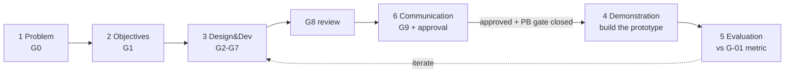

# DSRM Prototype Development Roadmap (Deliverable 8)

The prototype's development organized by the six **Design Science Research Methodology** activities
(Peffers et al., 2007 — see [`../context/DSRM.md`](../context/DSRM.md)). The design package (this
repo) IS DSRM activities 1–3; the running prototype is activity 4 (Demonstration), gated behind the
G9 human approval. Build tasks are in [`implementation-backlog.md`](implementation-backlog.md); tests
in [`test-strategy.md`](test-strategy.md).

> **Hard boundary:** no prototype application code before G9 approval AND before the blocking
> pre-build gate (PB-1..PB-5: G-18, G-23, G-24, G-01, G-05) closes.

| DSRM activity | Package gate(s) | Objectives | Deliverables (artifacts) | Responsible | Review gate | Exit criteria |
|---|---|---|---|---|---|---|
| **1. Problem identification & motivation** | G0 | Frame the problem: tamper-evident, confidentiality-preserving anchoring of HRIS PII changes | `knowledge-graph.md`, `grounding-gaps.md`, seeded risk register | pm, dsrm-researcher | citation-falsification | grounding complete or `[ASSUMPTION]`-tagged |
| **2. Objectives of a solution** | G1 | Define what the artifact must achieve; assemble the knowledge base | 35 `context/` docs + access matrix | fabric-architect, backend-engineer, security-architect | duplication/citation-rot | 0 unresolved `[VERIFY]`; all cited |
| **3. Design & development** | G2–G7 | Design the artifact end-to-end (no code) | 3 skills, agent suite + 4 agents, 10 ADRs, solution design (network/data/API/integration), security architecture, tasks + test strategy | architect, fabric-*, security-architect, qa, reviewer | per-gate adversarial verify (xref lint, confidentiality invariant, control→threat→test) | each gate's exit condition; G8 whole-package sweep clean |
| **4. Demonstration** | **post-G9** | Build the working prototype and exercise the anchor→verify flow on a pilot tenant | chaincode `anchorcc`, Go anchor-service, Fabric network, integration; per `implementation-backlog.md` (NET/CC/AS/INT/DEP) | fabric-engineer, backend-engineer, sre, fabric-architect | test-strategy layers (unit→integration→contract→perf→security); **ST-1 (P0) confidentiality invariant** | an approved PII change yields a committed anchor with 0 PII on-chain; verify returns MATCH/MISMATCH/erased correctly |
| **5. Evaluation** | Phase-6 (QA) → maps to G8 for the design | Measure the artifact against the objective/metric | evaluation report (via `dsrm-research-assistant`), Caliper perf results, security test results | qa, dsrm-researcher, security-architect | evaluation report vs G-01 success metric | metric met or gaps documented; rigor/relevance recorded |
| **6. Communication** | G9 | Package, publish, hand off | this roadmap, MCP architecture, repo structure, final README, ADR index; Confluence publish (if access) | architect, sre, pm | **human approval** | package approved; build authorized |

## Sequencing & dependencies

*The design-only boundary inverts the textbook DSRM order (Evaluation/Communication of the DESIGN
precede the running Demonstration) — see `../skills/dsrm-research-assistant/SKILL.md` and DSRM.md §2.*

## Build phases (activity 4, post-approval)

Ordered per the backlog: **PB gate** (close G-18/G-23/G-24/G-01/G-05) → **NET** (network bring-up) →
**CC** (chaincode) → **AS** (anchor-service) → **INT** (integration) → **DEP** (deploy) → **QA**
(execute test-strategy). Each phase's exit is its DoD in `implementation-backlog.md`; the whole of
activity 4 does not start until the PB gate is green.
