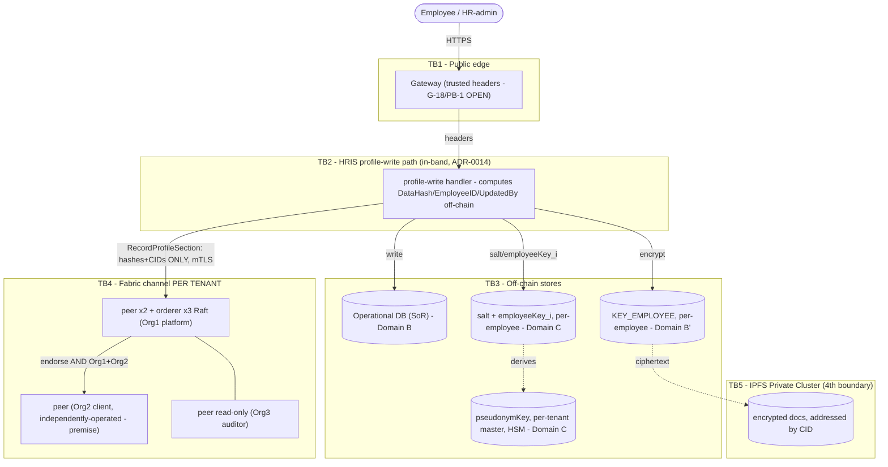

# Security Architecture — HRIS PII-anchoring prototype (G6)

> **Re-derived 2026-08-06** against the ratified design in `prd-fabric-hris-2026-08-02/prd.md`
> (status: final) — **not** a new design. This supersedes the 2026-07-13 STRIDE pass in substance
> (object list, topology, trust boundaries); it does not re-litigate frames already settled
> (ZKP deferral ADR-0008, general ASVS/API/Zero-Trust method) — those are cross-referenced, not
> re-derived. See `../../_bmad-output/planning-artifacts/prds/prd-fabric-hris-2026-08-02/` for the
> ratifying source and `rencana-rekonsiliasi.md` Gelombang 4 item #27 for the change mandate.

The threat model and security-frame application for the design in
[`../00-architecture/solution/`](../00-architecture/solution/) as amended by PRD §4–§9 and ADR-0011
through ADR-0020 (several pending, owned by `fabric-architect`/`fabric-engineer`, referenced but not
authored here). **Design-only.** Depth on each frame lives in the context docs (`THREAT-MODELING`,
`SECURITY-BY-DESIGN`, `PRIVACY-BY-DESIGN`, `CRYPTOGRAPHY`, `OWASP-*`) and the `security-review` /
`fabric-security-review` / `privacy-by-design` / `zkp-designer` skills — this doc is the
system-specific synthesis, driven by `fabric-security-review/references/stride-threat-model.md`.
Control→threat traceability lives in [`control-matrices.md`](control-matrices.md).

> **Trust-model honesty (re-stated, not softened).** The ratified topology is **three
> organizations** — the platform provider (Org1, 2 peers + 3-orderer Raft), the enterprise client
> (Org2, 1 peer, **stated to be independently client-operated**), and an auditor (Org3, 1 read-only
> peer) `[prd: §5.1]`. This is a real improvement over the prior two-vendor-org model **on paper**:
> UJ-1's closing claim is that an attacker "must control all three organizations simultaneously" to
> alter a record, and FR-22 requires the client to hold its own independent ledger copy. **But this
> claim is currently a stated premise, not a demonstrated fact.** Errata **E-11** and PRD §10.4
> prerequisite #4 both flag that *who actually operates Org2's peer* has not been verified, and the
> P1/P3 scenarios' evidentiary strength depends entirely on it being genuinely independent. Until
> Org2 independence is operationally demonstrated (Fase 4), state the collusion-resistance property
> as **"identity-bound tamper-evidence under a stated-independent-Org2 assumption,"** not as achieved
> adversarial decentralization. `[ASSUMPTION G-04]`.

## 1. Trust boundaries (DFD)

See [`trust-boundaries.mmd`](trust-boundaries.mmd) (embedded below, re-derived 2026-08-06). **Five**
boundaries, one more than the pre-reconciliation model: TB1 public edge, TB2 the HRIS profile-write
path itself (in-band — no Kafka, no anchor-service, per ADR-0014), TB3 off-chain stores (operational
DB + the four key domains of ADR-0019), TB4 the Fabric network (**replicated once per tenant
channel**, FR-20), and **TB5 — the IPFS Private Cluster**, a boundary this model did not previously
have (PRD §11.4: the cluster operator and the swarm key are a real trust boundary, not an
implementation detail).

## 2. STRIDE threat model

Each threat maps to a mitigation naming a Fabric capability (`D#`, see knowledge-graph Layer D) or an
existing app control (`[code:]`). Residual risk noted; **accepted** risks flagged for the prototype.
**Object churn from the 2026-08-06 re-derivation:** T9, T10, T11, and T15 are all **RETIRED** — their
objects (per-field `changedFieldNames`, a separate anchor-service's authenticated read-back, PDC,
Kafka `employee_info`) no longer exist in the ratified design. T9/T10 were held at *likely dissolved*
pending the sponsor's S-4 decision; **S-4 was decided 2026-08-06** (dissolve, `implementation-backlog.md`
§1.2), so both are now formally retired, not merely "likely." T16 is **re-verified** against the
independently-random `employeeKey_i` construction (ADR-0021, closing T16b same day) — see below.
T17–T21 are **new**: IPFS-specific threats and channel-per-tenant-at-scale threats neither the PDC/Kafka
model nor the two-org model ever surfaced.

| ID | STRIDE | Element / flow | Threat | Mitigation (mechanism) | Residual |
|----|--------|----------------|--------|------------------------|----------|
| **T1** | Spoofing | TB1/TB2 gateway→app | Forged tenant/user identity headers → tenant/user impersonation | Gateway strips + re-injects headers; internal **mTLS** (D13); `[ASSUMPTION] G-18/PB-1` — **still OPEN**, unaffected by the section/erasure rework `[code: ems/internal/base/handler/base.go]` | If the gateway is misconfigured, cross-tenant impersonation — **HIGH until PB-1 closed** |
| **T2** | Spoofing | TB4 Fabric identity | Stolen X.509 signing key → submit/endorse as an org | HSM/file-based key protection (D14, ADR-0009 domains A, carried by ADR-0019); cert lifecycle + CRL (D15); NodeOU roles; now **three** orgs, not two | Key theft = impersonation until revocation |
| **T3** | Tampering | HRIS app→Fabric in transit | MITM alters `RecordProfileSection` tx | **mTLS** on all peer/orderer endpoints (D13) `[docs: enable_tls.rst]` | Low |
| **T4** | Tampering | ledger history | Rewrite/backdate an anchor | `AND(Org1MSP.peer, Org2MSP.peer)` endorsement (D5, pending ADR-0012) + ledger immutability (D12); collusion-resistance is **conditional on genuine Org2 independence** (see header note) | **Medium-High until Org2-operator independence is demonstrated** (errata E-11, PRD §10.4#4); downgrades to Low once shown. Auditor Org3 is read-only and does not endorse, so it adds visibility, not collusion-resistance. |
| **T5** | Tampering | digest build/verify (PB-3/G-24) | Non-canonical serialization of the **section JSON** → digest ambiguity/false mismatch | **RFC 8785 JCS** selected for the canonical section representation, writer and verifier pinned to the identical routine (PRD §5.2) — scheme decided, **PB-3/G-24 stays OPEN** until pinned by test | Implementation bug (mitigate: equivalence tests at build) |
| **T6** | Repudiation / Tampering | in-band profile write (ADR-0014) | (a) Actor denies making a change; **(b) NEW under in-band recording** — the operational-DB write succeeds but the paired `RecordProfileSection` call fails/times out, with **no async reconciliation job** to catch it (the Kafka-based catch-up mechanism this used to lean on no longer exists) | `UpdatedBy` (HMAC via `employeeKey_i`) + `Timestamp`+`Version` on the immutable ledger for whatever **does** get anchored (D12) addresses (a). **(b) is currently UNMITIGATED** — the write path's failure semantics (does a failed anchor block/roll back the DB write, or is there a compensating sweep?) are undesigned; this is an open item for `fabric-engineer`'s integration design, not resolved here | (a) An org could still omit anchoring — no longer caught by reconciliation, since none exists; (b) **OPEN — silent under-anchoring risk**, flagged for build-time design, not accepted |
| **T7** | Info-disclosure | ledger contents | PII plaintext exposed on-chain | **Confidentiality invariant (INV-1, PRD §5.2)** — only `DataHash`(salted)/`EmployeeID`/`UpdatedBy`(HMAC-keyed)/`PrevHash`/`Version`/`Timestamp`/CID(s) on-chain; 0 bytes PII plaintext (D2). **Now fully satisfiable without splitting** the confidentiality-invariant test (ST-1) — see `test-strategy.md` | Mitigated by design — the core property, **contingent on ST-1 passing across the expanded surface** (adds IPFS CIDs, sweeps every tenant channel) |
| **T8** | Info-disclosure | on-chain `DataHash` | Brute-force a low-entropy section field from its digest | **≥128-bit CSPRNG salt, per record**, stored off-chain only (Domain C, ADR-0019) `[prd: §5.2 FR-3]` | Only if the salt store AND the section content are both compromised — two separate domains |
| **T9** | Info-disclosure | ~~per-field `changedFieldNames`~~ | ~~Field names would reveal *which* fields changed~~ | **RETIRED 2026-08-06 (S-4).** The anchoring unit is the **whole `ProfileSection`** (PRD §4); there is no `changedFieldNames` array in `EmployeeProfileRecord`. The only revealed metadata is *which of the five known section types* changed — a required, non-secret field (`ProfileSection`, FR-8), structurally coarser than the field-name leak this threat modeled | Retired |
| **T10** | Info-disclosure / Elevation | ~~separate anchor-service read-back~~ | ~~A dedicated anchor-service authenticating a read-back of the PII delta~~ | **RETIRED 2026-08-06 (S-4, PB-2/G-23 dissolved).** Kelompok B′ (FR-34..37) makes plaintext **never** a chaincode argument, and the digest is computed off-chain by the same process that already legitimately holds the data — no separate anchor-service performing a read-back of someone else's data exists | Retired |
| **T11** | Info-disclosure | ~~PDC `hrAuditExchange`~~ | ~~Over-broad private-data exposure~~ | **RETIRED 2026-08-06.** No PDC exists anywhere in the ratified topology — channel-per-tenant is the sole isolation mechanism (FR-20/21); this is a settled fact, not a pending sponsor decision, unlike T9/T10 | Retired |
| **T12** | DoS | orderer availability | Flood submissions; orderer outage | **Improved.** Ratified topology specifies a **3-node Raft orderer set** (crash-fault-tolerant, tolerates 1 node failure) `[prd: §5.1]`, not the prior single-node SPOF; operational DB stays system-of-record so the HRIS survives a Fabric outage for reads (writes: see T6b) | **Downgraded from "accepted SPOF" to "mitigated, tolerates 1 failure."** Beyond 1 concurrent orderer failure remains a residual, and is a `fabric-architect` scale question, not this prototype's |
| **T13** | Elevation | chaincode | ABAC bypass / missing authz in the profile-record chaincode (`RecordProfileSection`, `VerifyProfileIntegrity`-read-only per B′, `GetHistoryForKey`, `GetProfileHistory`) | CID attribute checks (D9) + endorsement policy (D5); explicit reject-if-MSP-unverified (FR-6); `fabric-security-review` at build; **semgrep/Guardian** SAST | Chaincode bug — mitigate via build-time security tests |
| **T14** | Elevation | key domains (ADR-0019) | Using a document-decrypting or identifier-pseudonymizing key to sign anchors, or vice versa — **now four domains, six pairwise boundaries, not one** | **Strict key-domain separation, four domains** (A Fabric MSP/TLS, B app AES, B′ `KEY_EMPLOYEE`, C `pseudonymKey`→`employeeKey_i`); no domain derives another (ADR-0019) | Operational discipline (enforce in ops runbooks); more surfaces to get wrong than the prior two-domain model |
| **T15** | Spoofing / Tampering | ~~Kafka `employee_info` bus~~ | ~~Forged/tampered event; suppressed event~~ | **RETIRED 2026-08-06.** No Kafka bus and no anchor-service exist in the ratified design (ADR-0014: in-band recording from the HRIS profile-write path); this is a settled fact | Retired |
| **T16** | Info-disclosure | off-chain `pseudonymKey`/`employeeKey_i` (Domain C) + on-chain `EmployeeID`/`UpdatedBy` | **Re-verified against the two-tier hierarchy — residual CHANGES, in both directions.** **(a)** `employeeKey_i` (per-employee) compromise ⇒ de-anonymizes **exactly that one employee** — a **new, lower-severity** case that did not exist before the hierarchy (the pre-hierarchy design had no per-employee containment at all). **(b)** `pseudonymKey` (tenant master) compromise ⇒ de-anonymizes the **entire tenant retroactively** (bounded to one tenant now, an improvement over the old cross-ledger framing) **AND, newly surfaced by this re-verification: silently reverses every crypto-shred erasure that tenant has ever completed**, because `employeeKey_i = HMAC-SHA256(pseudonymKey, tenantId‖employeeInternalId)` is a pure, stateless function — deleting the *stored* `employeeKey_i` does not stop anyone holding `pseudonymKey` from recomputing it, given `employeeInternalId` is empirically enumerable in seconds (PRD §12 OQ-1/errata E-1) | `employeeKey_i`/salt **destroyable per employee** (ADR-0015); `pseudonymKey` **HSM-custody, never destroyed, only tenant-scope-rotated** (ADR-0019 Domain C) — rotation protects future derivations only, **not** past ones | **(a) Downgraded** — contained blast radius is the hierarchy's whole point. **(b) Elevated / newly disclosed** — `pseudonymKey` compromise is now understood to be able to un-erase already-erased employees, not just leak current ones; accepted with mitigation (HSM custody, never backed up outside the HSM boundary) because the alternative (no hierarchy) has the strictly worse cross-employee blast-radius property (PRD §5.2 2026-08-03 correction) |
| **T17** *(new)* | Info-disclosure | IPFS CID, on-chain | Any org holding a channel replica (Org1, Org2, **and Org3 auditor**) can read every supporting-document CID for every employee on that tenant's channel; a CID plus swarm-cluster access is enough to fetch the ciphertext | Documents are encrypted with **`KEY_EMPLOYEE`** before upload (FR-30, Domain B′, ADR-0019) — CID exposure alone yields ciphertext, not content; the **swarm key** gates who can even reach the cluster `[prd: §11.4]` | Confidentiality of document *content* rests entirely on `KEY_EMPLOYEE` secrecy + swarm-key secrecy holding, independent of who can read the CID; a `KEY_EMPLOYEE` leak (independent of any ledger compromise) plus swarm access = full plaintext retrieval by any of the three orgs |
| **T18** *(new)* | Info-disclosure | IPFS objects post-erasure | `unpin` is **not** `delete` (PRD §11.4) — any node that ever fetched an employee's encrypted document may retain the block indefinitely; the crypto-shred erasure claim (ADR-0015) is a **key-destruction** claim, not an **object-removal** claim | State the erasure basis correctly in every compliance claim: "encrypted, and the only key is destroyed" — never "the file is gone." Treat `KEY_EMPLOYEE` backup/replication as erasure-critical (ADR-0015/0019 follow-up) | **HIGH if the key-destruction procedure is not independently verifiable** — this is exactly the legal-argument risk PRD §9.4 flags for "menghapus" vs "memusnahkan"; not a defect, a property that must be disclosed |
| **T19** *(new)* | Info-disclosure / Tampering-DoS | IPFS Private Cluster operator (**the system's 4th trust boundary**, PRD §11.4) | The cluster operator (whoever runs the cluster nodes) can observe access metadata (which CIDs are requested, replication/pinning patterns) even without content access, and can censor/withhold objects it hosts | Private cluster (not public IPFS swarm) restricts membership; **cluster-membership/operations model is not yet ADR'd** | `[ASSUMPTION]` — no ADR yet governs who operates the cluster or its membership boundary relative to the three Fabric orgs; recommend the pending IPFS topology ADR (owned by `fabric-architect`/`fabric-engineer`) resolve this explicitly rather than leaving it implicit |
| **T20** *(new)* | Elevation | tenant onboarding (FR-24) | Provisioning a new tenant's channel requires elevated Fabric admin/orderer-config privileges (channel creation, chaincode install/approve/commit on the new channel, MSP registration for the new tenant) — over-privileged or leaked onboarding credentials could provision rogue channels or grant **standing, cross-tenant** admin rights instead of rights scoped to one tenant | Least-privilege, **per-tenant-scoped** onboarding credentials; deny-by-default channel MSP policies (D5/D7/D8) | `[ASSUMPTION]` — the concrete onboarding-privilege design is `fabric-architect`'s topology decision; this row states the security *requirement* the design must satisfy, not the mechanism |
| **T21** *(new)* | Tampering / DoS | chaincode lifecycle across **N tenant channels** | Every chaincode change (bugfix, field addition, a canonicalization-scheme bump) must be installed/approved/committed on **every tenant channel individually** (Fabric's per-channel lifecycle model); at scale, a missed or partially-rolled-out upgrade leaves some tenants running a stale or version-skewed chaincode — e.g. an old canonicalization routine that silently disagrees with a patched verifier, breaking FR-2/INV-6 determinism for just those tenants | Automated per-channel lifecycle rollout tooling + version-skew detection (compare committed chaincode version per channel) | `[ASSUMPTION]` — operational tooling is a `fabric-architect`/`fabric-engineer` build-time task; this row states that "every channel runs the pinned canonicalization version" is a **security precondition** (ties to PB-3/G-24), not merely an ops nicety |

## 3. CIA triad

- **Confidentiality** — the confidentiality invariant (T7), now satisfiable **whole**, without
  splitting ST-1, because §5.2's salt+HMAC construction is adopted; document confidentiality via
  `KEY_EMPLOYEE` (Domain B′, T17); mTLS in transit (T3); existing application AES-256 at rest for
  operational-DB PII `[code: ems/pkg/db/encryption_plugins.go]`; off-chain per-record salt (T8). No
  PDC is used for confidentiality — channel-per-tenant is the sole isolation primitive. → frame E1.
- **Integrity** — salted `DataHash` + `PrevHash` chain **per section per employee** (PRD §4.2);
  `AND(Org1,Org2)` endorsement (T4, pending ADR-0012); ledger immutability (D12); JCS canonicalization
  (T5). → frame E1.
- **Availability** — **3-node Raft ordering** (T12, upgraded from single-node SPOF) + peer
  replication; the operational database remains system-of-record so HRIS reads survive a Fabric
  outage; the **in-band write-path failure mode (T6b)** — what happens to the HRIS write when the
  anchor call fails — is an **open design item**, not yet resolved, because in-band recording removed
  the async decoupling the old Kafka-based design used for resilience. → frame E1.

## 4. Privacy-by-Design & Security-by-Design

- **PbD (7 principles)** — proactive (design-time threat model, this document); privacy-by-**default**
  (PII off-chain by default, INV-1); embedded (the invariant is a data-model property — section-based
  anchoring, not a bolt-on); full functionality (audit *without* exposure, via digests + pseudonymous
  identifiers); end-to-end security (AES at rest → salted digest → crypto-shred, ADR-0015 — **not**
  `PurgePrivateData`, which no longer applies, see ADR-0015 §Alternatives); visibility/transparency
  (the immutable per-section audit chain); respect for the user (right-to-erasure via the four-part
  crypto-shred, ADR-0015; consent seam = existing change-request workflow, `[ASSUMPTION] G-12`).
  **Two DPIA-adjacent findings are not yet closed and must not be presented as if they were:**
  the DPIA obligation itself (PRD §9.2 row 10, Pasal 34) is unmet, and the retention obligation
  (PRD §9.2 row 11, Pasal 42) cannot be satisfied by a request-triggered crypto-shred alone — both are
  carried into the risk register under a **legal-compliance** category, not accepted as technical
  residual risk. The `privacy-by-design` skill's PDC/`PurgePrivateData`-based erasure narrative is
  **superseded in substance by ADR-0015**; that skill file is owned by a different Gelombang-5 item and
  is not edited here, but its erasure mechanics must not be read as current for this system.
- **SbD** — secure **defaults** (mTLS on, deny-by-default ABAC, **no PDC to misconfigure at all**);
  **least privilege** (per-tenant-scoped onboarding credentials, T20; role→attribute mapping,
  ADR-0005); **defense-in-depth** (gateway → app authz → chaincode ABAC → endorsement policy — four
  independent layers, unchanged in kind from the prior model). See `context/SECURITY-BY-DESIGN.md`.

## 5. NIST Zero-Trust alignment

| ZT tenet | Applied here |
|----------|--------------|
| Verify explicitly, every request | Per-request X.509 identity at Fabric (CID) for all three orgs; mirrors the existing per-request app-context pattern `[code: ems/internal/base/app/context.go]` |
| Least-privilege access | Chaincode ABAC (D9); per-tenant-scoped onboarding credentials (T20); role→OU/attribute (ADR-0005) |
| Assume breach | Immutable per-section audit (D12); key-domain isolation limits blast radius across **four** domains now (T14, ADR-0019), not two; SAST (semgrep) |
| Microsegmentation | **Channel-per-tenant** (D7) is now the *sole* segmentation primitive — no PDC layered underneath (contrast with the prior PDC+single-channel model); mTLS everywhere, including to the IPFS cluster boundary (TB5) |
| No implicit network trust | mTLS on all Fabric endpoints; gateway header trust remains an **explicit, still-open** assumption to verify (T1/G-18/PB-1) |
| Continuous verification | Cert expiry/rotation/CRL (D15); **per-channel chaincode-version verification** is a new continuous-verification surface at scale (T21) that did not exist under a single shared channel |

## 6. ZKP posture

**Unchanged from ADR-0008: deferred.** The `zkp-designer` necessity gate previously returned "not
required" for the core prototype (Idemix 2.5 cannot express salary-band value predicates; no user
story confirms minimal disclosure) — nothing in the §5.2 salt/HMAC adoption, the section-based
anchoring unit, or the topology change (two orgs → three, single-channel+PDC → channel-per-tenant)
bears on that necessity question, so it is not re-opened here. Core minimal-disclosure continues to
be achieved by anchoring **digests, not values** (T7/T8), now over whole sections rather than changed
fields — if anything a *coarser*-grained disclosure surface than before. If an evaluation-phase story
later needs "prove active-employee / salary-band without disclosing the value," route that decision
to `zkp-designer` explicitly; do not infer it from this document. → frame E2.

## 7. Residual & accepted risks (explicit)

| Risk | Disposition |
|------|-------------|
| T1 gateway header spoofing | **Open — HIGH** (PB-1/G-18, unaffected by this rework) |
| T4 Org2-independence unverified | **Open — Medium-High**, downgrades to Low once operationally demonstrated (errata E-11, PRD §10.4#4) — **not** an accepted risk, a verification precondition |
| T6b in-band write-path partial failure | **Open — undesigned**, not accepted; needs a `fabric-engineer` design decision on transactional/compensating semantics for the DB-write ↔ anchor-write pair |
| T9/T10 metadata/read-back objects | **RETIRED 2026-08-06** — S-4 decided, both formally closed, not merely "likely" |
| T11 PDC exposure | **Retired** — object no longer exists |
| T12 single-orderer SPOF | **Downgraded** from accepted-SPOF to mitigated (3-node Raft, tolerates 1 failure); >1 concurrent failure remains residual |
| T15 Kafka bus integrity | **Retired** — object no longer exists |
| T16a `employeeKey_i` compromise | **Accepted, contained** — blast radius is one employee; unaffected by the 2026-08-06 fix below |
| T16b `pseudonymKey` compromise | **CLOSED 2026-08-06 (ADR-0021)** — `pseudonymKey` removed from the design entirely; `employeeKey_i` is now an independently-random per-employee secret (CSPRNG, generated once, no master key). No key's compromise can retroactively reverse a completed erasure. Human decision (Chandra Kurniawan), chosen explicitly over keeping the hierarchy or a hybrid audited-escrow design — trade-off accepted: an accidentally-lost `employeeKey_i` is now permanent, symmetric with the existing `KEY_EMPLOYEE`-loss risk (OQ-5) |
| T17/T18 IPFS confidentiality/erasure basis | **Accepted with mitigation** — rests on `KEY_EMPLOYEE` + swarm-key secrecy and on key-destruction (not object-removal) being the correct legal characterization (PRD §9.4, untested) |
| T19 IPFS cluster operator boundary | **Open — `[ASSUMPTION]`**, no governing ADR yet |
| T20 tenant-onboarding privilege | **Open — `[ASSUMPTION]`**, requirement stated, mechanism owned by `fabric-architect` |
| T21 chaincode lifecycle fan-out at scale | **Open — `[ASSUMPTION]`**, requirement stated, tooling owned by `fabric-architect`/`fabric-engineer` |
| DPIA obligation (Pasal 34) | **Open — unmet.** Legal-compliance gap, not a technical residual risk; see risk register "INTEGRITAS RISET" note and the new legal-compliance rows |
| Retention obligation (Pasal 42) | **Open — unmet by design.** Crypto-shred is request-triggered (Pasal 43(1)(c)); Pasal 42 requires automatic time/purpose-based termination. Not resolved by ADR-0015 |

*Consumed by the build-time security review (`reviewer`, `fabric-security-review`) and by
`qa`'s security-test derivation. Prototype-level security risks are appended to
[`../10-risk/risk-register.md`](../10-risk/risk-register.md).*
