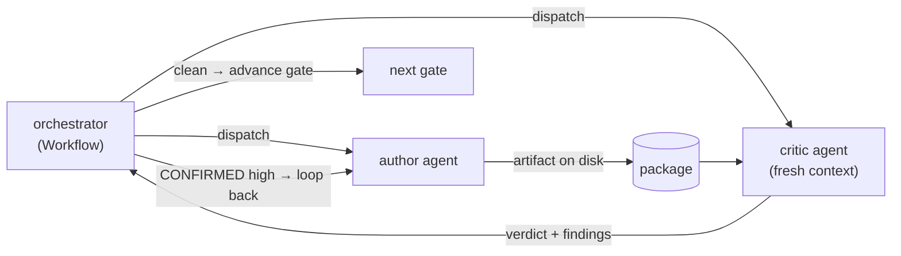

# Review Workflow

How the agent suite reviews its own work. This is the **method** the package was built with, not a
one-off — every gate G0–G9 ran it. Findings and per-gate logs live in
[`verification/`](verification/).

## 1. Principle: author → critic separation of duties

Every deliverable is produced by an **author** agent and checked by a **separate critic** agent running
in a **fresh context**. The critic's job is not to bless — it is to **falsify**: break a citation, find
a contradiction, name an untracked assumption, prove a control has no test. An author reviewing its own
output rationalizes; a skeptic with no stake in the artifact catches the "sounds right, isn't sourced"
defects. This is why the package is built *find → verify*, never *find → trust*.

## 2. Verdict vocabulary

Findings carry a severity (`high` / `med` / `low`) and, where a critic asserts a defect is real, a
verdict:
- **CONFIRMED** — the critic reproduced/verified the defect (e.g. a cited file does not exist; two docs
  give different org counts). Blocks the gate if `high`.
- **PLAUSIBLE** — a suspected issue the critic could not fully confirm; recorded, not gate-blocking.

Each finding is dispositioned: **fix-now**, **accepted** (a documented limitation, e.g. the T9
field-name metadata risk), or **deferred** (with the gate/gap it defers to).

## 3. Per-gate blocking verification

Each gate embeds a verification step that must pass before the gate advances (see
[`../00-architecture/quality-gates-and-approval.md`](../00-architecture/quality-gates-and-approval.md)).
The verification is **specific to the gate's failure mode**:

| Gate | Adversarial check |
|------|-------------------|
| G0 | citation-falsification: no invented requirement; every specific cited or `[ASSUMPTION]`-tagged |
| G1 | duplication + citation-rot + access-matrix drift across the 35 context docs |
| G2 | skill redundancy vs the existing suite; no context-doc restatement |
| G3 | **cross-reference linter** — every skill/context/MCP a spec names resolves to a real artifact |
| G4 | ADR decision-rigor: Accepted/Rejected only, ≥1 rejected alternative, gap-linked |
| G5 | **confidentiality-invariant** + ADR-consistency + testability |
| G6 | every control traces to a threat AND a mechanism; STRIDE covers the DFD |
| G7 | every security control maps to ≥1 test; every task links an ADR/design doc |
| G8 | whole-package contradiction / citation / gap-integrity sweep (this doc) |

## 4. The cross-reference linter (structural gate)

The package is a graph: 12 agents naming skills/context/MCP, ADRs naming gaps/context, tests naming
controls, tasks naming ADRs. A linter asserts **every edge resolves to a real node** — no dangling
skill, renamed context doc, or unwired MCP. This turns "is the package internally consistent?" from a
hope into a machine-checked assertion. It is the primary G3 gate and is re-run at G8 over the whole
package.

## 5. Failure recovery — the no-op incident (real evidence)

During this build, dispatched agents intermittently returned a **0-tool-call preamble** (echoing a
system-reminder, skill list, or their own prompt) instead of producing the artifact — a
context-regurgitation failure mode of fan-out at scale. Every occurrence was caught by the gate's
**file-existence + tool-call census**, not by trusting the agent's self-report, and healed by one of:
1. **re-dispatch** with a sharpened, path-enumerating prompt (retry #1), or
2. **direct authoring** of the single missing artifact by the orchestrating thread (for keystone files).

This is the empirical justification for two package rules: verification is **blocking and
deterministic** (never "the agent said it wrote it"), and the highest-value single-file artifacts are
authored directly rather than via a fan-out slot where a no-op is expensive.

## 6. Disposition ledger

The G8 consolidated findings + dispositions are recorded in
[`verification/g8-review-report.md`](verification/g8-review-report.md). Per-gate verification notes (the
critic verdicts summarized as the build progressed) are captured in the same directory. `high` CONFIRMED
findings are fixed before G9; `accepted`/`deferred` items are carried explicitly (never silently
dropped) into the risk register and grounding-gaps.
