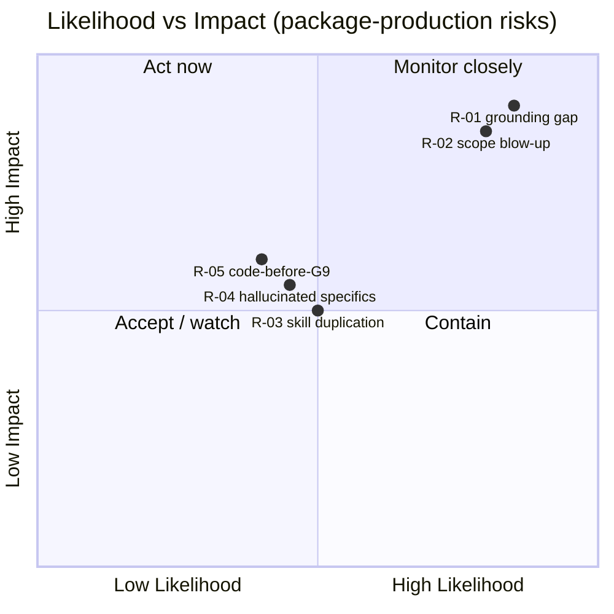

# Risk Register — Producing the HRIS-on-Fabric Architecture Package

> **Scope of this register.** These are the risks to **producing this design + tooling package**
> (the ~40-agent suite, ~40 context docs, ADRs, security architecture, roadmap) — *not* the risks of
> the eventual Fabric prototype. The package writes **no prototype application code** before the
> final human approval gate **G9** (per [`../README.md`](../README.md) and the brief in
> [`../../agents-guide.md`](../../agents-guide.md)).
>
> **Mode:** the project runs in **proceed-with-assumptions** mode as of **2026-07-12** — the
> requirement docs (Jira HLF-6 / Confluence) are unreachable and the scope report was empty. That
> condition is the root of R-01 below and colours several others.
>
> **Re-derivation note (2026-08-06).** The ratifying PRD (`prd-fabric-hris-2026-08-02/prd.md`) closed
> two requirement-layer gaps (G-01, G-05 — see PRD Lampiran A) and introduced §5.2's salt/HMAC
> construction, a three-org/channel-per-tenant/no-PDC topology, and IPFS as a document tier. Rows
> below marked **"re-rated 2026-08-06"** were re-derived against `08-security/security-architecture.md`
> T1–T21 (2026-08-06); rows not marked are unaffected and carried forward unchanged. Three risk
> classes now exist: package-production (R-01..05), prototype-phase security (R-06..15, R-24..30),
> **research integrity** (R-16..21, new), and **legal/regulatory compliance** (R-22..23, new) — the
> last two are deliberately **not** folded into the technical-security class because their owners,
> remediation paths, and stakeholders (a thesis examiner; a data-protection regulator) differ from a
> Fabric/chaincode security finding's.
>
> **ADR-number note.** As in `08-security/security-architecture.md` and `06-roadmap/test-strategy.md`,
> only **ADR-0015** and **ADR-0019** exist on disk as of 2026-08-06; other numbers in the 0011–0020
> range cited below are **(pending)** — reserved by `rencana-rekonsiliasi.md` Gelombang 3 for a
> `fabric-architect`/`fabric-engineer` decision not yet authored, cited for the ratified PRD fact it
> will formalize.
>
> Likelihood / Impact scale: **HIGH · MED · LOW**.

## Seed risks

| ID | Risk | Likelihood | Impact | Mitigation | Owner-agent |
|----|------|-----------|--------|------------|-------------|
| **R-01** | **Grounding gap** — the whole product-requirement layer is [ASSUMPTION]; design decisions may not match what HLF-6 / Confluence actually require. | HIGH | HIGH | Every requirement-derived specific tagged `[ASSUMPTION]` and tracked in [`../11-execution/grounding-gaps.md`](../11-execution/grounding-gaps.md); technical layers grounded in real repos + pinned Fabric corpus; no gap silently closed; re-open affected deliverables the moment real docs arrive. **Partial resolution 2026-08-02/03:** the ratifying thesis + PRD closed G-01 (objective) and G-05 (anchoring unit) by explicit human decision — see PRD Lampiran A — but this register does not itself declare gaps closed; that is `dsrm-researcher`'s register to update. | Engineering Orchestrator (with DSRM Research Assistant) |
| **R-02** | **Scope / consistency blow-up** — ~40 agents × ~40 context docs drift apart: duplicated facts, contradictory PII inventories, citation rot, an unmaintainable package. | HIGH | HIGH | Single shared spine — [`../11-execution/knowledge-graph.md`](../11-execution/knowledge-graph.md); AUTHORING-CONTRACT; full-package consistency review at gate. | Engineering Orchestrator (with Reviewer Agent) |
| **R-03** | **Skill duplication vs the existing Fabric suite** — new skills re-implement content the installed 8-skill `fabric-skill-suite` already owns. | MED | MED | Reuse-first; every Fabric fact points at the owning skill instead of copying. | Solution Architect (with Principal Software Engineer) |
| **R-04** | **Hallucinated Fabric / security specifics** — invented flag names, config keys, capability behaviours, or CWE/ASVS mappings creep into context docs. | MED | MED | All Fabric claims carry `[docs: …]` citations to the pinned 2.5 corpus; out-of-corpus claims tagged `[VERIFY]`. | Hyperledger Fabric Architect (with Security Reviewer) |
| **R-05** | ✅ **RE-SCOPED 2026-08-06 (S-1 decided), not retired.** Was: any prototype/chaincode/application code before G9. **Now:** code written **outside a tracked `implementation-backlog.md` item** (skipping its Definition of Done / design-doc / ADR traceability) — since S-1 split G8 into G8a (docs, passed)/G8b (measured, code now expected) and G9 was re-approved against the current design (`00-architecture/quality-gates-and-approval.md` §5.5). The governance deadlock PRD §11.2 documented is **resolved** by this same decision — it is no longer open. | LOW | MED | The boundary moved, it did not disappear: `implementation-backlog.md`'s per-item DoD + ADR traceability is now the control, replacing the blanket "0 lines" rule. `qa`/`reviewer` verify each build item against its tracked scope. | Engineering Orchestrator (with Security Architect) |

## Risk map (Mermaid)

## Prototype-phase risks (from the G6 threat model, re-derived 2026-08-06)

These are the risks of the eventual **Fabric prototype** (distinct from the package-production risks
R-01..R-05 above). Each traces to a `08-security/security-architecture.md` STRIDE threat (`T#`) and
its test (`ST-/IT-`). **R-06..R-15 are the pre-reconciliation rows, re-rated in place where the
2026-08-06 STRIDE re-derivation changed their basis; R-24 onward are new rows for threats that did
not exist before (T17–T21) or were newly surfaced by re-verification (T16b, T6b).**

| ID | Risk | Likelihood | Impact | Mitigation | Trace |
|----|------|-----------|--------|------------|-------|
| **R-06** | On-chain `DataHash` brute-forced to recover a low-entropy section value (if the off-chain salt store is also compromised) | LOW | HIGH | ≥128-bit CSPRNG per-record salt (PRD §5.2), off-chain only (Domain C); ST-6 | T8 |
| **R-07** | *Re-rated 2026-08-06 — surface widened.* Key-management divergence across a key domain — now **four** domains (A/B/B′/C, ADR-0019), not two; more pairwise boundaries to get wrong than before | MED → **MED (surface wider, same likelihood band)** | HIGH | Strict ADR-0019 four-domain separation, no derivation across any pair; ops runbooks per domain; ST-10 | T14 |
| **R-08** | Gateway header-trust boundary unverified (PB-1/G-18) — spoofable tenant/user identity at the gateway | MED | HIGH | Pen-test the gateway header strip/re-inject boundary BEFORE build; ST-2. **Unaffected by this rework — still open.** | T1 |
| **R-09** | *Re-rated 2026-08-06 — object likely gone.* The separate anchor-service read-back this risk described (G-23) has no equivalent in the in-band design (ADR-0014, Kelompok B′) | MED → **LOW (pending formal closure)** | MED | Kelompok B′ makes plaintext never a chaincode argument, computed by the same process that already holds the data — no read-back surface exists to secure. **Formal closure awaits sponsor S-4**; kept open, not deleted. | T10 |
| **R-10** | *Re-rated 2026-08-06 — premise changed, verification gap opened.* Collusion rewriting/withholding anchors — topology is now **three** orgs with Org2 **stated** to be independently client-operated (not vendor-operated, PRD FR-22/UJ-1), which if true eliminates the old honest-but-curious ceiling entirely | LOW → **MED (the independence claim itself is unverified — errata E-11)** | HIGH | `AND(Org1,Org2)` endorsement (pending ADR-0012); **the collusion-resistance upgrade is conditional on Org2 operator independence being operationally demonstrated, which has not happened** — until then, treat as identity-bound tamper-evidence, not proven collusion-resistance | T4 |
| **R-11** | *Re-rated 2026-08-06 — downgraded.* Single-Raft orderer SPOF | MED → **LOW** | MED | Ratified topology specifies a **3-node Raft orderer set** (crash-fault-tolerant, tolerates 1 failure) `[prd: §5.1]` — this is no longer an accepted prototype limitation, it is mitigated by the ratified design; >1 concurrent failure remains residual | T12 |
| **R-12** | Chaincode ABAC / endorsement misconfiguration → over/under-exposure | MED | HIGH | `fabric-security-review` + semgrep (ST-9); U-5/IT-2 tests; deny-by-default. Function set updated: `RecordProfileSection`, read-only `VerifyProfileIntegrity`, `GetHistoryForKey`, `GetProfileHistory`. | T13 |
| **R-13** | *Re-rated 2026-08-06 — two of three cited gaps ratified-closed.* Requirement-layer assumptions prove wrong → design rework | HIGH → **MED** | MED | G-01 (objective) and G-05 (anchoring unit) were closed by explicit human ratification (PRD §2, §4, Lampiran A); this is noted here for consistency but **this register does not itself close a grounding gap** — that update belongs to `dsrm-researcher`'s `grounding-gaps.md`. Residual: other requirement-layer specifics (org topology, multi-tenancy model) are also now PRD-stated but not yet reflected as closed rows in the gap register. | R-01 |
| **R-14** | *Re-rated 2026-08-06 — split into two sub-risks, one downgraded, one elevated.* `pseudonymKey`/`employeeKey_i` compromise | — | — | — | T16 |
| **R-14a** | `employeeKey_i` (per-employee) compromise de-anonymizes **exactly one employee** | LOW | MED | Per-employee containment is the two-tier hierarchy's intended property (PRD §5.2, ADR-0019 Domain C); ST-12(a) | T16a |
| **R-14b** | ✅ **CLOSED 2026-08-06 (ADR-0021).** Was: `pseudonymKey` (tenant master) compromise de-anonymizes the entire tenant retroactively AND silently reverses every crypto-shred erasure that tenant has ever completed — because `employeeKey_i` was a stateless function of `pseudonymKey` + an enumerable `employeeInternalId`. Closed by removing `pseudonymKey` from the design: `employeeKey_i` is now independently random (CSPRNG, generated once per employee), so no key's compromise can reverse a completed erasure. Human decision (Chandra Kurniawan), chosen over two alternatives (keep hierarchy / hybrid audited-escrow). **New residual, not a re-opening of this risk:** an accidentally-lost `employeeKey_i` is now permanent and indistinguishable from an intentional erasure — tracked as the same class as the existing `KEY_EMPLOYEE`-loss risk (OQ-5), not re-added here as a duplicate row. | LOW | **CLOSED** (was HIGH) | `employeeKey_i` treated identically to the `DataHash` salt store — independently random, generated once, destroyed on erasure, no master key. See OQ-5 for the shared accidental-loss discipline needed for both `KEY_EMPLOYEE` and `employeeKey_i` | T16b (closed) |
| **R-15** | *Re-rated 2026-08-06 — object likely gone.* `changedFieldNames`-style metadata inferable on-chain | LOW → **N/A pending S-4** | LOW | The section-based anchoring unit has no `changedFieldNames` field at all (PRD §4); ST-7 is kept as a schema regression guard. **Formal closure awaits sponsor S-4**; kept open, not deleted. | T9 |

### New prototype-phase risks (T17–T21, T6b — did not exist before 2026-08-06)

| ID | Risk | Likelihood | Impact | Mitigation | Trace |
|----|------|-----------|--------|------------|-------|
| **R-24** | IPFS CID is on-chain and readable by all three orgs; a CID plus swarm-cluster access yields ciphertext — document confidentiality rests entirely on `KEY_EMPLOYEE` + swarm-key secrecy | MED | HIGH | `KEY_EMPLOYEE` encryption before upload (FR-30, Domain B′); swarm key restricted to the private cluster; ST-13 | T17 |
| **R-25** | `unpin ≠ delete` — the crypto-shred erasure claim for IPFS content is a key-destruction claim, not an object-removal claim; the legal characterization ("menghapus" vs "memusnahkan") is untested (PRD §9.4) | MED | HIGH | State the erasure basis correctly in every compliance claim; ST-13/IT-9 prove decryption fails post-key-destruction | T18 |
| **R-26** | IPFS Private Cluster operator is an un-modeled 4th trust boundary — can observe access metadata or censor/withhold objects even without content access | MED | MED | Private (not public) cluster membership; **no governing ADR yet** — `[ASSUMPTION]`, owned by the pending IPFS topology ADR | T19 |
| **R-27** | Tenant-onboarding privilege escalation — over-privileged or leaked onboarding credentials could provision rogue channels or grant cross-tenant admin rights instead of tenant-scoped rights | MED | HIGH | Per-tenant-scoped onboarding credentials, deny-by-default channel MSP policy; **mechanism owned by `fabric-architect`, not yet designed** | T20 |
| **R-28** | Chaincode lifecycle fan-out across N tenant channels — a missed/partial rollout leaves some tenants on a stale or version-skewed chaincode (e.g. a canonicalization routine that silently disagrees with a patched verifier) | MED | HIGH | Automated per-channel lifecycle rollout + version-skew detection; **tooling not yet built** — ties to PB-3/G-24 as a security precondition, not merely an ops nicety | T21 |
| **R-29** | Per-employee key/salt stores (`KEY_EMPLOYEE`, `employeeKey_i`, salts — Domains B′/C) are backed up/replicated in a way that retains "deleted" material, silently defeating ADR-0015's crypto-shred with no visible symptom | MED | HIGH | Provable, irreversible destruction procedures for B′/C stores specifically (distinct discipline from key *rotation*); backup-exclusion policy for these stores — **build-time design item for `fabric-engineer`, not yet specified** | ADR-0015/0019 follow-up |
| **R-30** | In-band recording (ADR-0014) removed the async reconciliation the prior Kafka-based design used to catch missed anchors — a DB-write-succeeds/anchor-fails split now leaves a profile change **unanchored with no catch-up mechanism**, silently breaking FR-1 | MED | MED–HIGH | **Currently unmitigated.** Needs a `fabric-engineer` decision on transactional or compensating semantics for the DB-write ↔ anchor-write pair; IT-6 currently asserts only detectability, not remediation | T6b |

## Research-integrity risks (INTEGRITAS RISET) — new class, appended 2026-08-06

> **Why a third class.** R-01..05 (producing the package) and R-06..30 (the eventual prototype's
> security) both have engineering owners and engineering remediation. The risks below are different
> in kind: they threaten the **defensibility of the thesis/research artifact itself** at an academic
> examination (*sidang*) or in front of a methodology-literate reviewer — their "attacker" is a
> thesis examiner reading for internal consistency, not an adversary attacking the system. They are
> sourced from `errata-tesis.md` and PRD §10.6/§11, not invented here.

| ID | Risk | Likelihood | Impact | Mitigation | Trace |
|----|------|-----------|--------|------------|-------|
| **R-16** | Placeholder Hyperledger Caliper performance numbers (850.4 TPS write / 1,950.5 TPS read / 2.85s latency — thesis Table 4.3, Abstract, BAB V) are mistaken for, or presented as, real measured results before the harness has actually run | HIGH (until PT-1/PT-2 run for real) | HIGH | PRD §3.1 explicitly flags these as placeholders; ADR-0018 (pending, `fabric-architect`) must state this in writing and forbid any artifact from citing them as results; real numbers write back to the thesis only after Caliper v0.5 executes (`rencana-rekonsiliasi.md` Gelombang 6 #40) | PRD §3.1, errata E-8 |
| **R-17** | Methodology-vs-results mismatch: BAB III promises 10–15 semi-structured interviews, a per-section STRIDE pass, and Miles–Huberman thematic analysis for RQ1; BAB IV reports none of them — "the single most common cause of *sidang* revision" per the errata's own assessment | HIGH (already found, unresolved) | HIGH | Either report the instruments (if actually run) or revise BAB III to describe what was actually done (architecture analysis of the as-is system) — the latter is cheaper and does not weaken the RQ1 contribution | errata E-4 |
| **R-18** | UU PDP Table 4.5 in the thesis body still shows the uncorrected citations (4 of 5 article numbers wrong) while the PRD's corrected 12-row matrix (§9.2) exists only in this reconciliation package, not yet transcribed into the thesis | MED (correction exists, not yet propagated) | HIGH | Replace Table 4.5 wholesale per PRD §9.2 before submission; re-verify every direct quotation against the primary legislative text (Lembaran Negara RI 2022 No. 196) before relying on this reconciliation's own secondary-source verification as final | errata E-14, PRD §9.5 |
| **R-19** | Bibliography integrity: 5 in-text citations missing from the reference list, 16 of 48 reference-list entries never cited in text, one name/year collision with inconsistent titles (`Adhiatma, A.` vs `Adhiatma, F.`, both 2022) | HIGH (already found) | MED | Reconcile the citation list before submission; resolve the Adhiatma collision by checking the original source | errata E-12 |
| **R-20** | Audit-trail suppression risk: an earlier synthesis pass recommended *against* "the thesis wins" (citing G4–G7 re-run cost) before the human decision-maker overrode it in favour of thesis-authoritative reconciliation | LOW (already disclosed) | HIGH if ever found undisclosed | The reversal and its rationale are recorded in PRD Lampiran A precisely so this is never discoverable-as-suppressed later; never silently remove or edit that note | PRD Lampiran A |
| **R-21** | Residual small numeric/factual inconsistencies within the thesis (FGD participant count given three different ways; a throughput peak figure that contradicts its own source table; the operational database named three different ways; a grade-level typo in scenario SC-C) — individually cheap, collectively signal insufficient proofreading to an examiner | HIGH (already found) | MED | Errata E-7, E-8, E-10, OQ-3/OQ-4 each name a one-line fix; batch-resolve before submission — cheap now, expensive if raised in the room | errata E-7/E-8/E-10, PRD §12 OQ-3/OQ-4 |

## Legal/regulatory-compliance risks — new class, appended 2026-08-06

> **Why not folded into the technical-security class.** These two rows are gaps in **statutory
> compliance** (UU PDP No. 27/2022), not gaps in a technical control. No STRIDE mitigation, no
> chaincode change, and no test in `06-roadmap/test-strategy.md` can close either one — they require
> a legal/organizational instrument (a DPIA document; a retention policy with a legal basis) that is
> outside this package's design authority. PRD §9.3 states both explicitly as "Tidak dapat diklaim"
> (cannot be claimed) and requires them to be carried as open limitations, not silently accepted.

| ID | Risk | Likelihood | Impact | Mitigation | Trace |
|----|------|-----------|--------|------------|-------|
| **R-22** | **DPIA obligation unmet (Pasal 34(1)–(2)).** This design triggers the DPIA requirement through **at least four** of Pasal 34(2)'s independent gates simultaneously — including limb (f), "use of new technology," which is the thesis's own claimed novelty — and no DPIA has been produced. | HIGH (known gap, zero mitigation exists) | HIGH (regulatory exposure if operated, not merely a research limitation) | **No technical mitigation exists.** State as an explicit limitation (PRD §9.3 row 10); a DPIA is a prerequisite for any real (non-prototype) deployment, not an artifact this package can produce as a side effect of a security architecture | PRD §9.2 row 10, §9.3 |
| **R-23** | **Automatic retention/erasure-of-purpose obligation unmet (Pasal 42(1)(a)(b)).** The ledger is append-only and retains anchored digests/pseudonyms **forever**; crypto-shred (ADR-0015) is triggered by a **request** (Pasal 43(1)(c)), never by the passage of time or the end of a processing purpose, which is what Pasal 42 actually requires. Concrete scenario the PRD itself poses: an employee who resigned in 2026 has a record still on the ledger in 2041 — on what basis? | HIGH (structural — append-only ledgers cannot satisfy a time/purpose-triggered duty by construction) | HIGH | **ADR-0015 does not resolve this and does not claim to.** No technical retention mechanism exists for on-chain state (by design — INV-3 forbids ledger rewrites); a policy-level answer (e.g. a stated retention schedule backed by a legal basis for the *anchors themselves*, independent of the crypto-shred mechanism for the *content*) is needed and does not yet exist | PRD §9.2 row 11, §9.3 |

## Notes

- **Prototype-level risks are appended as the design phase (G3+) produces a threat model** — this is
  now R-06..R-30 (2026-08-06). Future gate transitions (G8b measured evaluation, Fase 4 demonstration)
  will append further rows, particularly once T4/T10/T19/T20/T21's `[ASSUMPTION]` tags are resolved by
  real ADRs or real operational evidence.
- **R-14 is intentionally recorded as two sub-rows (R-14a/R-14b), not one.** Collapsing them back into
  a single rating would hide the fact that the two-tier hierarchy changed the risk's *shape*, not just
  its number — one sub-case improved, the other is a newly disclosed, more severe finding.
- **The research-integrity and legal-compliance classes are deliberately excluded from the Mermaid
  quadrant chart above**, which is scoped to package-production risk only (its own title says so);
  extending that chart to a third axis of "who this risk embarrasses" is out of scope for this
  register's existing visualization and is not attempted here.
- This register is a **living document**; review it at every gate transition. Owner-agents are roles
  from the agent catalog ([`../01-agents/`](../01-agents/)), not individuals.
