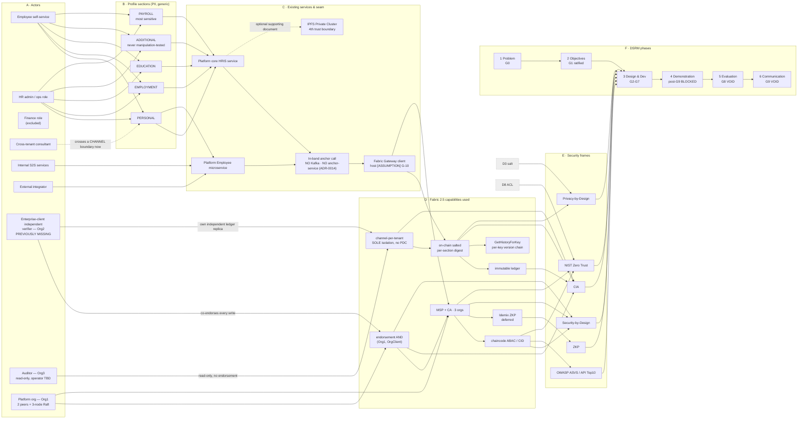

# Project Knowledge Graph — Employee Profile-Section Integrity & Confidentiality on Hyperledger Fabric 2.5

> **Purpose.** One map that links the six layers this package reasons over:
> **Actors → HRIS profile-section data (concrete PII, generic register) → existing services/APIs →
> Fabric security-layer capabilities → security frames → DSRM phases.** It is the shared index
> every agent consults so the design agents and the context-doc library stay mutually consistent.
>
> **Rebuilt 2026-08-06** (`rencana-rekonsiliasi.md` Gelombang 2 #11) against the ratified design in
> `prd-fabric-hris-2026-08-02/prd.md` (status: final). The version this replaces was **stale** —
> `dsrm-phase-artifact-map.md` §2 flagged it explicitly as still narrating a two-org topology,
> event-based anchoring, and single-channel+PDC tenancy, all of which the STOP-LIST in
> `_bmad-output/planning-artifacts/project-context.md` retires. This rewrite does not re-litigate
> those retirements; it consumes them the way every other Gelombang-4 design document does.
>
> **Grounding mode (updated 2026-08-06).** The project moved from pure proceed-with-assumptions mode
> (declared 2026-07-12) to a mixed mode: the 2026-08-02/03 human ratification ("the thesis wins")
> plus the 2026-08-06 real-repo grounding pass **closed** gaps **G-01** and **G-05** by explicit
> human decision and **re-scoped** several others (`G-02`, `G-03`, `G-04`, `G-08` reopened, `G-10`
> superseded-in-kind) — see [`grounding-gaps.md`](grounding-gaps.md) Parts 0–1. Jira `HLF-6` and the
> Confluence space remain unreachable from this environment and are now formally **retired as the
> closing authority**, in favor of the ratifying PRD + thesis extract
> ([`sources/README.md`](sources/README.md)). Governance itself is blocked pending four further
> sponsor decisions **S-1..S-5** (`rencana-rekonsiliasi.md` §2) — most urgently **S-1** (the G8a/G8b
> gate split), without which gates **G8/G9 stay VOID** `[prd: §11.1]`. Every requirement-shaped
> specific not covered by a closed/ratified item remains **[ASSUMPTION]**, tracked in the companion
> register [`grounding-gaps.md`](grounding-gaps.md) (now **G-01..G-29**).
>
> **Confidentiality framing.** Every fact below stays in the **generic register** mandated
> 2026-08-06 (`project-context.md` AUTHORITY NOTICE) — no literal product/company name, real
> repository path, or literal table/column name. Real internal-code grounding was consulted to
> verify the actors, PII inventory, and integration seam described below; it is **not reproduced
> verbatim** here. How to preserve that grounding as a checkable audit trail without violating the
> generic register is itself an **open question — gap G-29** — this document does not invent a
> format unilaterally.

## Citation convention

- `[prd: §n]` — a ratified fact from `prd-fabric-hris-2026-08-02/prd.md` (status: final), the
  primary ratifying source as of 2026-08-06.
- `[thesis: BAB <bab> §<n>]` — a fact cited directly from the underlying thesis, via
  `source-thesis-extract.txt` (pre-InfoSec-revision text extraction — see `grounding-gaps.md`
  **G-28** for the verification limit on the newer revision).
- `[docs: <path>]` — a Hyperledger Fabric 2.5 fact from the pinned corpus
  `fabric-skill-suite/corpus/fabric-docs-2.5/`, carried verbatim from the Fabric-capabilities report.
- `[brief: agents-guide.md]` — a directive stated in the project brief `../../agents-guide.md`
  (e.g. the mandated security theories and the design-only boundary).
- **Generic-register code grounding** — a fact originally verified against real internal source
  code (two live repositories) is stated below as a plain, generic fact (e.g. "the platform's core
  HRIS service") **without** a literal `[code: <repo>/<path>]` citation. This is a deliberate
  narrowing from the pre-2026-08-06 version of this graph, which cited literal paths — see gap
  **G-29** for the still-open question of how to preserve this internal grounding as a checkable
  audit trail. Where a fact is internal to this `agent-suite/` repo itself (an artifact this package
  produced, not the external product), it is still cited `[code: <path-under-agent-suite>]`.
- **[ASSUMPTION]** — a requirement/design specific not yet closed by a ratified source; a
  placeholder a human decision or a real requirement artifact must confirm. Never treat as fact.
  Carries its gap ID from [`grounding-gaps.md`](grounding-gaps.md) (**G-01..G-29**).

---

## 1. Layer definitions

### Layer A — Actors (who touches employee profile data, and who verifies it)

> **Fixed defect (2026-08-06).** The prior version of this graph modeled the Fabric consortium as
> two vendor-operated "org members" and had **no actor at all** for the enterprise client's own
> independent verifier — even though the package's ratified primary objective exists specifically
> to serve that actor: *"a client can prove independently, without needing to trust the platform
> provider, that a profile change has occurred and matches the off-chain record"* `[prd: §2.1]`. The
> table below adds that actor explicitly (**A7**) and splits the old single "Fabric org members" row
> into the three organizations the ratified topology actually names.

| Actor | Grounding | Notes |
|---|---|---|
| **A1 — Employee (self-service)** | Generic-register code grounding: the platform's public employee self-service surface | Reads/edits own profile sections; edits for most sections route through an approval workflow before they commit. |
| **A2 — HR admin / operations role** | Generic-register code grounding: RBAC gated on employee-record view/edit scopes | The actor whose edit, if unauthorized, predicate **P1** exists to make detectable — this is the role a direct, out-of-band database mutation (bypassing the application layer entirely) impersonates in the tamper scenarios (SC-A..SC-D + the still-missing `ADDITIONAL` scenario, `errata: E-2`). |
| **A3 — Finance role** | Generic-register code grounding | Explicitly excluded from employee-data RBAC scope, same exclusion as the employee role for certain fields. |
| **A4 — Cross-tenant consultant** | Generic-register code grounding: a company-context switch header | Privileged, legitimately cross-tenant actor. Under **channel-per-tenant** (ADR-0013), this actor's tenant switch now crosses a **Fabric channel boundary**, not merely a composite-key scope as the pre-reconciliation design assumed — this is exactly the boundary predicate **P3** (cryptographic tenant isolation) tests against. |
| **A5 — Internal platform services (service-to-service)** | Generic-register code grounding: an internal service-to-service credential, no end-user identity | Not itself a Fabric actor unless it becomes the in-band write-path caller (gap **G-10**, reopened). |
| **A6 — External integrator (public API)** | Generic-register code grounding: a gateway-fronted public API surface | Highest-exposure external actor; not a Fabric actor — it can only reach the ledger's effects indirectly, through whichever write path it triggers. |
| **A7 — Enterprise-client independent verifier (Org2)** ⚠ *previously missing* | **Ratified** `[prd: §5.1]`, ADR-0012 | Operates its own Fabric peer **independently of the platform vendor**; holds its own independent ledger replica (FR-22) and co-endorses every write (`AND(Org1MSP.peer, OrgClient-<tenantID>MSP.peer)`, ADR-0012 §5). **This is the actor the entire package exists for** — the primary objective (`[prd: §2.1]`) and predicate **P1**'s collusion-resistance claim ("an attacker must control all three organizations simultaneously to alter a record", UJ-1) are both written *from this actor's point of view*. Its genuine operational independence is currently a **stated premise, not yet operationally demonstrated** — `security-architecture.md`'s header note, errata **E-11**, and PRD §10.4 prerequisite #4 all flag that *who actually operates* this peer has not been verified. `[ASSUMPTION] gap G-04 residual.` |
| **A8 — Auditor (Org3, read-only)** | **Ratified role** `[prd: §5.1]`, ADR-0012 | A read-only Fabric peer; commits and reads, but **does not endorse** — it adds visibility, not collusion-resistance (contrast with A7). Its **operator identity is `TBD`** — not fixed by any ratified requirement (`fabric-network-design.md` §1/§8). Distinct from A7: an auditor observes; the enterprise client's own peer co-signs. |
| **A9 — Platform org (Org1)** | **Ratified role** `[prd: §5.1]`, ADR-0012 | Owns the HRIS write path that triggers `RecordProfileSection`; operates 2 endorsing/committing peers **and** the entire 3-node Raft ordering service alone. A disclosed residual risk (ADR-0012 Consequences): Org1 alone controls network-wide ordering availability and inclusion timing, even though it structurally cannot forge A7's endorsement under the `AND` policy. |

**Historical note.** The pre-2026-08-06 version of this row set an "Auditor / compliance" actor as
only an activity-log *sink*, tagged `[ASSUMPTION]` for whether it was a first-class Fabric ledger
actor at all. That assumption is now **resolved**: the auditor is a ratified, first-class Fabric
actor (A8) — what remains open is only *who operates* its peer, not *whether* it exists on-ledger.

### Layer B — HRIS profile-section data & concrete PII categories

> **Unit change (2026-08-06).** The anchoring unit is no longer a field-level change *event*; it is
> a **whole profile section**, ratified as exactly five values, closing gap **G-05** and cancelling
> the pre-reconciliation `EVENT_*` surface entirely `[prd: §4]`. Layer B is rebuilt around this
> section taxonomy rather than literal table names — both because that is what the ratified data
> model (`data-model.md` §8) actually anchors against, and because literal table/column names are
> exactly what the generic register forbids reproducing here.

| Profile section | Representative PII category (generic) | Change frequency | Crypto state today (existing application layer) |
|---|---|---|---|
| **PERSONAL** | Identity and contact fields (national/tax identifiers, contact details, demographic data) | Infrequent | Some fields already under the existing application-level envelope encryption at rest (versioned key); the remainder plaintext at the application layer today. Inventory not confirmed exhaustive — gap **G-17**. |
| **EMPLOYMENT** | Job/employment-status fields (role, band, transfer/promotion history) | On promotion/transfer | Plaintext at the application layer today. |
| **EDUCATION** | Education-history fields (institution, degree, field of study, scores) | On a new qualification | Plaintext at the application layer today. |
| **ADDITIONAL** | Marital-status and dependents/family-data fields (including a family member's own identity fields) | On a marital/dependent-status change | Plaintext at the application layer today. **This is the section no manipulation scenario has ever tested (`errata: E-2`) — see the anchor chain, §3.** |
| **PAYROLL** | Compensation fields (salary figures, bank account, tax-computation inputs) | On a salary/bank-account change | Bank-account fields: a **deterministic, non-reversible lookup hash** exists today at the application layer (distinct from the on-chain digest scheme below); salary/tax fields: plaintext at the application layer today. **Most sensitivity-critical section** (`[prd: §4.1]`). |

**The employee master record is the shared authentication identity** across the platform's
services — company/tenant-scoped — and is where most PERSONAL-section fields live at the
application layer (generic-register code grounding).

**Existing crypto assets to reuse, not reinvent** (generic-register code grounding, unchanged in
substance from the pre-reconciliation graph, citations not reproduced literally — gap **G-29**):

- **Envelope encryption at rest** for a subset of PERSONAL-section fields — versioned keys, phased
  rollout (encrypt → read-encrypted → write-only).
- **Deterministic lookup hashing** for bank-account fields (PAYROLL) — a separate scheme from, and
  never to be confused with, the on-chain `DataHash` construction (ADR-0011; §3 below).
- **Display masking** for a subset of identity/contact fields at presentation time.

None of these is replaced by the Fabric design — Fabric **anchors on top of** this existing
encryption; it is a separate key domain from all of it (`project-context.md`, "Four key domains are
never mixed").

### Layer C — Existing services, APIs & the integration seam

> **Surface change (2026-08-06).** The pre-reconciliation seam (a Kafka `employee_info` producer/
> consumer pair and an `EVENT_UPDATE_PERSONAL` approval hook feeding a standalone anchor-service) is
> **retired in full** — STOP-LIST, `project-context.md`. Recording is now **in-band**: each of the
> five profile-section write paths computes its own digest and calls the chaincode **synchronously,
> in the same request** that commits the section (ADR-0014).

| System | Role | Fabric integration seam (ratified / generic) |
|---|---|---|
| **Platform core HRIS service** (generic register — a PHP/Yii2-based system-of-record) | Owns the change-approval workflows for most of the five sections; owns the shared operational database schema | Hosts (or calls into) whichever of the five section-specific write paths triggers `RecordProfileSection` **in-band**, in the same request that commits the section (ADR-0014) — no queue, no consumer loop. |
| **Platform Employee microservice** (generic register — a Go strangler-fig extraction reading/writing the same shared operational database) | Owns a subset of the five write paths | Same in-band contract as above; which of the two systems ultimately hosts the Fabric Gateway client is **not decided** — gap **G-10**, reopened by ADR-0014. |
| **API gateway** | Injects trusted identity/tenant headers in front of both systems | Trust boundary; end-to-end enforcement **not verified** — gap **G-18**, a blocking pre-build gate (**PB-1**). |
| **Central identity/SSO service** | Central identity provider | Links the employee master record to a central identity; unaffected by this reconciliation. |
| **Fabric Gateway client** | **[ASSUMPTION]** which process hosts it — gap **G-10**, reopened. Not the standalone anchor-service the pre-reconciliation design assumed; that surface no longer exists. | Candidate hosts: the core HRIS service's own write-path process, the Employee microservice, or a new thin Go component `project-context.md` names as "more likely" without deciding it. |
| **IPFS Private Cluster** *(new since the pre-reconciliation graph)* | Off-chain storage for supporting documents (identity documents, certificates, payslips) tied to a specific profile-section record version | Swarm-key gated, encrypt-before-add with the employee's own document-encryption key (`KEY_EMPLOYEE`); only the resulting CID goes on-chain, never document content (ADR-0016, FR-30/31). A **4th trust boundary**, distinct from the three Fabric-MSP-credentialed ones (`security-architecture.md` TB5). |
| **Operational database** | System-of-record for all five sections' plaintext, under its existing at-rest encryption | Stays authoritative — Fabric never becomes source-of-truth for a field (`[prd: §2.3]` explicit non-goal); no migration is planned (ADR-0017, sponsor confirmation pending — **S-2**). |

> **Working design decision, ratified:** the authoritative profile-section data stays off-chain in
> the existing operational database; Fabric anchors only per-section salted digests + HMAC-derived
> pseudonymous identifiers + non-PII metadata (+ document CIDs). This is no longer an
> `[ASSUMPTION]` in the sense the pre-reconciliation graph meant it — it is `[prd: §2.3, §5.2]`,
> instantiated by **ADR-0011** and **ADR-0020**. What remains open at the Layer-C level is narrower:
> *which* component hosts the Gateway client, and the write-path's failure/outage policy when Fabric
> is unreachable (gap **G-10**; `integration-design.md` §7 — the in-band posture makes this a live,
> undecided availability question that the pre-reconciliation async/Kafka design did not have to
> answer this way).

### Layer D — Fabric 2.5 security-layer capabilities

Carried verbatim (with citations) from the Fabric-capabilities discovery report, plus one addition
(**D16**) the ratified data model now leans on. The **"Used in this design?"** column is new —
Fabric documents a capability as real; whether *this* ratified design invokes it is a separate,
project-specific fact.

| # | Capability | Owning skill | Used in this design? | Citation |
|---|---|---|---|---|
| D1 | Private Data Collections (field-level confidentiality) | fabric-chaincode-dev | **No — retired.** Channel-per-tenant is the sole isolation mechanism; no PDC exists anywhere in the ratified topology (ADR-0013 §5, ADR-0020 §9). Reintroducing one would need a new ADR reopening both. | `[docs: private-data/private-data.md]` |
| D2 | On-chain hash/commitment vs off-chain data | fabric-chaincode-dev | **Yes — the core mechanism.** Per-section `DataHash = SHA-256(salt‖JCS(section))`, computed off-chain (ADR-0011/ADR-0020). | `[docs: private-data/private-data.md]`, `[docs: private-data-arch.rst]` |
| D3 | Salt/encrypt predictable PII (brute-force defense) | fabric-chaincode-dev (S: fabric-security-review) | **Yes.** ≥128-bit CSPRNG salt, unique per record, off-chain only (ADR-0011). | `[docs: private-data-arch.rst]` |
| D4 | Purge / `blockToLive` — retention & erasure (v2.5 `PurgePrivateData`) | fabric-chaincode-dev | **No — retired.** Erasure is **crypto-shred** (destroy the operational-DB field, `KEY_EMPLOYEE`, the salt, and `employeeKey_i`) — the ledger itself is never rewritten or purged (ADR-0015). | `[docs: private-data/private-data.md]`, `[docs: private-data-arch.rst]` |
| D5 | Collection- & key-level endorsement policies | fabric-chaincode-dev (S: fabric-identity-security) | **Yes**, at the channel level (not collection-level, since D1 is unused): `AND(Org1MSP.peer, OrgClient-<tenantID>MSP.peer)` — the auditor org (A8) is excluded from the endorsement set. | `[docs: endorsement-policies.rst]` |
| D6 | MSP + Fabric CA identity (PKI / X.509) | fabric-identity-security | **Yes**, across **three** orgs now (Org1/OrgClient-\<tenantID\>/Org3), not two. | `[docs: identity/identity.md]`, `[docs: msp.rst]` |
| D7 | Channels for tenant / data isolation | fabric-network-architect | **Yes — now the *sole* tenancy/isolation primitive.** One channel per tenant (ADR-0013); no PDC layered underneath. | `[docs: channels.rst]` |
| D8 | ACLs on resources | fabric-identity-security | Yes, unaffected in kind. | `[docs: access_control.md]` |
| D9 | Attribute-based access control in chaincode (CID / OUs / roles) | fabric-chaincode-dev + fabric-identity-security | Yes, unaffected in shape — only the org names it is instantiated against changed (ADR-0005 unchanged; `fabric-network-design.md` §3). | `[docs: private-data/private-data.md]`, `[docs: identity/identity.md]` |
| D10 | Idemix — ZKP anonymous, unlinkable credentials | fabric-identity-security | **Deferred, unaffected by the reconciliation** — ADR-0008's "not required for the core prototype" finding still holds (`security-architecture.md` §6); gap **G-07** untouched. | `[docs: idemix.rst]` |
| D11 | World state: CouchDB vs LevelDB | fabric-performance (S: fabric-chaincode-dev) | **LevelDB, unchanged** (ADR-0007) — every query this design needs is key- or per-key-history-addressed; no rich/JSON query is required. | `[docs: couchdb_as_state_database.rst]` |
| D12 | Ledger immutability & audit | fabric-core | Yes — the per-section-per-employee `PrevHash` chain rests on this. | `[docs: ledger/ledger.md]` |
| D13 | TLS in transit | fabric-identity-security | Yes, mTLS on all peer/orderer endpoints, extended to the IPFS cluster boundary. | `[docs: enable_tls.rst]`, `[docs: security_model.md]` |
| D14 | HSM key protection | fabric-identity-security | Yes, for the MSP/TLS signing-key domain specifically (Domain A of ADR-0019). | `[docs: hsm.md]` |
| D15 | Certificate lifecycle (expiry, rotation, CRL) | fabric-identity-security | Yes, unaffected in kind; now a **continuous-verification surface at scale** across N tenant channels (`security-architecture.md` T21). | `[docs: certs_management.md]`, `[docs: msp.rst]` |
| **D16** *(new, 2026-08-06)* | Per-key ledger history (`GetHistoryForKey`) | fabric-chaincode-dev | **Yes — load-bearing.** Recovers a section's full version chain from the ledger's own per-key history, without a chaincode-built secondary index; depends on the peer's history database being enabled (`data-model.md` §5, operational precondition). | `[docs: Fabric-FAQ.rst]` |

### Layer E — Security frames (the lenses each control is justified against)

All seven frames remain **mandated by the project brief** `[brief: agents-guide.md]` — directives to
apply, not analyst-chosen lenses. The mapping below is updated to the ratified mechanisms; the
frames themselves are unchanged.

| Frame | What it constrains | Primary Fabric mapping (updated) |
|---|---|---|
| **CIA Triad** | Confidentiality, Integrity, Availability | C → D7 (channel-per-tenant, sole mechanism, **not** D1) + off-chain PII; I → D2/D3/D5/D12 + per-section `PrevHash` chaining; A → D12 replication + **3-node Raft** ordering (ADR-0012) — the in-band write-path's outage-handling policy is a still-**open** availability question (`security-architecture.md` T6b), not yet mitigated. |
| **ZKP** | Prove attribute without disclosing identity/value | D10 (Idemix, still deferred — ADR-0008) + D2/D3 (digests as coarse, whole-section minimal disclosure). |
| **Privacy-by-Design (PbD)** | Data minimization, purpose limitation, right-to-erasure | D2 (off-chain PII, unchanged posture), D3 (salt); erasure is **crypto-shred** (D2's digests become un-openable orphans, ADR-0015) — **not** D4 (purge is unused). Two DPIA-adjacent findings are open, not accepted residuals: the DPIA obligation itself is unmet (**G-25**) and the automatic-retention obligation cannot be satisfied by a request-triggered crypto-shred alone (**G-26**). |
| **Security-by-Design (SbD)** | Secure defaults, least privilege, defense-in-depth | D5/D8/D9 layered auth **plus** "no PDC to misconfigure at all" (a simplification, not merely an addition) `security-architecture.md` §4; D14 keys; per-tenant-scoped onboarding credentials as a new least-privilege surface (T20). |
| **OWASP ASVS** | Verification standard for app-level controls | D9 (access control), D13 (transport, now extended to the IPFS boundary), the existing application-level encryption-at-rest for a subset of PERSONAL fields (generic-register code grounding). |
| **OWASP API Security Top 10** | API-layer risks (esp. BOLA/BFLA) | Maps to the existing IDOR-guard pattern (generic-register code grounding) + D9; the pre-reconciliation anchor-service's BOLA/BFLA rows are retired along with that surface — the live API-shaped rows are now the read-only verification endpoints and the tenant-onboarding surface (`control-matrices.md` §2). |
| **NIST Zero Trust** | Never trust, always verify; per-request auth | D6/D8/D9, now asserted across **three** orgs, not two; **microsegmentation is D7 alone** (no PDC underneath); the gateway header-trust boundary remains an **explicit, still-open** assumption (T1/**G-18**/PB-1). |

### Layer F — DSRM phases (Peffers et al.) mapped to this package's gates

> **Update (2026-08-06) — G8 and G9 below are currently VOID.** The thesis/PRD ratification voided
> both: G9 approved *a set of assumptions*, at least six load-bearing members of which are now known
> false (the two-org topology, single-channel+PDC, the Kafka anchor-service, the unsalted
> single-key digest scheme, the event-based anchor surface, and performance-out-of-scope) `[prd:
> §11.1]`. **Do not treat the historical G8/G9 sign-off (`g8-review-report.md`) as current
> authorization** — this is *stricter* than "no gate exists," not looser. A pending sponsor decision
> (**S-1**, `rencana-rekonsiliasi.md` §2) proposes splitting Evaluation's gate into **G8a**
> (document-consistency review — Descriptive + Analytical, the 0-prototype-code rule retained) and
> **G8b** (measured-artifact evaluation — Testing + Experimental, prototype code required); see
> `context/DSRM.md` §4's evaluation-method-family table for the mapping this split rests on.
> Communication (G9) requires **re-approval** against the current, reconciled assumption set
> (**S-5**) once Design & Development (activity 3) and Evaluation (activity 5) land.

| DSRM phase | Package gate(s) (per `agent-suite/README.md`) | Deliverable | Status note (2026-08-06) |
|---|---|---|---|
| 1. Problem identification & motivation | **G0** grounding & discovery | this graph + `grounding-gaps.md` + seeded risk register | Substance ratified `[prd: §1]`; this graph itself was the stale representation the substance had outrun — now rebuilt. |
| 2. Objectives of a solution | **G1** context knowledge base | `context/` docs, solution objectives | **Ratified 2026-08-02** — gap **G-01 closed**, four testable predicates **P1–P4** `[prd: §2, §3]`. |
| 3. Design & development | **G2** new skills · **G3** architecture/agents · **G4** ADRs · **G5** solution design · **G6** security architecture · **G7** tasks + test strategy | design artifacts (no prototype code) | 10 new ADRs (0011–0021) now exist (`05-adr/README.md`); most Gelombang-4 design docs rewritten; this graph and a handful of Gelombang-5 items are the residual debt. |
| 4. Demonstration | **post-G9** (prototype build after approval) | working prototype | **Blocked** — G9 is VOID; do not plan any Testing/Experimental activity as if a network exists today (label any such plan **Phase-4 (post-G9)**). |
| 5. Evaluation | **G8** full-package review + security testing | review + verification logs | **PASS VOID** `[prd: §11.1]` — the existing `g8-review-report.md` certified a design that no longer exists; a re-run (`g8-review-report-r2.md`) awaits the G8a/G8b split (**S-1**). |
| 6. Communication | **G9** roadmap/risk/MCP/repo/README + **approval** | published package | **Approval VOID** `[prd: §11.1]` — republication awaits **S-5**; the status board's historical "G9 · APPROVED" entry predates the voiding and is not live authorization. |

---

## 2. Entity / relationship map (Mermaid)

*(D3 salt and D8 ACL are shown as light nodes to keep the frame edges legible; both are full
capabilities in Layer D. D1/D4/D11 are omitted from this diagram entirely — D1/D4 are documented
Fabric capabilities this design does **not** invoke (§1, Layer D); D11 = LevelDB, a settled,
non-controversial choice with no further edges to draw.)*

---

## 3. Traceability spine (the load-bearing chains)

> These chains encode the **ratified design**, not working assumptions, for the four load-bearing
> facts that changed the most: the anchoring unit (section, not event), the topology (three orgs,
> not two), the isolation mechanism (channel-per-tenant, not PDC), and the erasure mechanism
> (crypto-shred, not purge). Residual `[ASSUMPTION]`s inside each chain are called out explicitly,
> not smoothed over.

1. **Anchor chain (integrity/audit) — the chain A7 exists to verify.**
   `HR admin / employee edits a profile section` → `core-HRIS/Employee-microservice write path
   commits it to the operational DB (existing at-rest encryption)` → **in-band, same-request digest
   computation off-chain** (`DataHash = SHA-256(salt‖JCS(section))`, `EmployeeID`/`UpdatedBy` =
   `HMAC-SHA256(employeeKey_i, …)`, ADR-0011/ADR-0014) → `RecordProfileSection` → **co-endorsed by
   Org1 (platform) AND OrgClient-<tenantID> (A7, the enterprise-client verifier)** (D5, ADR-0012) →
   **immutable per-section-per-employee `PrevHash` chain** (D2/D12/D16) → **CIA-Integrity (E1)**.
   `[ASSUMPTION]`: A7's operational independence from the platform vendor is a stated premise, not
   yet demonstrated (Layer A, gap **G-04** residual) — without it, this chain proves *tamper
   evidence*, not yet *collusion resistance*.
2. **Confidentiality chain.** `profile-section plaintext` → **stays off-chain in the operational
   database** (D2, unchanged posture, `[prd: §2.3]`) → **channel-per-tenant is the *sole* isolation
   mechanism** (D7, ADR-0013) — **no PDC anywhere** (D1 retired) → each tenant's own
   independently-operated peer (A7) holds a full, isolated ledger replica → **Privacy-by-Design
   (E3)** + **CIA-Confidentiality (E1)**. The per-record salt (D3) is the second confidentiality
   lever, defending the digest itself against brute-force of a low-entropy section value.
3. **Access chain (Zero Trust).** `per-request X.509 identity` (D6, now **three** orgs: Org1 / A7 /
   A8) → `chaincode CID/ABAC maps HRIS role → OU/attribute` (D9, unchanged shape, ADR-0005) →
   `endorsement policy AND(Org1, A7) gates every write` (D5) — **A8 (the auditor) is excluded from
   the endorsement set**, consistent with its read-only role → **Zero Trust (E6)** + **OWASP BOLA
   (E5)**, mirroring the platform's existing IDOR-guard pattern (generic-register code grounding).
   A7 and A8 each **verify against their own peer** (`integration-design.md` §6, FR-37) — neither
   needs to trust Org1's answer for a verification it intends to rely on.
4. **Erasure chain.** `right-to-erasure request` → **crypto-shred** (ADR-0015): delete the
   operational-DB field + destroy `KEY_EMPLOYEE` + destroy the employee's `DataHash` salts +
   destroy `employeeKey_i` (independently random per employee, ADR-0021 — **no `pseudonymKey`
   master key exists in this design**) → the on-chain `DataHash`/`EmployeeID`/`UpdatedBy` values are
   **never modified, moved, or deleted** — they become **un-openable orphans**, recomputable by
   no one → **Privacy-by-Design (E3)**. **No PDC, no `PurgePrivateData`, no `blockToLive`** anywhere
   in this chain (D4 retired) — this is the sharpest divergence from the pre-reconciliation graph's
   erasure chain, which routed through D4. Two compliance gaps remain explicitly open, not silently
   resolved by this mechanism: the DPIA obligation (**G-25**) and the automatic-retention obligation
   crypto-shred cannot satisfy on its own (**G-26**).
5. **Minimal-disclosure chain.** `prove "active employee / band X" without disclosing the value` →
   **Idemix selective disclosure** (D10) → **ZKP (E2)**. **Unaffected by this reconciliation** —
   still deferred (ADR-0008), still `[ASSUMPTION]` pending a user story that needs it (gap **G-07**).
   Core minimal-disclosure today is achieved more coarsely, by anchoring whole-section digests
   rather than values at all (chains 1–2), not by a ZKP construction.

---

## Grounding provenance

### From real internal code (consulted, not reproduced — generic register, 2026-08-06)

> The pre-2026-08-06 version of this graph cited literal repository paths for every fact below
> (`[code: <repo>/<path>]`, pointing at two real, on-disk repositories the discovery agents read).
> Per the confidentiality register adopted 2026-08-06 (`project-context.md` AUTHORITY NOTICE), those
> literal citations are **removed** here — the underlying grounding remains valid and was consulted
> internally; it is simply not reproduced verbatim, consistent with `grounding-gaps.md` Part 2's own
> header note. **How to preserve this as a checkable audit trail without violating the generic
> register is gap G-29 — still open, no format decided.**

- **PII inventory & existing encryption** (Layer B) — the employee master record and its associated
  detail/family/salary-history/education entities; the existing envelope-encryption, deterministic
  bank-hash, and display-masking assets (Layer B "Existing crypto assets" note).
- **AuthN/AuthZ** (Layer A, C) — the RBAC scopes underlying A1–A4's descriptions; the IDOR-guard
  pattern referenced in the access chain (§3.3) and by `reviewer`'s STRIDE co-authorship.
- **Integration seam** (Layer C) — the platform's core HRIS service and Employee microservice, their
  shared operational database, and the API gateway's header-injection behavior.
- **Section-to-write-path mapping** — internal grounding exists mapping each of the five profile
  sections (Layer B) to a real write path inside the platform, used to verify the
  SC-A..SC-D + `ADDITIONAL` manipulation-scenario mapping (`dsrm-phase-artifact-map.md` §5) — not
  reproduced literally here, per the same generic-register constraint.

### From the pinned Fabric 2.5 corpus (unaffected by the confidentiality register)

All `[docs: …]` citations in Layer D trace to the pinned corpus
`fabric-skill-suite/corpus/fabric-docs-2.5/`, verified in the original Fabric-capabilities report —
nothing tagged `[VERIFY]`. This category was never subject to the generic-register constraint,
since it never named the real HRIS product in the first place.

### From the ratifying PRD / thesis (new provenance category, 2026-08-06)

`[prd: §n]` and `[thesis: BAB … §…]` citations throughout this graph trace to
`prd-fabric-hris-2026-08-02/prd.md` (status: final), `errata-tesis.md`, and
`source-thesis-extract.txt` — see `../../_bmad-output/planning-artifacts/prds/prd-fabric-hris-2026-08-02/`.
`[thesis:]` citations are bounded by gap **G-28**'s verification limit (the InfoSec-revised `.docx`
could not be read by this tooling; citations are checked against the pre-revision text extraction
only).

---

## [ASSUMPTION] register — requirement-shaped specifics not yet fully closed

> Renumbered from the pre-2026-08-06 graph's `A-KG-#` list, preserving IDs where the underlying
> question survived and marking **RESOLVED**/**SUPERSEDED** explicitly where it did not — per this
> package's own rule that a gap is never silently closed or silently deleted.

| ID | Status | Current statement |
|---|---|---|
| **A-KG-1** | **RESOLVED 2026-08-02/06** | Whether an auditor is a first-class Fabric ledger actor — **yes**, ratified as Org3/A8 (read-only peer) `[prd: §5.1]`, ADR-0012. Residual: A8's operator identity is `TBD` (`fabric-network-design.md` §1/§8). |
| **A-KG-2** | **SUPERSEDED 2026-08-06** | The two-org topology (HR + Audit) this graph once assumed is retired. Ratified topology is **three** organizations (A9 platform / A7 enterprise-client / A8 auditor) `[prd: §5.1]`, ADR-0012. New residual: multi-tenant `OrgClient-<tenantID>` multiplicity (shared vs per-tenant client org) — open, low priority for a single-pilot-tenant prototype (`project-context.md`). |
| **A-KG-3** | **STILL OPEN (reopened)** | Which component hosts the Fabric Gateway client — no longer "which service consumes the standalone anchor-service's queue" (that surface is gone); now "which in-band caller." Gap **G-10**, reopened by ADR-0014. |
| **A-KG-4** | **SUPERSEDED / MOOT** | The Kafka event + approval-hook anchor points this graph once named no longer exist as anchor points at all (STOP-LIST, ADR-0014). The anchor points are now the **five section-specific write paths** inside the existing profile-write flow (`data-model.md` §4) — **ratified**, not merely assumed, since `[prd: §4]`/`[prd: §5]` name the section taxonomy directly (gap **G-05 closed**). |
| **A-KG-5** | **NARROWED** | Which PII is in scope for on-chain anchoring — resolved at the **section** level (gap **G-05 closed**: five sections, ratified), but field-level completeness *within* each section (Layer B) is still open — gap **G-17**, PII inventory not confirmed exhaustive. |
| **A-KG-6** | **RESOLVED 2026-08-06** | Multi-tenancy model — ratified as **channel-per-tenant** (ADR-0013, gap **G-03 closed**); PDC is retired entirely, not merely deprioritized (STOP-LIST). |
| **A-KG-7** | **STILL OPEN, unaffected** | Whether Idemix/ZKP is actually required by a user story — deferred (ADR-0008); gap **G-07** untouched by the 2026-08-02/06 reconciliation wave. |
| **A-KG-8** | **STILL OPEN, unaffected** | Mapping of HRIS roles to Fabric MSP OUs / chaincode attributes — gap **G-11**; the org-topology change only relabels which MSP IDs the (unchanged) mapping is instantiated against (`fabric-network-design.md` §3). |
| **A-KG-9** | **NARROWED — regulatory basis now a verified fact, three sharper legal gaps replace the old open framing** | The regulatory basis for retention/erasure is **no longer** an open assumption — Indonesia's data-protection statute, cross-checked against the primary legal text by seven independent readers `[prd: §9.5]`. What remains open: the DPIA obligation was never conducted (**G-25**), the automatic-retention obligation is unmet by a request-triggered crypto-shred (**G-26**), and the platform org's/enterprise-client org's Controller-vs-Processor role is undetermined (**G-27**). |
| **A-KG-10** *(new)* | **OPEN — high-severity, load-bearing for A7** | The enterprise-client independent verifier's (A7/Org2) **operational** independence from the platform vendor is a **stated premise**, not yet operationally demonstrated — the entire predicate **P1** collusion-resistance claim rests on it (`security-architecture.md` header note; errata **E-11**; `[prd: §10.4]` prerequisite #4). Gap **G-04** residual. |
| **A-KG-11** *(carried forward)* | **OPEN — blocking, PB-1** | The API-gateway identity-header trust boundary is not verified end-to-end — gap **G-18**, a blocking pre-build gate. Unaffected by this reconciliation wave. |

> Nothing in Layers D–F invents a Fabric feature: capabilities and their behaviours are quoted from
> the corpus. All requirement-shaped specifics live behind an `[ASSUMPTION]` tag or a gap ID —
> including, now, the actor (A7) the pre-2026-08-06 version of this graph omitted.

---

## Cross-references (index only, does not restate)

- **Data model / world-state shape:** [`../00-architecture/solution/data-model.md`](../00-architecture/solution/data-model.md) (instantiates ADR-0011/0014/0020; Layers B/C/D above).
- **Network topology:** [`../00-architecture/solution/fabric-network-design.md`](../00-architecture/solution/fabric-network-design.md) (instantiates ADR-0012/0013; Layer A's A7/A8/A9).
- **Write/verify sequence:** [`../00-architecture/solution/integration-design.md`](../00-architecture/solution/integration-design.md) (instantiates ADR-0011/0014/0020; §3 chains 1–4 above).
- **Chaincode contract:** [`../00-architecture/solution/api-contracts.md`](../00-architecture/solution/api-contracts.md) (instantiates ADR-0020).
- **Threat model / control matrices:** [`../08-security/security-architecture.md`](../08-security/security-architecture.md), [`../08-security/control-matrices.md`](../08-security/control-matrices.md) (T1–T21; Layer D "used in this design" column, Layer E frame mapping).
- **DSRM phase/artifact detail:** [`../06-roadmap/dsrm-phase-artifact-map.md`](../06-roadmap/dsrm-phase-artifact-map.md) (per-activity status this graph's Layer F summarizes).
- **Gap register:** [`grounding-gaps.md`](grounding-gaps.md) (G-01..G-29, the source of every `[ASSUMPTION]` tag above).
