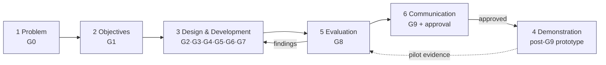

# DSRM — Design Science Research Methodology (project operating model)

> **Scope.** How Design Science Research Methodology structures *this* package: the six DSRM
> activities, their exact mapping onto the project gates **G0–G9**, the artifact types the package
> produces, the rigor-vs-relevance balance, and the evaluation methods appropriate for a
> *security* prototype. This is the basis for the future **dsrm-research-assistant** skill (G2).
>
> **Mandate.** DSRM is the declared development methodology for the prototype
> `[brief: agents-guide.md]` (its "Development methodology" line). DSRM is a general IS-research
> methodology — it is **not** in the Fabric 2.5 corpus, so this doc cites the seminal literature by
> author/year (a bibliographic attribution, not a corpus `[docs:]` citation) and grounds the
> project-specific mapping in the package's own artifacts.

## 1. The methodology (Peffers et al., 2007)

DSRM (Peffers, Tuunanen, Rothenberger & Chatterjee, 2007, *A Design Science Research Methodology
for Information Systems Research*) defines **six activities** and four possible **entry points**.
The activities are nominally sequential but iterate — evaluation feeds back into design.

| # | Activity | What it produces |
|---|----------|------------------|
| 1 | **Problem identification & motivation** | A defined problem + why it matters; justifies the artifact's value. |
| 2 | **Define objectives of a solution** | What a good solution must achieve (quantitative or qualitative). |
| 3 | **Design & development** | The artifact — constructs, models, methods, or instantiations. |
| 4 | **Demonstration** | The artifact used on an instance of the problem (case, experiment, proof). |
| 5 | **Evaluation** | Measured evidence of how well the artifact meets the objectives; iterate back to 3. |
| 6 | **Communication** | The problem, artifact, rigor and utility conveyed to researchers + practitioners. |

**Entry point for this project:** *problem-centered initiation* — the problem (tamper-evident,
confidentiality-preserving anchoring of employee profile-section changes) is the starting
motivation.

**Fact (updated 2026-08-06).** The solution *objectives* are **no longer** `[ASSUMPTION]`. Gap
**G-01** in [`../11-execution/grounding-gaps.md`](../11-execution/grounding-gaps.md) was **closed**
2026-08-02 by an explicit human decision (Chandra Kurniawan), transcribed verbatim in that
register's Part 0: the primary objective — proving a profile change is verifiable independently by
the client, without needing to trust the platform vendor — plus four testable success predicates
**P1–P4** `[prd: §2, §3]`. Objectives no longer wait on Jira **HLF-6** / Confluence; those sources
are formally retired as the closing authority in favor of the ratifying PRD + thesis extract
(`../11-execution/sources/README.md`). What remains genuinely open is narrower and tracked
explicitly: the **G8a/G8b gate split** (sponsor decision **S-1**, §2 below) and four further
sponsor decisions **S-2..S-5** (`rencana-rekonsiliasi.md` §2) — none of which reopens G-01 itself.

**Artifact types** (March & Smith, 1995; carried into Hevner et al., 2004). This package is a
*design + tooling* package, so it produces the first three types now and the fourth only after the
final approval gate:

| Type | Definition | This project's instances |
|------|------------|---------------------------|
| **Constructs** | Vocabulary & concepts | The knowledge graph Layers A–F, the security-frame vocabulary, the citation convention `[docs:]`/`[code:]`/`[brief:]`. |
| **Models** | Abstractions & representations | Architecture + C4 diagrams (`00-architecture/`, G5), the blockchain data model (G5), the threat model (G6). |
| **Methods** | Practices & algorithms | The agent-orchestration workflow (`prompts/hlf-orchestrator` — planned, G3), the G-gate process, the reusable skills, the salted-commitment anchoring pattern. |
| **Instantiations** | Working systems | The Fabric prototype + operational `.claude/` agents & skills — **built only in Phase 4, post-G9**.† |

*† "Post-G9" now means post-**re-approved** G9, not post-the-historical-sign-off — see §2's
2026-08-06 update: **G9 is currently VOID** `[prd: §11.1]`.*

## 2. The six activities mapped to the project gates (G0–G9)

This mapping reproduces **Layer F** of
[`../11-execution/knowledge-graph.md`](../11-execution/knowledge-graph.md) exactly; the gate names
and exit criteria are the status board + gate table in [`../README.md`](../README.md).

| DSRM activity | Project gate(s) | Deliverable at that gate |
|---------------|-----------------|--------------------------|
| **1. Problem identification & motivation** | **G0** grounding & discovery | knowledge graph + `grounding-gaps.md` + seeded risk register |
| **2. Objectives of a solution** | **G1** context knowledge base | `context/` docs, solution objectives |
| **3. Design & development** | **G2** new skills · **G3** architecture + agent specs + agents · **G4** ADRs · **G5** solution design · **G6** security architecture · **G7** tasks + test strategy | the design artifacts (**no prototype application code**) |
| **4. Demonstration** | **post-G9** (prototype build after approval) | working prototype exercising the anchor/verify flow |
| **5. Evaluation** | **G8** full-package review + security testing | review report + verification logs |
| **6. Communication** | **G9** roadmap · risk · MCP · repo · README + **approval** | published package |

> **Update (2026-08-06) — G8 and G9 in the table above are currently VOID.** The thesis/PRD
> ratification voided both: G9 approved *a set of assumptions*, at least six load-bearing members of
> which are now known false (the two-org topology, single-channel+PDC, the Kafka anchor-service, the
> unsalted single-key digest scheme, the event-based anchor surface, and performance-out-of-scope)
> `[prd: §11.1]`. **Do not treat the historical G8/G9 sign-off (`g8-review-report.md`) as current
> authorization.** This is *stricter* than "no gate exists, so nothing blocks building" — build stays
> unauthorized until a sponsor decision. A pending sponsor decision (**S-1**,
> `rencana-rekonsiliasi.md` §2) proposes splitting Activity 5's gate into **G8a** (document-consistency
> review — Descriptive + Analytical, the 0-prototype-code rule retained) and **G8b** (measured-artifact
> evaluation — Testing + Experimental, prototype code expected and required) — see §4's evaluation-
> method-family table for the method mapping this split rests on. Activity 6 (Communication/G9)
> requires **re-approval** against the current, reconciled assumption set (**S-5**) once Activities 3–5
> land; the historical "G9 · APPROVED" status some status boards still show predates this voiding and
> must not be read as live.

**Fact:** DSRM's design→evaluate iteration is realized here as the *design cycle* — each gate is a
build-then-check step, and evaluation (G8) can send any deliverable back for revision before the
G9 approval. **Recommendation:** treat G8 — concretely, **G8a** until S-1 resolves it — as a hard
iteration boundary — do not advance a deliverable to G9 with an open CONFIRMED review finding; loop
it back to its owning gate.

*Note the ordering quirk this project deliberately adopts:* DSRM lists Demonstration (4) before
Evaluation (5), but the package's **design-only boundary** `[brief: agents-guide.md]` forces
Evaluation of the *design* (G8) and Communication + human approval (G9) to happen **before** any
running prototype exists. Post-approval demonstration then feeds a second evaluation loop (dashed
edge). This is a documented adaptation, not a deviation from the objectives. **This still holds for
G8a** (design-only evaluation stays before any prototype, unchanged); **whether it still holds for
G8b is exactly the question sponsor decision S-1 answers** — G8b's whole premise is a measured
evaluation *of a running artifact*, which is why it is deferred to Phase-4 Demonstration in §4's
table, not treated as a second design-only pass.

## 3. Rigor vs. relevance (Hevner's three cycles)

Hevner (2007) / Hevner et al. (2004) frame design science as three coupled cycles. Naming them
keeps the package honest about where it is strong and where it is provisional.

- **Relevance cycle** (environment ↔ design). **Updated 2026-08-06 — two grounding sources now,
  not one.** (a) The *real* platform environment — the platform's core HRIS service (PHP/Yii2) and
  its Employee microservice (Go), the concrete PII inventory, and the real actors, generic-register
  citations (no literal repo/table name — `project-context.md` AUTHORITY NOTICE); and (b) the
  ratified thesis/PRD reconciliation (2026-08-02/03 human decision, plus the 2026-08-06 real-repo
  grounding pass), which **closed** gap **G-01** (objective) and **G-05** (anchored surface) by
  explicit human decision and re-scoped several others (`G-02` per-section digest, `G-03`
  channel-per-tenant, `G-04` three-org topology, `G-08` reopened for performance) — see
  `grounding-gaps.md` Part 0/Part 1. **Weak point, restated rather than resolved:** Jira **HLF-6** /
  Confluence remain unreachable from this environment and are now formally retired as the closing
  authority in favor of the thesis extract + PRD (`../11-execution/sources/README.md`); separately,
  *governance itself* is blocked pending four further sponsor decisions **S-1..S-5**
  (`rencana-rekonsiliasi.md` §2) — most urgently **S-1**, without which §2's G8/G9-void state does
  not resolve. Every requirement-shaped specific not covered by a closed/ratified item remains
  **[ASSUMPTION]**, tracked in `grounding-gaps.md` (now **G-01..G-29**).
- **Rigor cycle** (knowledge base ↔ design). Grounded in the pinned **Fabric 2.5 corpus**
  (`[docs:]` citations), the mandated security frames — CIA Triad, ZKP, Privacy-by-Design,
  Security-by-Design, OWASP ASVS, OWASP API Security Top 10, NIST Zero Trust `[brief: agents-guide.md]`
  — and the DSRM literature itself. The 8-skill fabric-skill-suite is the reusable knowledge base;
  this package **cites and points**, it does not copy. **Fact (2026-08-06):** the ratifying thesis
  contributes a second rigor pillar alongside the Fabric corpus — its own BAB II frames (CIA, PbD,
  SbD, TOE Framework, Trust Theory) and UU PDP's verified legal text — which the reconciled ADRs are
  now expected to cite explicitly, not only the Fabric corpus (`dsrm-phase-artifact-map.md` §8).
- **Design cycle** (build ↔ evaluate). The G-gate loop (§2). Each artifact is built against a
  cited knowledge base (rigor) and a grounded environment (relevance), then checked at **G8a**
  (§2's 2026-08-06 update — G8/G9 are currently VOID; G8b does not exist yet, pending S-1).

**Recommendation:** because relevance rested on assumptions, the original advice here was to weight
rigor heavily — a control that is corpus-grounded and frame-justified survives a requirement change
better than one tuned to a guessed requirement — and to revisit relevance-sensitive ADRs the moment
a gap closes. **Fact (2026-08-06): that loop is exactly what happened.** When G-01/G-05 closed and
G-02/G-03/G-04/G-10 were re-scoped, **six of the original ten ADRs** were revisited and marked
`Superseded by ADR-NNNN` (`../05-adr/README.md`) rather than silently left `Accepted` for a decision
no longer in force — empirical validation of the recommendation, not merely a restatement of it.
The recommendation still holds prospectively: weight rigor heavily for whatever remains
`[ASSUMPTION]` (S-2..S-5, G-25..G-29), and revisit the ADRs those items rest on the moment each
resolves.

## 4. Evaluation methods for a *security* prototype

Hevner et al. (2004) enumerate five design-evaluation families. For a security artifact the
emphasis differs from a performance artifact — correctness of a control is argued and tested, not
merely benchmarked. Mapped to this package:

> **Update (2026-08-06).** The ratifying thesis/PRD reconciliation named two concrete evaluation
> methods it actually uses that had no row below — **regulatory-compliance analysis** and
> **Focus Group Discussion (FGD)** — and flagged that the performance-out-of-scope clause at the
> end of this section no longer holds `[prd: §3.1, §10.2]`. Both are folded in below without
> inventing a sixth Hevner family: each new row is a **concrete method inside an existing family**.

| Method family | How it applies here | Owner / where |
|---------------|---------------------|---------------|
| **Descriptive** (informed argument, scenarios) | **Primary while design-only.** Argue each control against the seven frames; walk the traceability-spine scenarios (anchor / confidentiality / access / erasure / minimal-disclosure). | knowledge graph Layer E + §3 spine; security architecture (G6) |
| **Analytical** (architecture & static analysis) | Control-to-frame traceability matrices; static review of chaincode + integration seam. | `09-review/`, and the **fabric-security-review** skill (do not duplicate its checklist here) |
| **Analytical — regulatory-compliance analysis** *(added 2026-08-06)* | Map the artifact's controls row-by-row against an external legal/regulatory norm (e.g. a data-protection-law compliance matrix), using a multi-tier honesty scale (fully-met / partially-met / met-with-caveat / cannot-claim) rather than a binary pass/fail — a structured mapping exercise against an external specification, which is why it belongs to *Analytical* rather than *Testing*. | Success predicate **P4**; owning artifact = the PRD's compliance-matrix section `[prd: §9]` |
| **Testing** (functional black-box, structural white-box) | Black-box: demonstrate anchor-then-verify without exposing plaintext. White-box: chaincode unit/endorsement tests. **Security testing is the G8 activity.** | G7 test strategy → G8; Phase-4 prototype |
| **Experimental** (controlled experiment, simulation) | Tamper-attempt simulation against the immutable ledger; selective-disclosure proof-of-concept if ZKP is confirmed (gap **G-07**). | Phase-4 demonstration |
| **Observational** (case / field study) | Pilot-tenant case study — **deferred to post-G9**, one tenant per the working objective (**G-01**). | Phase 4 |
| **Descriptive + Observational — Focus Group Discussion (FGD)** *(added 2026-08-06)* | A facilitated qualitative session where domain-practitioner participants score the artifact against a fixed evaluation checklist (e.g. usefulness, ease of use, **trust**, feasibility). **Descriptive** because participants reason about the artifact against criteria rather than measuring it under load; **Observational** because it captures situated practitioner judgment closer to a field setting than a lab. If a trust-theory frame is declared for the project, "trust" must actually be one of the scored criteria — not merely aspirational (a documented failure mode: promising a criterion and not consistently scoring it). | Feeds the Communication (G9) narrative and the Trust-Theory frame specifically; not a G8 quantitative gate on its own |

**Fact:** the package is design-only until G9 `[brief: agents-guide.md]`, so the *currently
applicable* methods are **Descriptive + Analytical**; Testing and Experimental become primary in
Phase 4 Demonstration. This still holds even though G8/G9 have since been **voided** by the
ratifying reconciliation `[prd: §11.1]` — if anything it is reinforced: the package is further from
Phase 4 today than the pre-voiding status board suggested. **Recommendation:** define each
objective's success metric (G-01) as a *testable predicate* now — e.g. "a verifier can confirm a
PII change occurred and matches the off-chain record, without learning the plaintext" — so
Phase-4 Testing has an unambiguous target.

**Fact (revised 2026-08-06):** performance-oriented evaluation is **no longer out of scope**. The
ratified success predicate **P2** (write latency < 3s @ 500 TPS) makes a *measured* Hyperledger
Caliper benchmark load-bearing evidence, not a deferred nicety `[prd: §3.1]` — gap **G-08** is
**reopened**, not closed (see `../11-execution/grounding-gaps.md`). **Recommendation:** this doc
still does not re-derive throughput-tuning *method* (block size, CouchDB vs LevelDB) — that depth
still routes to the **fabric-performance** skill — but the Evaluation Report Generator mode must
now carry the Caliper result as evidence for P2, sourced from `fabric-performance`, not re-run
inside this doc. Until the harness actually runs, any published throughput/latency figure is a
**placeholder** and must be labelled as such, never cited as a result `[prd: §3.1]`.

## 5. Communication (Phase 6) and the research thread

Communication is not an afterthought — it is a first-class DSRM activity and this package's G9
deliverable. The research-lane agents own it: the **dsrm-research-assistant** (which this doc
seeds), a **literature-reviewer** for the frame/methodology bibliography, and an **ADR writer**
for the decision record (see [`ADR.md`](ADR.md)). Scholarly rigor for the eventual write-up —
naming the DSRM entry point, artifact types, and evaluation methods used — comes directly from
§§1–4 above.

## Authoring discipline (per the suite contract)

This meta-doc follows the same discipline as the Fabric context docs
([`../../fabric-skill-suite/docs/AUTHORING-CONTRACT.md`](../../fabric-skill-suite/docs/AUTHORING-CONTRACT.md) §5 + §7),
adapted for methodology content:

- **Cite the source.** Fabric facts → `[docs:]` corpus; repo facts → `[code:]`; the brief's
  directives → `[brief: agents-guide.md]`. DSRM literature is attributed by author/year; no
  corpus citation is fabricated for it.
- **Fact vs. recommendation.** Documented/mandated facts are marked "Fact:"; engineering judgment
  is marked "Recommendation:".
- **State assumptions.** Every requirement-shaped specific carries **[ASSUMPTION]** and its gap ID
  (G-01..G-22); none is silently treated as settled.
- **Cross-reference, don't duplicate.** Security-testing and performance-evaluation depth live in
  the **fabric-security-review** / **fabric-performance** skills; this doc points to them.
