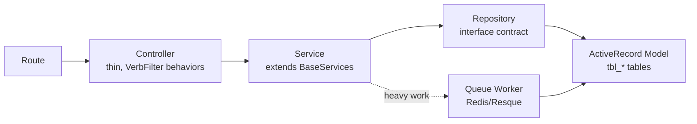

# talenta-core Architecture (PHP / Yii2)

> **Scope.** How the HRIS system-of-record is laid out: the Yii2 MVC skeleton, the
> Service-Repository-Controller (SRC) layering, application components, the module system, and the
> Vue front-end seam. This is the "left half" of the integration the project brief omits; the Go side
> (`employee-management-service`) is documented in the knowledge graph Layer C
> (`../11-execution/knowledge-graph.md`). Read this before reasoning about *where* a Fabric anchor hook
> can physically live inside talenta-core.
>
> **Grounding.** `[code: talenta-core/<path>]` = a fact read from the real repo at
> `/Users/chan/www/talenta-core`. Engineering judgement is marked **Recommendation:** and is not a
> documented fact.

## 1. Stack and platform (fact)

| Concern | Value | Source |
|---|---|---|
| Framework | Yii2 `2.0.41.1` | `[code: talenta-core/composer.json:23]` |
| Language | PHP `>=7.4.0` | `[code: talenta-core/composer.json:18]` |
| Front-end | Vue.js 2.x built with Laravel Mix / webpack | `[code: talenta-core/webpack.mix.js]`, `[code: talenta-core/CLAUDE.md:21]` |
| Data store | MySQL/MariaDB via ActiveRecord ORM; read/write slave split | `[code: talenta-core/config/web.php:260]`, `[code: talenta-core/models/User.php:1207]` |
| Session + queue | Redis (`yii\redis\Session`; queue via Redis/Resque workers) | `[code: talenta-core/config/web.php:261-266]` |
| Tenancy | Multi-tenant, every domain operation scoped by `company_id` | `[code: talenta-core/.github/copilot-instructions.md:52]` |

The system is an "enterprise HR management system" whose central entity is the employee `User`
implementing `yii\web\IdentityInterface` `[code: talenta-core/models/User.php:39]`. The employee
master **is** the auth identity (knowledge-graph Layer B).

## 2. Directory layout (fact)

Standard Yii2 application-template roots, extended with an explicit service/repository tier:

```
talenta-core/
├── controllers/       # thin HTTP entry points; delegate to services
├── models/            # ActiveRecord models + validation rules (User.php, FamilyData.php, ...)
├── services/          # business logic; extend BaseServices (services/kafka/ for producers)
├── repositories/      # data-access layer behind interface contracts
├── modules/           # self-contained sub-apps (e.g. modules/manager)
├── components/        # application components + reusable helpers (BaseComponent, Helper, ...)
├── abstracts/         # abstract bases (e.g. abstracts/Kafka.php)
├── traits/            # cross-cutting mixins (traits/EncryptableFieldsTrait.php)
├── workers/           # queue jobs (PublishEmployeeInfoWorker, WebhookWorker, ...)
├── listeners/ events/ # event-driven side effects
├── interfaces/        # service/repository contracts for DI
├── transformers/ validators/ helpers/
├── config/            # web.php, console.php, db.php, params.php
├── vue/               # Vue 2 SPA-in-page front-end (mounted into server views)
└── web/               # public docroot + built assets
```

Directory survey: `[code: talenta-core/]` (top-level `ls`). Naming rules for each tier are in
`PHP-CONVENTIONS.md`.

## 3. The SRC request flow (fact)

The documented request pipeline `[code: talenta-core/.github/copilot-instructions.md:85-91]`:



- **Controllers stay thin.** `FamilyDataController` extends `CustomLoginController` and declares only a
  `VerbFilter` in `behaviors()`; its actions call models/services rather than embedding logic
  `[code: talenta-core/controllers/FamilyDataController.php:28-34]`. Base-class controllers
  (`CustomLoginController`) carry the auth/session gate.
- **Services hold business logic** and extend `BaseServices`, whose constructor resolves the acting
  user and company from `Yii::$app->user->identity` (or injected fallbacks), giving every service the
  tenant context automatically `[code: talenta-core/services/BaseServices.php:24-27]`. New services use
  constructor dependency injection of repositories `[code: talenta-core/services/ChangeDataService.php:44-68]`.
- **Repositories** wrap data access behind interface contracts (e.g. `UserRepository`,
  `EmployeeDataRequestRepository`), injected into services `[code: talenta-core/services/ChangeDataService.php:44-56]`.
- **ActiveRecord models** own table mapping (`tableName()`), `rules()`, relations, and lifecycle hooks
  (`beforeSave`/`afterSave`) `[code: talenta-core/models/User.php:825-828]`,
  `[code: talenta-core/models/FamilyData.php:71-74]`.
- **Heavy or fan-out work is deferred to queue workers** via `Yii::$app->queue->push(...)`
  `[code: talenta-core/services/kafka/EmployeeInfoProducerService.php:169]`.

## 4. Application components (fact)

Shared services are registered as Yii application components in `config/web.php` and reached through
`Yii::$app->{id}`:

| Component | Class / role | Source |
|---|---|---|
| `session` | `yii\redis\Session`, httpOnly + secure cookies | `[code: talenta-core/config/web.php:261-266]` |
| `db` / `dbArchive` | MySQL with slave read-splitting toggled per query | `[code: talenta-core/config/web.php:260]`, `[code: talenta-core/models/User.php:1207-1209]` |
| `sso` / `sso_v1_1` | `Mekari\SsoClient\SsoComponent` (central identity) | `[code: talenta-core/config/web.php:271-288]` |
| `jwt` | `sizeg\jwt\Jwt` for token auth | `[code: talenta-core/config/web.php:267-270]` |
| `kafka` / `talentaKafka` | `Mekari\SsoClient\KafkaComponent` (event bus) | `[code: talenta-core/config/web.php:289-298]` |
| `featureToggle` | Unleash-style flags gating behaviour per `company_id` | `[code: talenta-core/models/FamilyData.php:159]` |
| `base` | catch-all domain helper (`Yii::$app->base->...`) | `[code: talenta-core/services/ChangeDataService.php:126]` |

`Kafka` producers subclass an abstract base that publishes through `Yii::$app->talentaKafka->publish()`
`[code: talenta-core/abstracts/Kafka.php:19-27]` (see `PHP-INTEGRATION.md` §1).

## 5. Modules (fact)

Modules are self-contained sub-applications with their own controller namespace. `modules/manager`
declares `controllerNamespace = 'app\modules\manager\controllers'` and holds its own `controllers/` and
`views/` `[code: talenta-core/modules/manager/Module.php]`. Modules are the coarse feature-isolation
unit; most functionality lives in the flat top-level `controllers/` + `services/` tiers rather than in
modules.

## 6. The Vue front-end seam (fact)

The front end is **not** a standalone SPA. Vue 2 instances are mounted into DOM element IDs rendered by
Yii server-side views:

- `vue/App.js` iterates a config registry and, for each configured group, checks
  `document.getElementById(group.id)` and mounts a Vue instance there via a `config-registrar`
  `[code: talenta-core/vue/App.js:16-27]`. Server-rendered Yii views expose those mount-point IDs.
- Laravel Mix / webpack compiles `vue/` to `web/assets/new-talenta/js`, with alias `@ -> vue/`
  `[code: talenta-core/webpack.mix.js:7,15-24]`.
- Groups may opt into the `@mekari/pixel` design system per instance (`isPixel`)
  `[code: talenta-core/vue/App.js:23]`.

**Recommendation:** any Fabric-facing UI (audit-evidence viewer, consent/erasure screens) should attach
as a new Vue group mounted into a Yii view, reusing this island pattern rather than introducing a
separate SPA. This keeps the auth/session gate on the PHP side. Front-end rules for new UI live in the
`coding-standards-frontend` skill (Mekari Pixel + single-spa MFE contract), not here.

## 7. Where a Fabric anchor attaches (orientation)

talenta-core is the HRIS system-of-record (knowledge-graph Layer C) but the working assumption is that
it is **not** the Fabric gateway host - a thin Go anchor-service is the candidate
(**[ASSUMPTION]** gap **G-10**, `../11-execution/grounding-gaps.md`). talenta-core's contribution to the
anchor chain is at two seams it already owns:

1. the Kafka `employee_info` producer (`services/kafka/`), and
2. the `EVENT_UPDATE_PERSONAL` approval hook in `ChangeDataService`.

Both are detailed in `PHP-INTEGRATION.md`. For the Fabric-side gateway client that consumes these
signals, see `fabric-chaincode-dev/references/gateway-client.md`; for how HRIS roles map onto ledger
identities, see `fabric-identity-security/references/msp-structure.md`.

## 8. Conventions and integration cross-refs

- Coding conventions, the PII encryption trait, and the RBAC model: `PHP-CONVENTIONS.md`.
- Outward integration seams (Kafka, approval hook, public API, SSO): `PHP-INTEGRATION.md`.
- Fabric capability mapping (D1..D15) and layers: `../11-execution/knowledge-graph.md`.
