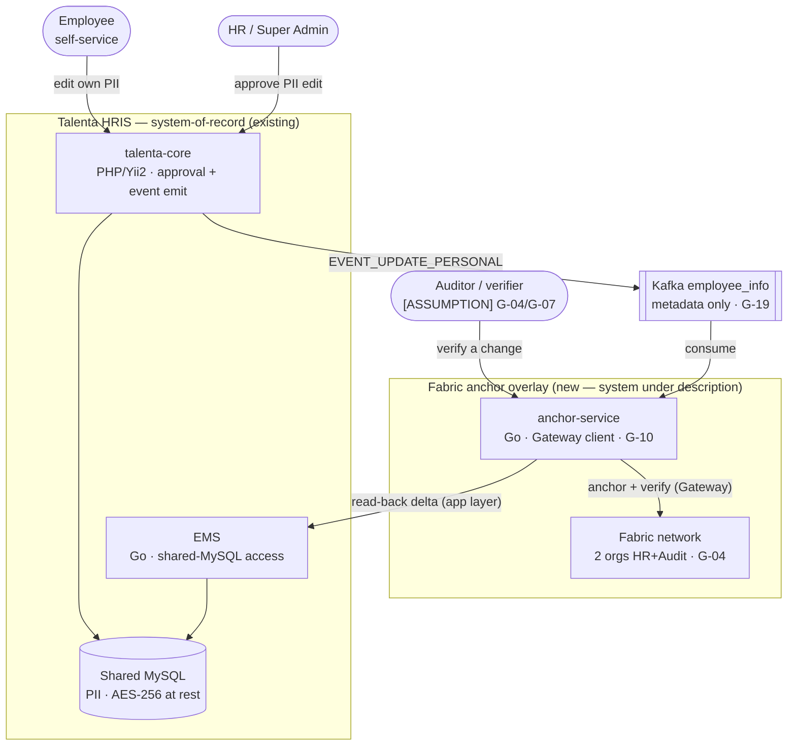
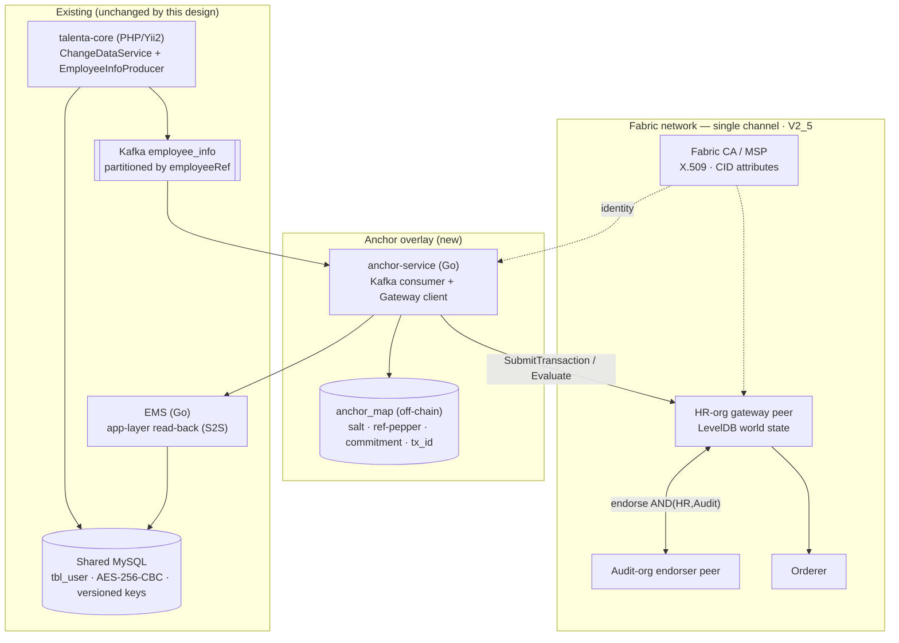

# SYSTEM-DIAGRAM — C4 view of the HRIS-on-Fabric anchor overlay

> **Scope.** The authoritative **C4 system view** (Level 1 Context + Level 2 Container) of the prototype:
> the existing Talenta HRIS (talenta-core + EMS) as system-of-record, the Kafka seam, and the new Fabric
> anchor overlay (anchor-service + two-org Fabric network). This realizes the interim entity/relationship
> map in [`../11-execution/knowledge-graph.md`](../11-execution/knowledge-graph.md) §2 (the shared spine)
> and is produced per the architecture-design skill's C4 conventions.
>
> **Cross-reference, do not duplicate.** The end-to-end call flow, seam failure modes, and read/verify
> paths live in [`../00-architecture/solution/integration-design.md`](../00-architecture/solution/integration-design.md)
> and its sequence diagram [`../00-architecture/diagrams/integration-flow.mmd`](../00-architecture/diagrams/integration-flow.mmd);
> record shapes in [`BLOCKCHAIN-DATA-MODEL.md`](BLOCKCHAIN-DATA-MODEL.md); the crypto domains in
> [`CRYPTOGRAPHY.md`](CRYPTOGRAPHY.md). Fabric topology depth is owned by the **fabric-network-architect**
> skill; these diagrams *instantiate* it for this system, they do not re-explain it.
>
> **[ASSUMPTION]-aware.** Nodes standing on an open gap (the anchor-service host G-10, the org topology
> G-04, the auditor as a first-class ledger actor G-04/G-07) are labelled, so a diagram never implies a
> settled decision. Citations: `[code:]` real repo · `[docs:]` Fabric 2.5 corpus · `[brief:]` project
> brief · **[ASSUMPTION]** = gap G-##.

**Last updated:** 2026-07-13

---

## Level 1 — System Context

Who touches the system, and what systems surround the new overlay. The **system under description** is the
anchor overlay; everything else already exists (ADR-0002: Fabric is an overlay, not the source-of-truth).

**Narrative.** Employees and HR admins edit personal data inside the existing Talenta HRIS; approved edits
are written to the AES-encrypted **shared MySQL** (the single system-of-record — ADR-0002) and announced as
an `EVENT_UPDATE_PERSONAL` on the **Kafka `employee_info`** topic
`[code: talenta-core/services/ChangeDataService.php:336-343]`, which carries identity/org metadata only
(**[ASSUMPTION] G-19**). The new **anchor-service** consumes that event, reads the approved change delta
back through the app layer, computes a **salted SHA-256 commitment**, and anchors it — endorsed by two
independent orgs — onto the **Fabric network**. Auditors verify any historical change by recomputing the
commitment; the ledger is read to *verify*, never to *reconstruct* a value (ADR-0001). No PII plaintext
ever crosses to the overlay.

## Level 2 — Containers

The deployable/runnable units. The two green-field containers are the **anchor-service** and its off-chain
**anchor_map** companion; the four Fabric nodes form the two-org network (ADR-0003/0004).

| Container | Tech (logical) | Responsibility |
|---|---|---|
| **talenta-core** | PHP/Yii2 monolith | System-of-record writer; approval workflow; **event emitter (unchanged)** `[code: .../ChangeDataService.php]`, `[code: .../EmployeeInfoProducerService.php]` |
| **EMS** | Go service | Shared-MySQL access; serves the **app-layer read-back** of the approved delta over S2S `[code: ems/internal/base/handler/base.go]` |
| **Shared MySQL** | Transactional DB | Authoritative store for all PII; AES-256-CBC at rest, versioned keys `[code: ems/pkg/db/encryption_plugins.go]` |
| **Kafka `employee_info`** | Event bus | Delivers change events (metadata only); **partitioned by `employeeRef`** to preserve per-employee ordering (ADR-0006) |
| **anchor-service** *(new)* | Go consumer + Fabric Gateway client | Consume → resolve delta → salted commitment → submit → confirm → commit offset; drives erasure crypto-shred (ADR-0006/0010) |
| **anchor_map** *(new)* | Off-chain key/value store | Per-event salt, per-subject ref-pepper, commitment, `fabric_tx_id`, status; the erasure lever (ADR-0001) — **not** the shared MySQL (G-16) |
| **HR-org gateway peer** | Fabric peer (LevelDB) | Hosts the Gateway service; endorses HR-side; holds public `AnchorRecord` world state (ADR-0007) |
| **Audit-org endorser peer** | Fabric peer | Independent co-endorser — `AND('HROrg.peer','AuditOrg.peer')` makes tamper-evidence real (ADR-0003) |
| **Orderer** | Ordering service | Orders + commits endorsed anchor envelopes |
| **Fabric CA / MSP** | PKI / CA | Issues X.509 identities carrying HRIS role + company as CID attributes (ADR-0005); owned by fabric-identity-security |

## Cross-cutting

- **Auth / trust boundary.** Human identity is federated via **Mekari SSO** (`sso_id`, `[code: talenta-core/config/web.php:271-288]`);
  Kong injects trusted headers (`X-Company-ID`, `X-Api-Key`) — the boundary flagged **[ASSUMPTION] G-18**
  (must be verified end-to-end). The anchor-service holds a **separate machine identity**: an X.509 cert in
  the HR-org MSP whose HRIS role/company are enrolled attributes read by chaincode via CID for read-side
  ABAC (ADR-0005). Fabric signing/TLS keys are kept **fully separate** from the app-level AES PII keys —
  no derivation, no wrapping, no cascade (ADR-0009).
- **Confidentiality boundary (the load-bearing invariant).** ADR-0001: only a salted 256-bit commitment +
  non-PII metadata cross from the anchor-service to Fabric — **0 bytes of PII plaintext** on-chain. The
  read-back delta and salts live only transiently in the service and durably off-chain in `anchor_map`.
- **System-of-record boundary.** ADR-0002: MySQL is authoritative for **0→∞** PII fields; Fabric owns
  **0** authoritative fields; the two stores are eventually consistent with **0** cross-store 2-phase
  transactions, reconciled by a periodic diff job (integration-design §9).
- **Observability.** Existing ULMS activity-log persists on non-GET success `[code: ems/internal/base/service/ulms]`;
  chaincode emits an event per anchor for downstream audit projections `[docs: gateway.md#listening-for-events]`;
  `anchor_map.status` is the operational source of truth for anchor liveness (integration-design §5.1).
- **Deployment.** anchor-service + Fabric nodes deploy on the same **Alibaba Cloud K8s** as EMS via the
  existing Helm pattern `[code: ems/deploy-alicloud/]` — **[ASSUMPTION] G-13**; production topology
  deferred. Scale is **1 pilot tenant, low volume** (G-08), so LevelDB and default block params suffice.
- **Data flows of note.** The end-to-end anchor / verify / erasure flows, the crash-safe offset state
  machine, and the full seam failure-mode table are in
  [`../00-architecture/solution/integration-design.md`](../00-architecture/solution/integration-design.md).

## Deferred C4 levels

- **C3 Component** — inside the anchor-service (consumer loop, commitment builder, Gateway client,
  reconciliation job) and the chaincode (`AnchorChange` + query functions): firms up alongside
  `> See fabric-chaincode-dev`.
- **Sequence diagrams** — the anchor-then-verify and erasure flows already exist as
  [`../00-architecture/diagrams/integration-flow.mmd`](../00-architecture/diagrams/integration-flow.mmd)
  and integration-design §4/§6/§7.

## Traceability

Grounds knowledge-graph Layer A (actors) → C (services + seam) → D (D2/D3 anchor, D6 identity, D9 ABAC,
D12 audit, D4 erasure) → E (CIA, Privacy-by-Design, Zero Trust). Realizes the anchor / confidentiality /
access / erasure chains of [`../11-execution/knowledge-graph.md`](../11-execution/knowledge-graph.md) §3.
Open gaps carried on the diagram: **G-04** (org topology), **G-07** (auditor as ledger actor), **G-10**
(anchor-service host), **G-13** (deploy target), **G-18** (header trust), **G-19** (topic PII).
