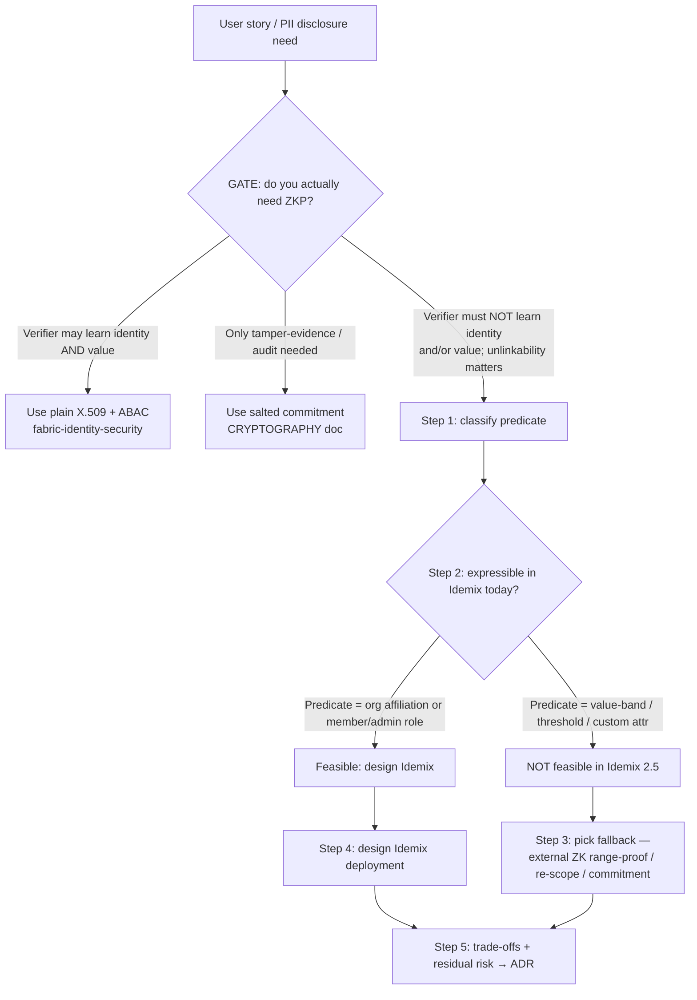

# zkp-designer

## Purpose and scope

Help an architect decide **whether** a zero-knowledge proof is warranted for an HRIS PII use case,
and if so, **how** to realize it on Hyperledger Fabric 2.5 using **Idemix** ("Identity Mixer") — the
one ZKP mechanism Fabric ships. A ZKP lets a **prover** convince a **verifier** that a statement is
true (e.g. "the bearer is an active employee", "salary is in band C", "age ≥ 21", "holds HR-admin
role") **without revealing the holder's identity or the underlying value** `[docs: idemix.rst#what-is-idemix]`.

This skill owns the **decision + design workflow**. It does **not** own the theory (that is the
`ZERO-KNOWLEDGE-PROOF.md` context doc — grounding, cross-referenced below, not restated) nor the
Idemix MSP/CA plumbing (that is `fabric-identity-security`).

> **Necessity is an [ASSUMPTION] (gap G-07 / A-KG-7).** No known HRIS user story is confirmed to
> require anonymous credentials. This skill is roadmap item **G2** and is exploratory. Its **first
> step is a decision gate**: build ZKP only if a user story genuinely needs minimal disclosure or
> unlinkability. Default answer is **NO**.

> **Grounding (read for depth, do not duplicate):**
> `../../context/ZERO-KNOWLEDGE-PROOF.md` — ZKP theory, the HRIS candidate use cases, and the
> honesty section on Idemix limits. This SKILL.md is the *workflow*; that doc is the *knowledge*.

## When to use this skill

Trigger on: "zero-knowledge proof", "ZKP", "anonymous credential", "selective disclosure", "minimal
disclosure", "unlinkability", "prove without revealing", "Idemix design", "privacy-preserving
attribute proof", or any ask to prove an HRIS attribute to a party who must not learn who the subject
is or what the exact value is.

## When NOT to use (route away)

- **Set up an Idemix MSP, Fabric CA, X.509 certs, enrollment, or `msptype: idemix` config** →
  `fabric-identity-security` (owns the identity plumbing; this skill only *decides and designs*).
- **General security audit, threat model, STRIDE, OWASP, hardening** → `security-review` (app) or
  `fabric-security-review` (Fabric-specific audit workflow).
- **The crypto primitives themselves** (hashes, salts, AES envelope, PBKDF2, salted commitments) →
  `../../context/CRYPTOGRAPHY.md`. A commitment is **not** a ZKP (see the gate below).
- **Tamper-evident audit anchoring** (prove a value existed/matches later, verifier *may* learn the
  value) → salted commitment via `fabric-chaincode-dev` private data; not ZKP.

---

## Workflow



### Step 0 — The necessity gate (ALWAYS run first)

ZKP is heavyweight (new MSP type, Java-only user SDK, cannot endorse, no revocation). **Only pass
the gate if ALL that apply are true** for a concrete user story:

1. The **verifier must not learn the subject's identity** (anonymity), **and/or**
2. The **verifier must not learn the underlying value**, only that a **predicate** over it holds
   (selective/minimal disclosure), **and**
3. **Unlinkability** across repeated presentations is a real requirement (else fresh X.509 suffices).

If the gate **fails**, stop and route:
- Verifier is trusted to see identity and value → **plain X.509 + ABAC** (`fabric-identity-security`).
- You only need "this value existed and matches later" for audit → **salted commitment**
  (`CRYPTOGRAPHY.md` §3; `fabric-chaincode-dev` private data). A commitment proves *existence/match*,
  **not** a predicate like `salary < N` in zero knowledge — do not conflate the two.

Record the gate outcome as an **[ASSUMPTION] (gap G-07)** either way — necessity is not yet ratified.

### Step 1 — Classify the predicate

Name the statement to prove and bucket it:

| Class | Example HRIS statement | Idemix-shaped? |
|---|---|---|
| **affiliation** | "bearer belongs to company C / org1.dept1" | maps to `ou` |
| **role** | "requester holds HR-admin (vs member)" | maps to `role` |
| **value-band** | "salary is in band C" | custom attribute — **not** supported |
| **threshold** | "age ≥ 21", "tenure ≥ 1yr" | custom attribute / range — **not** supported |
| **eligibility** | derived ("qualifies for loan") | derived from the above — **not** supported |

### Step 2 — Feasibility check against Idemix's documented limits

> The five documented Idemix limits (fixed attribute set, no revocation, cannot endorse, one MSP
> per channel, Java-only user SDK): see `../../context/ZERO-KNOWLEDGE-PROOF.md` §4 and
> `[docs: idemix.rst#current-limitations]`. Do not restate them — apply them.

Decision logic (which limit gates which input; this is the delta Step 3 consumes):

- **Predicate class → expressibility.** Only `ou` (affiliation) and `role` (member/admin) are ever
  revealed to chaincode `[docs: idemix.rst#idemix-and-chaincode]`. → **affiliation/role are
  expressible; value-band / threshold / eligibility are NOT** (custom attributes unsupported in 2.5).
- **`revocation_required: true` → blocked.** Idemix has no revocation; a leaver's credential cannot
  be cleanly revoked. → require a compensating control; never claim revocation works.
- **`anchor_service_lang: go` → flag gap G-10.** The proof-generating user SDK is Java. There is no
  standalone anchor-service in the ratified HRIS-on-Fabric design (ADR-0014 retires that concept;
  recording is in-band from the HRIS write path) — treat this field as "the language of whichever
  process ends up calling the Idemix SDK," not as a claim that a specific anchor-service exists.
- **Anonymity-set bound.** One Idemix MSP per channel → the set is a single org's members. Under the
  ratified **three-org**, channel-per-tenant topology (ADR-0012/ADR-0013, gap G-04 closed on org
  count), that set is typically even smaller than a single "org" suggests — the tenant's own client
  org and the auditor org each have, by default, one peer/operator on a given channel; only the
  platform org spans more than a trivial membership. State the bound explicitly; never imply
  network-wide anonymity.
- **Never an endorser.** Idemix is verify-only; it cannot endorse a transaction or approve a
  chaincode definition — design it as a client-side, verify-only identity.

### Step 3 — Pick the mechanism (decision)

- **affiliation / role predicate, gate passed** → **Idemix is feasible** → go to Step 4.
- **value-band / threshold / eligibility predicate** → **Idemix cannot do it in 2.5.** Choose:
  - **External ZK range-proof system** (e.g. a purpose-built proof over a committed value, outside
    Fabric) — the roadmap path; out of the corpus, treat as design exploration.
  - **Re-scope**: if the verifier can be trusted to see identity, drop ZKP → plain X.509 + ABAC band
    attribute (`fabric-identity-security`).
  - **Salted commitment** only if audit/tamper-evidence (not a live predicate) is the real need
    (`CRYPTOGRAPHY.md` §3). *Recommendation: do NOT force Idemix onto a value-band predicate.*

### Step 4 — Design the Idemix deployment (only if Step 3 = Idemix)

Map the three actors `[docs: idemix.rst#how-to-use-idemix]` and record the constraints:

- **Issuer** — Fabric CA ≥ 1.3 (production) or `idemixgen` (dev); produces `IssuerPublicKey` +
  `IssuerRevocationPublicKey`.
- **User** — Fabric **Java SDK** `idemixEnroll` (flag gap G-10 if the service is Go).
- **Verifier** — an Idemix MSP (`msptype: idemix`) whose `mspdir` holds the two issuer keys.
- **Constraints to write down:** one Idemix MSP per channel; anonymity set = that MSP's members
  (G-04); verify-only, no endorsement; no revocation → define a compensating control for leavers;
  attributes revealed = `[ou, role]` only.

> Plumbing depth (do not restate here): enrollment, `msptype: idemix` config, and CID
> `GetAttributeValue` live in `fabric-identity-security/references/advanced-identity.md`.

### Step 5 — Trade-offs, residual risk, and ADR

Emit the output schema (below). Every residual risk carries its gap tag; feed the necessity decision
and the anonymity-set bound into an ADR (`architecture-design` ADR mode).

---

## Input schema

```yaml
predicate:
  subject: <who/what holds the credential>     # e.g. employee, anchor service
  claim: <the statement to prove>              # e.g. "salary in band C", "active employee"
  type: affiliation | role | value-band | threshold | eligibility
verifier:
  identity_visible: true | false               # may the verifier learn WHO the subject is?
  value_visible: true | false                  # may the verifier learn the underlying value?
  trust: internal | external-partner
unlinkability_required: true | false           # must repeated presentations be unlinkable?
revocation_required: true | false              # must a terminated/revoked subject be rejected?
anchor_service_lang: go | java                 # user-SDK constraint (gap G-10)
data_source: <table.field>                     # e.g. tbl_employee_salary_history.salary
```

## Output schema

```yaml
zkp_decision:
  need_zkp: yes | no
  gate_rationale: <why the gate passed or failed>
predicate_classification: affiliation | role | value-band | threshold | eligibility
feasible_with_idemix: true | false
feasibility_notes: <which documented limit blocks it, cited>   # e.g. idemix.rst#current-limitations
recommended_mechanism: idemix | salted-commitment | external-zk | plain-x509-abac
idemix_design:                                 # present only when recommended_mechanism == idemix
  issuer: fabric-ca | idemixgen
  verifier_msp: { name: <str>, msptype: idemix }
  attributes_revealed: [ou, role]
  anonymity_set: <bound, e.g. "single org's members (G-04)">
  endorsement_note: "verify-only; Idemix cannot endorse"
  revocation_gap: <compensating control for leavers, since Idemix has none>
residual_risks:
  - <risk statement> [gap G-##]
open_gaps: [G-07, G-04, G-10, G-11]
adr_items: [<decision to ratify>]
```

---

## Worked example — prove salary-band membership

**Input**

```yaml
predicate:
  subject: employee
  claim: "salary is in band C"
  type: value-band
verifier:
  identity_visible: false
  value_visible: false
  trust: external-partner        # external loan-eligibility portal
unlinkability_required: true
revocation_required: true        # terminated employees must not qualify
anchor_service_lang: go
data_source: tbl_employee_salary_history.salary
```

**Reasoning**

1. **Gate:** verifier must not learn identity *nor* exact salary, and unlinkability matters →
   **gate PASSES**, `need_zkp: yes`. (Recorded as [ASSUMPTION] G-07 — still not a ratified story.)
2. **Classify:** `value-band`.
3. **Feasibility:** **FALSE.** A salary band is a **custom attribute**, and Idemix supports only
   `ou` + `role` with **no custom attributes** today `[docs: idemix.rst#current-limitations]`.
   Two further blockers: `revocation_required: true` but Idemix has **no revocation**; and the anchor
   is Go while the user SDK is **Java** (G-10) `[docs: idemix.rst#how-to-use-idemix]`.
4. **Mechanism:** **not Idemix.** Recommend an **external ZK range-proof** over a committed salary
   (roadmap), OR **re-scope** to plain X.509 + ABAC if the portal may see identity. If only audit is
   truly needed, a **salted commitment** suffices — but that does not prove the band in zero knowledge.

**Output**

```yaml
zkp_decision:
  need_zkp: yes
  gate_rationale: "External verifier must learn neither identity nor exact salary; unlinkability required."
predicate_classification: value-band
feasible_with_idemix: false
feasibility_notes: "Salary band is a custom attribute; Idemix 2.5 reveals only ou+role, no custom
  attributes [idemix.rst#current-limitations]. Also no revocation (revocation_required=true) and
  Go anchor vs Java user SDK (G-10)."
recommended_mechanism: external-zk        # or plain-x509-abac if re-scoped; commitment if audit-only
idemix_design: null
residual_risks:
  - "Idemix cannot express a salary-band predicate; forcing it would leak or fail [idemix.rst]."
  - "No Idemix revocation — a terminated employee's credential cannot be cleanly revoked [docs: idemix.rst#current-limitations]."
  - "User SDK is Java; anchor service is Go [gap G-10]."
open_gaps: [G-07, G-04, G-10, G-11]
adr_items:
  - "Ratify whether the loan-eligibility story truly needs ZKP, or accept X.509+ABAC (G-07)."
```

**Takeaway:** the honest answer is that Fabric Idemix does **not** solve salary-band disclosure today
— demonstrating why the gate and the feasibility check exist. See the beginner/intermediate/enterprise
graduated cases in `../../context/ZERO-KNOWLEDGE-PROOF.md` §3–§5.

---

## Reusable prompts

- **Necessity gate:** "Run the ZKP necessity gate on this user story: <story>. Answer need_zkp
  yes/no per the three gate conditions, cite the fallback if no."
- **Feasibility:** "Classify this predicate (<claim>) and check it against Idemix's documented limits;
  is it expressible with ou/role only?"
- **Design:** "Design the Idemix deployment to prove <ou/role predicate> anonymously to <verifier>,
  and list every constraint (anonymity set, endorsement, revocation, SDK)."
- **Trade-off memo:** "Produce the output-schema decision + residual risks + ADR items for <case>."

## MCP integration

**None required.** This skill is analysis-and-design only; it reads the corpus + context docs and
emits a decision. It writes no chain state and calls no MCP server. Any downstream Idemix MSP/CA
provisioning is handed to `fabric-identity-security`.

## Guardrails (skill-specific)

- **Default to NO ZKP.** Pass the gate only for a concrete minimal-disclosure/unlinkability story;
  otherwise route to X.509+ABAC or a salted commitment.
- **Never claim Idemix supports custom attributes, revocation, or endorsement** — it does not in 2.5
  `[docs: idemix.rst#current-limitations]`. Do not "design around" these by inventing capabilities.
- **Always state the anonymity-set bound** (single MSP / single org under G-04) — anonymity is not
  network-wide.
- **A commitment is not a ZKP.** Never present a salted hash as proving a predicate in zero knowledge.
- **Mark necessity [ASSUMPTION] (G-07)** in every recommendation until a user story ratifies it.

## Behavioral rules
- **Cite the corpus / context doc.** Ground factual claims in the official Fabric 2.5 documentation
  (`idemix.rst`) and the `ZERO-KNOWLEDGE-PROOF.md` context doc; when official docs and community lore
  conflict, say so and follow the docs. [FR-8]
- **Show the reasoning and the trade-off.** Never present a tunable (block size, endorsement policy,
  state DB) as a universal truth — give the "it depends" and the axis it depends on. [FR-9]
- **Fact vs. recommendation.** Mark documented facts (cited) distinctly from engineering judgment
  ("recommendation:"). [FR-10]
- **Flag the blast radius.** Whenever a suggested action carries a production, security, or
  performance implication, state it before the how-to. [FR-11]
- **State assumptions.** When the user's context is incomplete, mark `[ASSUMPTION]` and invite
  correction rather than guessing silently. [FR-12]

## Evaluation criteria

- [ ] The **necessity gate runs first**; a failing gate routes away (X.509+ABAC / commitment) instead
      of building ZKP.
- [ ] The predicate is classified and checked against Idemix limits; **value-band/threshold/eligibility
      is correctly rejected** as not expressible in 2.5, cited to `idemix.rst#current-limitations`.
- [ ] Idemix's four documented limits (fixed attrs, no revocation, no endorsement, one MSP/channel)
      are honored — no invented capabilities.
- [ ] Necessity is tagged **[ASSUMPTION] (G-07)**; anonymity-set bound (G-04) and SDK gap (G-10)
      surfaced where relevant.
- [ ] Output follows the schema; facts are cited, recommendations labelled; every claim resolves to
      the corpus or a gap tag (no unresolved verification markers).
- [ ] Cross-references `ZERO-KNOWLEDGE-PROOF.md`/`CRYPTOGRAPHY.md`/`fabric-identity-security` instead
      of restating them.
